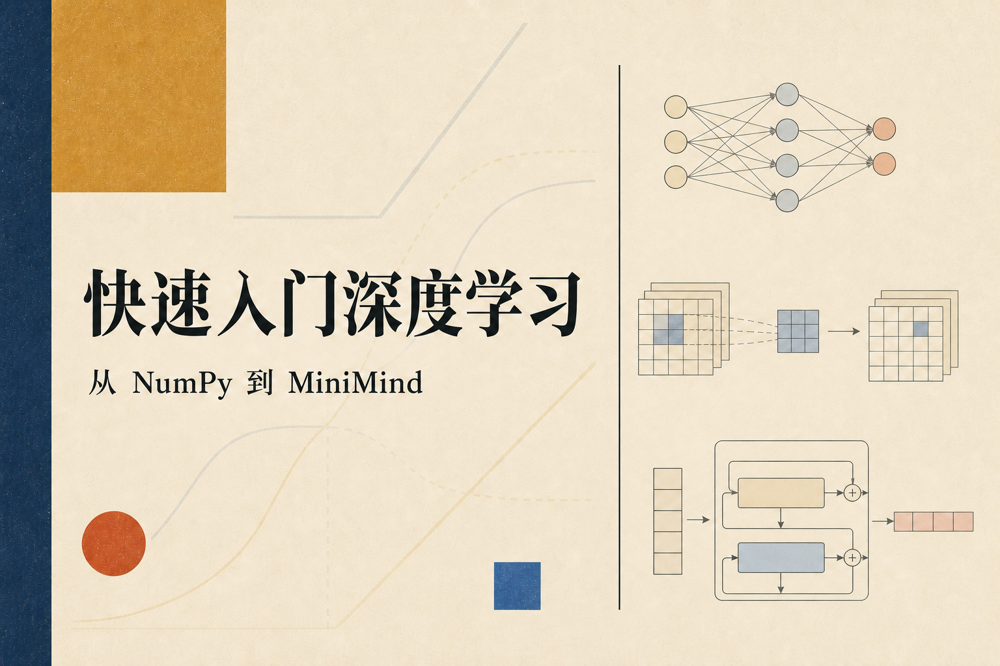

# 从 y = ax + b 到 MiniMind

这套教程从一个很小的问题开始：电脑怎样拟合一条直线？把预测、损失、梯度和更新算清以后，我们会保留这条“预测—计算损失—沿梯度更新”的骨架，依次处理 CIFAR-100 图片和文本生成。

我把正文写成 Markdown，而不是把讲义塞进 Notebook。文章里保留思路、公式和真正需要对照的代码片段，完整程序则放在旁边的 `exercises/` 目录。读到某个 shape 或一行训练日志时，可以立刻打开对应文件，不必在两套内容之间猜哪一份才算数。



[打开网页版教程](https://satoshinji2992.github.io/quickly_access_to_deeplearning/) · [从课程总览开始](chapters/00-课程总览.md) · [论文与视频资料](推荐教学视频.md)

## 三个 Block

- **Block 1：基础网络**：从直线拟合走到圆形分类，期间把 Linear、ReLU、交叉熵、反向传播和优化器拆成一个小型 NumPy 库，最后用它识别 MNIST。
- **Block 2：卷积与 ResNet**：先手算一个卷积窗口，再处理多通道、im2col、BatchNorm 和 shortcut，然后把 SmallResNet 接到 CIFAR-100。
- **Block 3：Transformer 与 MiniMind**：从 token（文本切分后的片段）查表和下一个 token 预测开始，随后加入 causal attention、RoPE、GQA、SwiGLU、采样和 KV Cache。

## 环境准备

阅读网页版不需要安装任何东西。要运行代码，可以用 conda 建一个 Python 3.10 环境：

```bash
conda create -n dl_tutorial python=3.10
conda activate dl_tutorial
pip install -r requirements.txt
```

神经网络算子主要使用 `numpy` 实现；绘图和数据处理还会用到 `pandas`、`matplotlib`、`scikit-learn` 与 `torchvision`。Block 3 使用 `torch`。

## 阅读顺序

### Block 1：先把一次更新算清楚

1. [y = ax + b：神经网络到底是什么？](chapters/01-基础知识.md)
2. [拟合一条直线](exercises/block_01_basics/task_00_linear_regression/README.md)
3. [判断点在圆内还是圆外](exercises/block_01_basics/task_01_circle_classifier/README.md)
4. [整理一个小型深度学习库](exercises/block_01_basics/task_02_mini_dl_lib/README.md)
5. [用 MLP 识别 MNIST](exercises/block_01_basics/task_03_mnist_mlp/README.md)

### Block 2：看一张图怎样变成 100 个分数

1. [一张图片怎样变成一百个分数](chapters/02-ResNet图像分类.md)
2. [图片进入卷积层之前](exercises/block_02_resnet/task_10_image_data_pipeline/README.md)
3. [从一个卷积窗口到 im2col](exercises/block_02_resnet/task_11_conv2d_im2col/README.md)
4. [BatchNorm、全局平均池化与 MaxPool](exercises/block_02_resnet/task_12_pooling_and_bn/README.md)
5. [两条路径怎样组成残差块](exercises/block_02_resnet/task_13_residual_block/README.md)
6. [把 SmallResNet 跑起来](exercises/block_02_resnet/task_14_numpy_resnet_train/README.md)
7. [读一遍已经跑完的实验](exercises/block_02_resnet/task_15_experiment_notes/README.md)

### Block 3：从 token 到文本生成

1. [Transformer 语言模型：从文本到下一个 token](chapters/03-Transformer与MiniMind.md)
2. [Embedding 与 LM head](exercises/block_03_transformer/task_25_embedding_lm_head/README.md)
3. [Attention 与 decoder-only](exercises/block_03_transformer/task_20_transformer_theory/README.md)
4. [正弦位置编码](exercises/block_03_transformer/task_21_sinusoidal_position/README.md)
5. [RoPE：把位置写进 Q/K](exercises/block_03_transformer/task_22_rope_position/README.md)
6. [Causal Attention 与 GQA](exercises/block_03_transformer/task_23_causal_attention/README.md)
7. [SwiGLU 前馈网络](exercises/block_03_transformer/task_24_swiglu_ffn/README.md)
8. [组装 Decoder Block](exercises/block_03_transformer/task_26_decoder_blocks/README.md)
9. [MiniMind Core](exercises/block_03_transformer/task_27_minimind_core/README.md)
10. [Next-token 训练](exercises/block_03_transformer/task_28_next_token_training/README.md)
11. [自回归生成与采样](exercises/block_03_transformer/task_29_generate_sampling/README.md)
12. [KV Cache](exercises/block_03_transformer/task_30_kv_cache/README.md)

Block 3 按概念出现的顺序阅读，所以会先打开 `task_25`，再回到 `task_20`。这些数字是仓库早期留下的目录编号，不是当前的阅读次序。

## 仓库里有什么

```text
chapters/     # 可以连续阅读的章节
exercises/    # 与各节对应的实现和运行说明
solutions/    # 对照实现
common/       # 后续任务共用的 NumPy 组件
tests/        # 数据隔离、梯度、shape、causal 和 checkpoint 检查
site/         # Hugo 文档站
assets/       # 共享配图
```

## 快速检查

不下载数据也能跑完的检查：

```bash
python -m unittest discover -s tests -p 'test_block1.py' -v
python -m unittest discover -s tests -p 'test_block2.py' -v
python -m unittest discover -s tests -p 'test_block3.py' -v
python -m unittest tests.test_docs tests.test_site -v
```

这些测试会抓住常见的实现错误。CIFAR-100 准确率和生成文本质量则属于实验结果，不能从单元测试推出。

## 后续内容

`exercises/ComingSoon.../` 收录了正在整理的 Tokenizer、Cross-Attention、SFT / LoRA、MoE、Mamba / State Space Model 和 RL Alignment 等主题。它们还没有进入当前三个 Block 的学习路线。

更新本地副本：

```bash
git pull origin main
```

## 许可

- 代码（`common/`、`exercises/` 中的代码、`solutions/`、`tests/`、`scripts/`）：[MIT](LICENSE)
- 教程文字与配图：[CC BY 4.0](LICENSE-CONTENT.md)

改稿原则和发布检查见 [教程改稿约定](CONTRIBUTING.md)。
