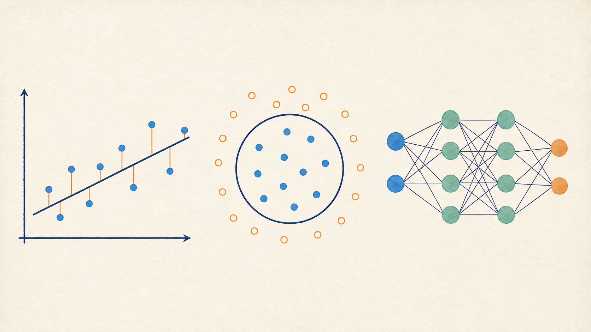

# 课程总览

这套教程按三个可运行项目展开。新概念只在代码需要它时出现：先建立最小训练循环，再处理图像的空间结构，最后实现自回归文本模型。

第一块从一条直线开始。用 $y=ax+b$ 拟合数据时，模型、参数、loss、梯度和学习率会落到同一个短循环里。圆形分类接着引入非线性、交叉熵、batch、epoch 和反向传播；随后把这些代码拆成小型深度学习库，并用 MLP 完成带验证集的 MNIST 实验。

先顺着 [$y=ax+b$! 神经网络到底是什么?](./01-基础知识.md)读完概念主线，再按需要进入实现页：

1. [线性回归](../exercises/block_01_basics/task_00_linear_regression/README.md)
2. [圆形分类 MLP](../exercises/block_01_basics/task_01_circle_classifier/README.md)
3. [小型深度学习库](../exercises/block_01_basics/task_02_mini_dl_lib/README.md)
4. [MNIST MLP](../exercises/block_01_basics/task_03_mnist_mlp/README.md)

第二块处理 CIFAR-100 彩色图片。像素的邻接关系不能像 MNIST MLP 那样在一开始就被抹平，因此这一块依次实现数据布局与增强、卷积和 im2col、池化、BatchNorm、残差块，再把它们接成可训练、可验证、可保存的 NumPy ResNet。

先顺着 [这是哪一种物体？从 MLP 走到 ResNet](./02-ResNet图像分类.md)读完概念主线，再查看各层的实现细节：

1. [图像数据管线](../exercises/block_02_resnet/task_10_image_data_pipeline/README.md)
2. [Conv2D 与 im2col](../exercises/block_02_resnet/task_11_conv2d_im2col/README.md)
3. [池化与 BatchNorm](../exercises/block_02_resnet/task_12_pooling_and_bn/README.md)
4. [残差块](../exercises/block_02_resnet/task_13_residual_block/README.md)
5. [NumPy ResNet 训练](../exercises/block_02_resnet/task_14_numpy_resnet_train/README.md)
6. [实验记录](../exercises/block_02_resnet/task_15_experiment_notes/README.md)

第三块进入自回归文本生成。内容从 scaled dot-product attention 和位置编码开始，随后加入 causal mask、RoPE、GQA、RMSNorm 与 SwiGLU，组成小型 decoder-only 模型。最后三节分别讲 next-token 训练、采样生成和逐层 KV Cache。

先顺着 [`apple is __`：从上下文预测下一个 token](./03-Transformer与MiniMind.md)读完模型主线，再进入各组件：

1. [Attention Is All You Need 到 MiniMind](../exercises/block_03_transformer/task_20_transformer_theory/README.md)
2. [Sinusoidal Position Encoding](../exercises/block_03_transformer/task_21_sinusoidal_position/README.md)
3. [RoPE 位置编码](../exercises/block_03_transformer/task_22_rope_position/README.md)
4. [Causal Attention 与 GQA](../exercises/block_03_transformer/task_23_causal_attention/README.md)
5. [SwiGLU 前馈网络](../exercises/block_03_transformer/task_24_swiglu_ffn/README.md)
6. [Embedding 与 LM Head](../exercises/block_03_transformer/task_25_embedding_lm_head/README.md)
7. [Decoder Block 叠加](../exercises/block_03_transformer/task_26_decoder_blocks/README.md)
8. [MiniMind Core](../exercises/block_03_transformer/task_27_minimind_core/README.md)
9. [Next-token 训练](../exercises/block_03_transformer/task_28_next_token_training/README.md)
10. [Generate 与采样](../exercises/block_03_transformer/task_29_generate_sampling/README.md)
11. [KV Cache](../exercises/block_03_transformer/task_30_kv_cache/README.md)

三块内容都沿着四条线索组织：输入输出的 shape、反向梯度的去向、训练与评估状态的差异，以及最小测试所能排除的错误。各节的运行与核对命令与这四条线索对应。
