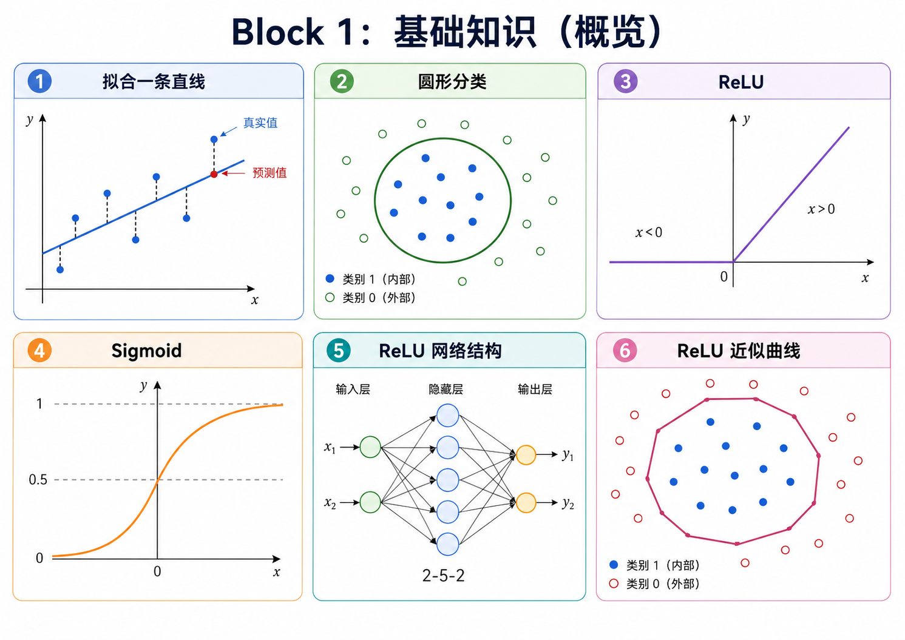
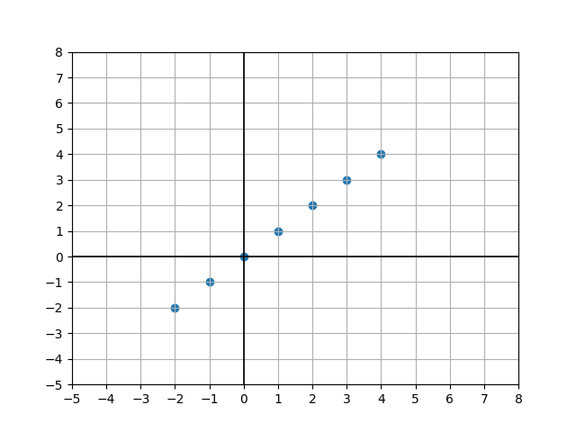
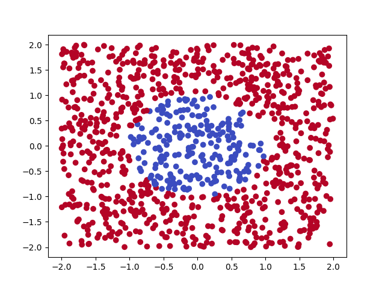
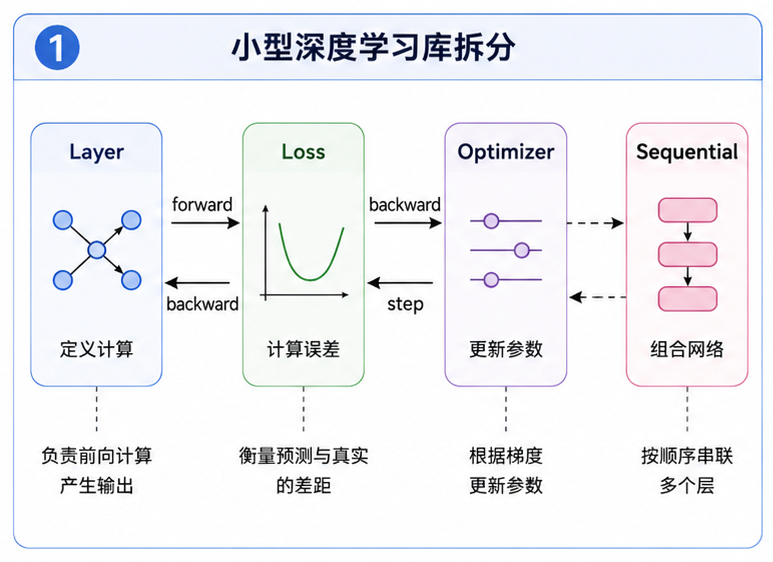
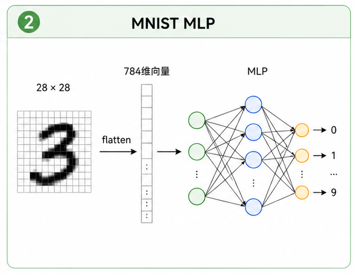

# y = ax + b! 神经网络到底是什么?

什么是神经网络? 你可以先把它理解成一个很复杂的函数, 记作 $f$。我们把输入 $x$ 塞进去, 得到输出 $y=f(x)$。这里的 $x$ 和 $y$ 不一定是单个数字, 更多时候是一整个 tensor: 图像识别里, $x$ 是图片, $y$ 是图片里的内容; 文本生成里, $x$ 是你输入的一段话, $y$ 是模型接下来写出的文字。

这个说法当然有点粗糙, 但够用了。刚开始学深度学习, 最怕一上来就被一堆结构名词淹没。我们先从最小的任务开始, 看看一个模型到底怎么从数据里学出东西。



---

## 任务一: 拟合一条直线



这是一个坐标系, 上面有一些点。你要让电脑告诉你, 当 $x=5$ 时, $y$ 大概是多少。人看一眼就知道这些点差不多落在一条直线上, 但电脑不会“看一眼就懂”。它需要一个可以调整的表达式。

既然这些点分布在一条线上, 那描述这条线的函数大概长这样:

$$y = ax + b$$

这就是你的第一个模型。只要找到合适的 $a$ 和 $b$, 问题就解决了。接下来你要做的不是凭感觉猜参数, 而是让电脑自己试着把参数往更好的方向改。为了知道“好不好”, 你需要一个损失函数, 比如均方误差 MSE:

$$L(a, b) = \frac{1}{n} \sum_{i=1}^{n} (y_i - (ax_i + b))^2$$

Loss 像一把尺子, 衡量模型预测得有多烂。然后你计算 loss 对 $a$ 和 $b$ 的偏导数, 沿着梯度的反方向更新参数:

$$
a \leftarrow a - \eta \frac{\partial L}{\partial a}, \quad
b \leftarrow b - \eta \frac{\partial L}{\partial b}
$$

这里的 $\eta$ 就是学习率。它决定每次往下走多大一步。太小, 学得慢; 太大, 可能直接越过谷底甚至发散。做到这一步, 你已经碰到了深度学习里最常见的几个词: 模型、参数、loss、梯度、学习率、训练。

这一关的完整说明在 [task_00_linear_regression](../exercises/block_01_basics/task_00_linear_regression/README.md)。先别急着把它看成“作业”, 它其实是在让你亲手写出训练循环最小的一版:

```text
初始化参数 -> 前向计算 -> 计算 loss -> 计算梯度 -> 更新参数 -> 重复
```

后面所有模型, 不管名字多吓人, 都绕不开这条线。

---

## 任务二: 使用神经网络预测点在圆形内还是圆形外

第一个任务里, 你让电脑学会了画一条最合适的线。现在问题变成: 给定一个平面上的点 $(x,y)$, 让模型判断这个点是在圆内还是圆外。



如果还用 $ax+by+c$ 这种线性模型, 它最多只能画出一条直线。圆的边界是曲线, 所以不管你怎么调 $a,b,c$, 它都画不出圆。这个失败很重要, 因为它逼着你引入非线性。

做法也不神秘。我们让输入先经过一层线性变换, 再经过 ReLU 这种激活函数:

$$\mathrm{ReLU}(x)=\max(0,x)$$

线性层负责把输入重新组合, ReLU 负责把空间折一下。多折几次以后, 原来只能画直线的模型, 就可以拼出接近圆形的分类边界。输出层给出两个 logits, 再用 softmax 变成概率:

$$\mathrm{softmax}(z_i)=\frac{e^{z_i}}{\sum_j e^{z_j}}$$

分类任务的 loss 用交叉熵。它比 MSE 更适合衡量“模型对正确类别有多自信”。如果真实类别是 one-hot 向量 $\mathbf{y}$, softmax 概率是 $\mathbf{p}$, 那么多分类交叉熵是:

$$L=-\sum_k y_k\log(p_k)$$

这一关还会第一次认真讲 batch 和 epoch。数据量变大以后, 每次用全部样本算梯度太慢, 每次只用一个样本又太抖, 所以我们把数据切成一小批一小批训练。训练集完整看完一遍, 就叫一个 epoch。训练完以后只看训练集准确率也不够, 因为模型可能只是把见过的数据背下来了, 所以还要留出测试集观察泛化能力。

完整任务在 [task_01_circle_classifier](../exercises/block_01_basics/task_01_circle_classifier/README.md)。这里会把 MLP 的矩阵形状、softmax + CE 的梯度、ReLU 的反向传播、batch 训练和 train/test 划分都讲清楚。读的时候建议你一直盯着 shape, 比如:

```text
X:          (batch, 2)
W1:         (2, hidden)
H1:         (batch, hidden)
logits:     (batch, 2)
targets:    (batch, 2)
```

只要 shape 不糊, 反向传播就没那么可怕。

---

## 任务三: 完善你的深度学习库

做完圆形分类以后, 你大概率已经有了一个能跑的 MLP。loss 会下降, 边界也能画出来, 但代码可能已经开始不太好看了: 参数初始化、前向传播、ReLU、softmax、交叉熵、反向传播、参数更新, 全挤在一个类里。

这不是不能用。只是后面你会很难改。比如你想把 ReLU 换成 GELU, 把 SGD 换成 Momentum, 多加一层隐藏层, 或者把圆形分类换成 MNIST, 如果每次都要钻进一大坨 forward 和 backward 里手动改, 很快就会乱。

所以第三关不是换一个更难的数据集, 而是先收拾工具。你要把模型拆成 Layer、Loss、Optimizer 和 Sequential。Linear 只关心 $XW+b$ 以及自己的梯度; ReLU 只关心小于 0 的位置不传梯度; Loss 只关心预测和标签差多少; Optimizer 只关心怎么用梯度更新参数。

拆开以后, 模型结构可以写得像这样:

```python
model = Sequential(
    Linear(2, 16),
    ReLU(),
    Linear(16, 16),
    ReLU(),
    Linear(16, 2),
)
```

这一节还会讲一串训练时绕不开的东西: SiLU/GELU、Momentum、Adagrad、RMSProp、Adam、AdamW、BatchNorm、LayerNorm、Dropout、L2 正则化和 Kaiming 初始化。它们不是为了显得高级, 而是在回答训练里常见的问题: 为什么 loss 下降很慢, 为什么梯度抖得厉害, 为什么训练集很好测试集很差, 为什么同样学习率今天能收敛明天就发散。

完整任务在 [task_02_mini_dl_lib](../exercises/block_01_basics/task_02_mini_dl_lib/README.md)。这一关不用急着复刻 PyTorch, 先把小库的骨架搭出来, 让训练循环从“一坨脚本”变成清楚的模块组合。



---

## 任务四: 用 MLP 识别 MNIST

到这里, 你已经会处理二维点了。但真实图片不是两个数字。一张 MNIST 手写数字图片是 $28\times 28$ 个像素, 展平成向量以后就是 784 个输入。

我们先不急着上卷积神经网络, 让 MLP 硬吃这个任务:

$$28 \times 28 \rightarrow 784 \rightarrow 128 \rightarrow 10$$

它当然能学到一些东西。MNIST 足够干净, 数字也足够规整, MLP 往往能得到还不错的准确率。但你也会发现一个问题: flatten 之后, 图片的空间结构没了。左边和右边、上面和下面、相邻笔画之间的关系, 都被压成了一串普通数字, 模型只能从头自己猜这些位置关系。

完整任务在 [task_03_mnist_mlp](../exercises/block_01_basics/task_03_mnist_mlp/README.md)。这一关不是为了证明 MLP 很适合图片, 恰恰相反, 它是为了让你亲眼看到 MLP 处理图片时哪里吃亏。下一章的 CNN 和 ResNet, 就是从这个别扭感里长出来的。



---

Block 1 做完以后, 你不只是跑通了几个脚本。你应该能把一个训练循环拆开来看: forward 负责产生预测, loss 负责衡量差距, backward 负责把差距变成梯度, optimizer 负责更新参数。参数不是玄学, 它们就是一堆会被训练出来的数字; 激活函数不是装饰, 它让模型能表达非线性; batch 也不是随便设的超参数, 它是在速度和稳定之间折中。

如果这些东西已经能在你脑子里连起来, 后面看 ResNet、Transformer、MiniMind 时就不会只是在背结构图了。
