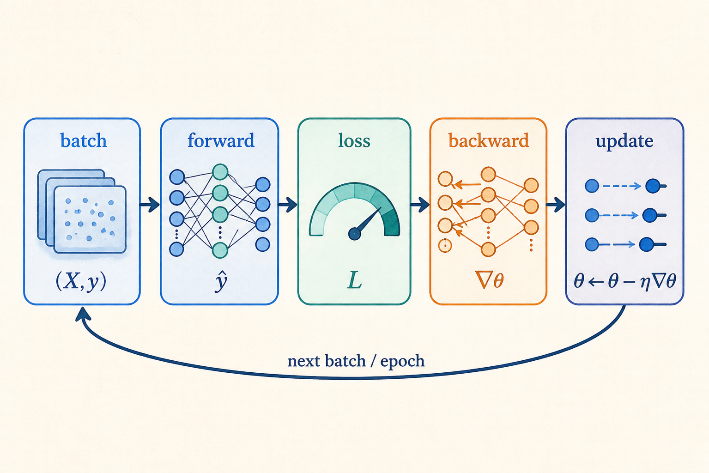
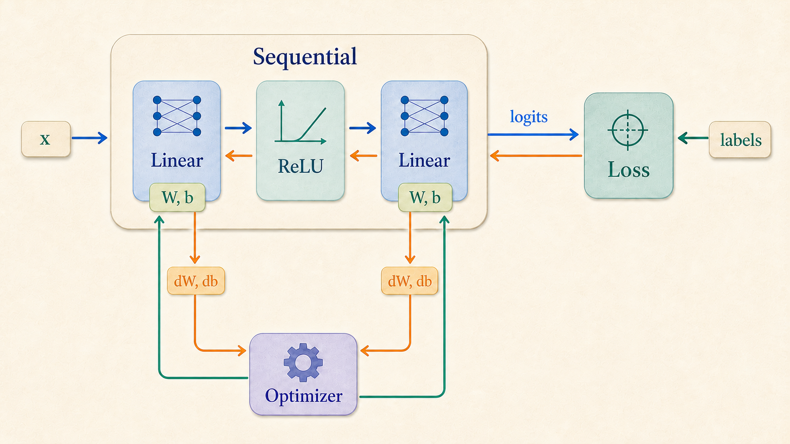
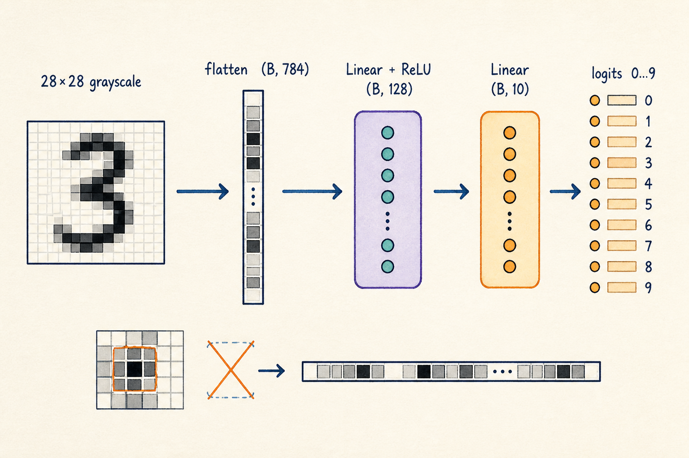

# $y=ax+b$：从一条直线开始

神经网络可以先被看成一个很普通的东西：带参数的函数。

$$
y=f(x;\theta)
$$

$x$ 是输入，$y$ 是输出，$\theta$ 是函数里可以调整的数字。图像分类、文本生成听起来离这句话很远，但训练时做的事并没有变：先得到预测，再衡量预测错了多少，最后调整参数，让下一次少错一点。

一上来讨论几百万个参数不太容易形成直觉。不如从两个参数开始。


---

## 先让电脑找到一条线


散点大致排成一条直线。人看一眼就能猜出趋势，程序却只拿到两列数字。要让它预测一个没见过的 $x$，第一步是先规定答案长什么样：

$$
\hat y=ax+b
$$

这里的 $a$ 决定斜率，$b$ 决定整条线向上或向下移动。模型暂时只有这两个参数。

### “哪条线更合适”怎样写成数字

取一个数据点 $(x_i,y_i)$。模型给出的预测是 $\hat y_i=ax_i+b$，两者的差为 $y_i-\hat y_i$。直接把误差相加会让正负值抵消，因此先平方，再对全部样本取平均：

$$
L(a,b)=\frac{1}{n}\sum_{i=1}^{n}\left(y_i-(ax_i+b)\right)^2
$$

这就是均方误差。它把“这条线看起来不太对”变成了一个可以比较的数。比如真实值是 $2$，预测值是 $1.8$，这一点贡献的平方误差就是 $(2-1.8)^2=0.04$。

现在问题从“找一条好线”变成了“找到让 $L(a,b)$ 最小的 $a,b$”。

### 梯度不是额外的魔法

枚举所有 $a,b$ 不现实。更有效的办法是先站在当前参数处，看看 $a$ 或 $b$ 略微增大时，损失往哪个方向变化。这个变化率就是偏导数：

$$
\frac{\partial L}{\partial a}
=-\frac{2}{n}\sum_i x_i(y_i-\hat y_i),
\qquad
\frac{\partial L}{\partial b}
=-\frac{2}{n}\sum_i(y_i-\hat y_i)
$$

导数为正，说明沿参数增大的方向损失在上升；导数为负则相反。于是每次朝负梯度方向移动一小步：

$$
a\leftarrow a-\eta\frac{\partial L}{\partial a},
\qquad
b\leftarrow b-\eta\frac{\partial L}{\partial b}
$$

$\eta$ 是学习率。它不决定方向，只决定一步走多远。太小会走得慢，太大可能越过低点，来回震荡甚至发散。

至此，一个最小训练循环已经出现了：

```text
初始化 a、b
   ↓
前向：计算预测值
   ↓
损失：预测离真实值有多远
   ↓
反向：损失对 a、b 的梯度
   ↓
更新参数，再重复
```



`a` 和 `b` 就是 weight 与 bias 最简单的形态。后面把一个输入扩展为许多输入时，$a$ 会长成权重矩阵 $W$，但这套循环不会变。

[第一节的代码与数值对照](../exercises/block_01_basics/task_00_linear_regression/README.md)还解释了为什么薪资数据先做标准化，以及怎样把标准化空间里的直线换回原始单位。

---

## 一条线为什么画不出一个圆

接下来把输入换成平面坐标 $(x,y)$。半径为 1 的圆内标为 1，圆外标为 0：

$$
\text{label}=\mathbb{1}[x^2+y^2\le 1]
$$


如果仍使用线性模型 $f(x,y)=w_1x+w_2y+b$，再按正负号分类，它的分界线只能是

$$
w_1x+w_2y+b=0.
$$

无论怎样调整三个参数，这条边界仍是一条直线，不可能围住圆心。此时问题不在优化器，也不在训练轮数，而在模型能表示的函数太少。

### 多叠几层线性变换也没有用

把两个线性层接起来：

$$
h=xW_1+b_1,qquad y=hW_2+b_2.
$$

代入后得到

$$
y=x(W_1W_2)+(b_1W_2+b_2),
$$

它仍然只是一次线性变换。要让边界弯起来，两层之间必须出现不能被合并掉的非线性。

### ReLU 把空间折出拐角

$$
\operatorname{ReLU}(z)=\max(0,z)
$$


ReLU 在 $z<0$ 时截断，在 $z>0$ 时保留输入。一个神经元仍只提供一次折转，多个神经元却可以从不同方向切分平面；继续堆叠后，这些分段线性区域能够拼出接近圆形的多边形边界。


这也是“隐藏层”在这里的作用：不是把信息藏起来，而是把原始坐标变换成更容易分类的表示。

---

## 从一个神经元走到 2-4-4-2

先看一条样本 $\mathbf x=[x,y]$。若第一层有 4 个神经元，每个神经元都需要两个输入权重，于是可以把它们排成一个 $2\times4$ 的矩阵：

$$
W_1=
\begin{bmatrix}
w_{11}&w_{12}&w_{13}&w_{14}\\
w_{21}&w_{22}&w_{23}&w_{24}
\end{bmatrix},
\qquad
\mathbf z_1=\mathbf xW_1+b_1.
$$

$W_1$ 的一列就是一个神经元的权重。一次矩阵乘法同时算出 4 个神经元：

```text
(1, 2) @ (2, 4) + (1, 4) -> (1, 4)
```

把一条样本换成 $m$ 条，只是把输入行数变成 $m$：

```text
X:       (m, 2)
W1:      (2, 4)
H1:      (m, 4)
W2:      (4, 4)
H2:      (m, 4)
W3:      (4, 2)
logits:  (m, 2)
```

前向传播因此写成：

$$
\begin{aligned}
Z_1&=XW_1+b_1,&H_1&=\operatorname{ReLU}(Z_1),\\
Z_2&=H_1W_2+b_2,&H_2&=\operatorname{ReLU}(Z_2),\\
\text{logits}&=H_2W_3+b_3.
\end{aligned}
$$

权重 shape 始终是 `(in_dim, out_dim)`。顺着相邻维度是否能消去，很多矩阵错误在运行前就能被看出来。

### logit 还不是概率

输出的两个数只是“圆外”和“圆内”的分数，可以是任意实数。softmax 把它们变成和为 1 的概率：

$$
p_k=\frac{e^{z_k}}{\sum_j e^{z_j}}.
$$

例如 logits 为 $[2,1]$ 时，概率约为 $[0.731,0.269]$。如果真实类别是第二类，交叉熵只关心正确类别的概率：

$$
L=-\log(0.269)\approx1.313.
$$

若模型把第二类概率提高到 $0.9$，损失会降到 $-\log(0.9)\approx0.105$。这比一句“交叉熵适合分类”更具体：它在惩罚模型没有把概率放到正确类别上。

实际实现会先减去每行最大 logit，再计算指数，避免数值溢出。

### 反向传播只是把局部导数接起来

对线性层 $Z=XW+b$，收到上游梯度 $\mathrm dZ$ 后：

$$
\mathrm dW=X^\top\mathrm dZ,
\qquad
\mathrm db=\sum_{i=1}^{m}\mathrm dZ_i,
\qquad
\mathrm dX=\mathrm dZ,W^\top.
$$

ReLU 则只让前向时大于 0 的位置通过梯度：

$$
\mathrm dZ=\mathrm dH\odot\mathbb{1}[Z>0].
$$

softmax 与交叉熵合在一起后，最后一层的梯度恰好化成

$$
\mathrm d\text{logits}=\frac{P-Y}{m}.
$$

从这里开始，梯度依次穿过输出层、第二个 ReLU、第二个线性层、第一个 ReLU和第一个线性层。所谓“反向”只是计算顺序和前向相反；每一层只处理自己的局部公式。

[圆形分类的完整说明](../exercises/block_01_basics/task_01_circle_classifier/README.md)把每一步梯度及其 shape 展开到了参数级别。

---

## batch、epoch 和验证集为什么会一起出现

只有几个点时，可以每次用全部数据计算梯度。数据变成几千条后，常见折中是一次取一小批样本：

- `batch_size=20`：每次用 20 条样本的平均梯度更新一次；
- 800 条训练数据完整走一遍：1 个 epoch，共 40 次更新；
- 下一轮开始前打乱训练顺序，避免批次一直由同一组样本组成。

训练准确率只能说明模型对参与更新的数据表现如何。验证集不进入 `backward()`，它用于观察模型在另一组数据上是否仍然有效。训练指标继续变好而验证指标变差时，模型很可能开始记住训练样本的细节。

圆形数据因此不是简单地“前 800 条训练、后 200 条验证”。代码先按类别分层划分，再检查两组坐标没有交集、标签都满足半径条件。否则验证数字看似漂亮，也可能只是数据泄漏。

---

## 为什么还要拆一个小型深度学习库

圆形分类可以把所有公式写在一个 `Model` 类里，但网络一变，forward、backward 和参数更新就会缠在一起。更自然的拆法是让每个部件只负责一件事：

- `Linear`、`ReLU` 保存自己的前向缓存，并计算局部反向传播；
- `Sequential` 正序调用层，反向时逆序调用；
- `CrossEntropyLoss` 从预测和标签产生损失与末端梯度；
- `SGD`、`Momentum` 只读取参数和梯度，不负责求导。



于是模型结构可以直接读出来：

```python
model = Sequential(
    Linear(2, 16),
    ReLU(),
    Linear(16, 16),
    ReLU(),
    Linear(16, 2),
)
```

新的工具也在遇到具体问题时再出现：

- ReLU 神经元长期停在负半轴时，SiLU、GELU 提供平滑的负区梯度；
- SGD 在狭长谷底来回摆动时，Momentum 记住一部分历史方向；
- 深层激活尺度漂移时，BatchNorm 或 LayerNorm 把统计量拉回可控范围；
- 训练集很好、验证集变差时，Dropout 和 weight decay 提供正则化；
- 层数增加后，Xavier、Kaiming 初始化帮助信号保持合适尺度。

这些组件的公式、train/eval 差异和接口见[小型深度学习库](../exercises/block_01_basics/task_02_mini_dl_lib/README.md)。

---

## 把同一套训练循环搬到 MNIST

MNIST 的一张图是 $28\times28$ 灰度矩阵。先把它展开成 784 维向量，再接一个隐藏层和 10 类输出：

$$
(B,28,28)\rightarrow(B,784)\rightarrow(B,128)\rightarrow(B,10).
$$



模型变大了，训练循环没有变化：forward 得到 10 个 logits，交叉熵产生损失，backward 计算梯度，优化器更新参数。验证集仍然只做前向计算。

真正的新问题出现在输入上。flatten 把图片变成一长排数字后，原本相邻的像素不再以二维结构出现；同一条边缘移动几个像素，也需要另一组权重重新学习。MLP 能识别 MNIST，却没有专门利用图像的局部性和平移结构。

这正是下一章引入卷积的理由，而不是因为“图像任务就应该用 CNN”。

[MNIST MLP 的数据划分与运行结果](../exercises/block_01_basics/task_03_mnist_mlp/README.md)
