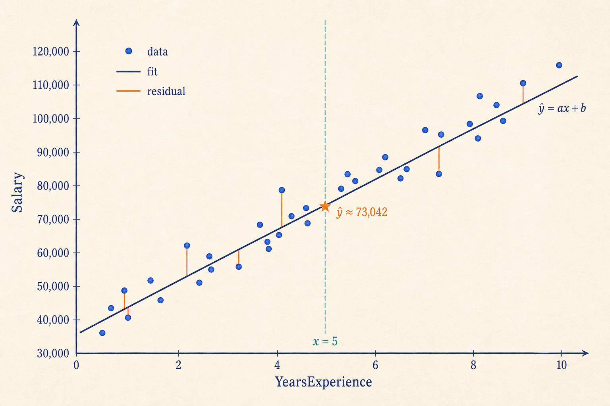
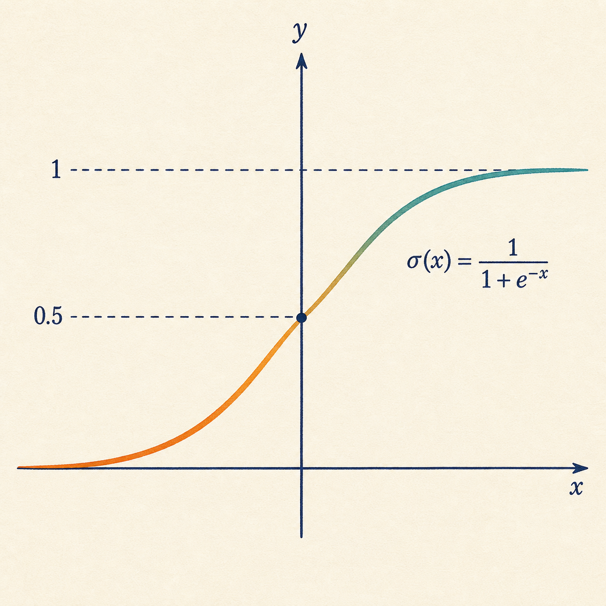

# y = ax + b! 神经网络到底是什么?

什么是神经网络？神经网络其实就是一个非常复杂的函数，我们把它叫做 $f$。我们有一个输入 $x$（$x$ 和 $y$ 通常不是单个数字，而是一个 tensor，[什么是 tensor（张量）?](https://www.bilibili.com/video/BV19C411G7Zw/?share_source=copy_web)），把 $x$ 塞进神经网络，就能得到输出 $y=f(x)$。这里的 $x$ 和 $y$ 可以是几乎任何有关联的事物：图像识别任务里，$x$ 是一张图片，$y$ 是图片的内容；ChatGPT 里，$x$ 是你的 prompt 和问题，$y$ 是它的回答。那神经网络是怎么完成这些复杂任务的？

一上来可能难以理解，让我们从最简单的任务开始。

## 任务一：拟合一条直线

这是一个坐标系，横轴是工作年限，纵轴是薪资。你要让电脑告诉你：当 $x=5$ 时，$y$ 大约是多少。

### 一. 如何让电脑看见线?

这个问题看起来很简单，你一眼就能看出工作年限越长、薪资通常越高。但具体斜率和截距是多少，电脑要怎么知道？既然这些点大致分布在一条线上，描述这条线的函数可以先写成：

$$y = ax + b$$

这便是你的模型。只要找到最合适的 $a$ 和 $b$，问题就解决了。

### 二. 如何衡量最合适?

一个自然的想法是把所有可能的 $a$ 和 $b$ 都试一遍，看哪条线离已知的点最近。但"远近"该如何衡量？对每个已知点 $(x_i, y_i)$，先让模型给出预测 $\hat{y}_i = ax_i + b$，它与真实值的差距是 $e_i = y_i - \hat{y}_i$。直接把差距加起来不行——正负误差会互相抵消，所以取平方 $e_i^2$；再把所有点的误差平方求和取平均，就得到了均方误差（Mean Squared Error, MSE）：

$$L(a, b) = \frac{1}{n} \sum_{i=1}^{n} (y_i - (ax_i + b))^2$$

> 恭喜你发明了损失函数（Loss Function）！
> 在这个任务中，Loss 就是 MSE。它像一把尺子，衡量了你的模型预测得有多烂。你的目标就是最小化这个 Loss，让预测尽可能接近真实值。

### 三. 如何高效地找到最优参数?

遍历所有 $a$ 和 $b$ 显然不现实。你想到：如果随机猜了一组 $(a,b)$，算出 Loss 之后，能不能**有方向**地去调整？如果增大 $a$ 会让 Loss 变大，那就应该减小 $a$；如果增大 $b$ 会让 Loss 变小，那就继续增大 $b$。

这就像站在一个山谷里，想以最快的速度走到谷底：环顾四周，找到最陡的下坡方向，迈出一步。那一次调整多少呢？0.001？0.01？0.1？你决定先试试 0.01——但是直接这样加减，不是很容易走过头吗？于是你决定，每次调整的幅度应该和当前位置的坡度成正比，这样就能更快更准地接近最优解。这个最陡的下坡方向，不就是高数课上学的梯度吗？梯度的绝对值大，说明 Loss 对这个参数很敏感，应该多调一些；绝对值小，说明不敏感，应该少调一些。

于是你算出 Loss 分别对 $a$ 和 $b$ 的偏导数，沿着梯度的反方向更新参数：

$$
a \leftarrow a - \eta \, \frac{\partial L}{\partial a}, \quad
b \leftarrow b - \eta \, \frac{\partial L}{\partial b}
$$

> 恭喜你发明了梯度下降和学习率！
> - 梯度下降（Gradient Descent）：一种优化算法，通过计算 Loss 的梯度来指导参数更新的方向。
> - 学习率（Learning Rate，记为 $\eta$）：决定每次更新的步长，控制模型学习的速度。

### 四. 动手实现

现在你已经拥有完成任务所需的全部理论。整理一下，训练一个模型的完整步骤是：

1. 初始化参数：随机选择 $a$ 和 $b$ 的初始值。
2. 前向传播：用当前的 $a$ 和 $b$ 计算所有点的预测值 $\hat{y}$。
3. 计算损失：计算 $\hat{y}$ 和真实值 $y$ 之间的 MSE。
4. 计算梯度：计算损失函数关于 $a$ 和 $b$ 的偏导数。
5. 更新参数：用梯度下降更新 $a$ 和 $b$。
6. 重复步骤 2 到 5，直到达到预定迭代次数或损失不再显著下降。
7. 预测：用训练好的模型计算 $x=5$ 时的 $y$。

深度学习的本质，就是用梯度下降找到最合适的参数组合，让模型在训练数据上表现最好——这个过程就是模型的训练。当前仓库的代码入口是[线性回归 `starter.py`](../exercises/block_01_basics/task_00_linear_regression/README.md)，其中还处理了薪资数据的标准化与单位还原。把数据换成其他散点（例如从 $(-2,-4.4)$ 到 $(4,2.2)$ 的一条带噪声直线），同一套循环会拟合出新的 $a$ 和 $b$。

> 这里的 $a$ 和 $b$ 就是神经网络的参数（parameters）——权重（weight）与偏置（bias）的最简单形态。更复杂的神经网络不再是单个 $a$、$b$，而是一组组权重矩阵 $W$ 和偏置向量 $b$；训练本质上就是用数据自动找到这些参数的取值，让损失最小。现代大模型拥有数十亿（B）到上万亿（T）个参数，本质上与这里的 $a$、$b$ 相同，只是规模更大。

## 任务二：预测点在圆形内还是圆形外

第一个任务里，你让电脑学会了画一条最合适的线。但现在的任务没那么容易了：给定平面上的一个点 $(x,y)$，让电脑判断它在半径为 1 的圆内还是圆外。想象在纸上画一个圆，往上撒一把点，圆内的标 1、圆外的标 0，你要让电脑自动判断每个点的归属。

看起来像图形分类，对吧？那先试试上次的思路。

### 一. 为什么线性模型不行了?

任务一用了线性函数 $y = ax + b$，它能画出一条直线。现在类似地写一个 $f(x,y) = ax + by + c$，约定 $f(x,y) > 0$ 就判圆内。看起来挺合理，但问题很快出现：圆的边界是曲线，而这个函数的等值边界永远是直线——无论怎么调 $a,b,c$，它都画不出圆。

### 二. 加一层非线性：激活函数

怎么让边界弯起来？如果输入先经过一个"扭一扭"的函数，再进入线性组合，边界就可能出现折角。这个扭一扭的函数就是激活函数（activation function），常见的有三种：

- **ReLU**（Rectified Linear Unit）：$\mathrm{ReLU}(x) = \max(0, x)$。它把负数统统变成 0，正数原样保留，因此能让模型产生折线效果。

  

- **Sigmoid**：$\sigma(x) = \frac{1}{1 + e^{-x}}$。它把任意输入压到 $(0,1)$ 之间，常用于二分类输出或门控。

  

- **Softmax**：$\mathrm{softmax}(z_i) = \frac{e^{z_i}}{\sum_{j} e^{z_j}}$。它把一组数变成和为 1 的概率分布，通常用于多分类输出。

一句话总结它们的分工：ReLU 让模型能学出弯曲的边界，Sigmoid 把输出变成"是/否"的概率，Softmax 把输出变成多类别的概率分布。

把一个线性层和 ReLU 组合起来会发生什么？下面是一个单隐藏层、5 个神经元的小网络：

让我们把一个线性函数和 ReLU 结合起来，看看会发生什么——这是一个有一层隐藏层、5 个神经元的简单网络。输出已经不再是直线，而是带折角的曲线。照这个思路，如果隐藏层神经元足够多、层数足够深，折线越来越密，是不是就能逼近圆形边界了？

### 三. 交叉熵：分类任务怎样算损失

分类任务里，模型最终要输出"点在圆内的概率"。线性层给出的是任意实数 logits，概率却必须落在 $[0,1]$，所以还缺两样东西：一个把 logits 变成概率的函数（Sigmoid 或 Softmax），以及一个衡量概率预测好坏的损失函数。

为什么不用任务一的 MSE？MSE 并非不能训练分类器，但它与 Sigmoid/Softmax 组合后，在高置信度区域的梯度容易变得很小，训练拖沓；交叉熵直接惩罚正确类别的对数概率，与分类输出的概率含义更一致。

二分类交叉熵（BCE，单样本）的定义是：

$$L = -\big[y\log(\hat{y}) + (1-y)\log(1-\hat{y})\big]$$

其中 $y\in\{0,1\}$ 是真实标签，$\hat{y}$ 是模型给出的圆内概率。把不同的预测值代入公式，可以体会 BCE 怎样衡量预测的好坏：

| 真实值 $y$ | 预测值 $\hat{y}$ | BCE 损失 $L$ |
| -------- | ---------------- | ---------- |
| 1        | 0.9              | 0.1054     |
| 1        | 0.6              | 0.5108     |
| 0        | 0.4              | 0.5108     |
| 0        | 0.1              | 0.1054     |

预测越贴近真实标签，损失越小；预测错误还自信（比如 $y=1$ 而 $\hat{y}=0.1$），惩罚会急剧放大。

用本任务的具体数字走一遍。你的最后一层输出了一个 logit 值 $z$——让我们假定它是 2.0 吧！先用 Sigmoid 把它变成概率：

$$\hat{y} = \sigma(z) = \frac{1}{1 + e^{-2.0}} \approx 0.8808$$

这个点实际在圆内，所以真实标签 $y=1$，代入 BCE：

$$
\begin{aligned}
L&=-\big[1\cdot\log(0.8808)+(1-1)\cdot\log(1-0.8808)\big]\\
 &=-\log(0.8808)\approx0.1269
\end{aligned}
$$

看着复杂，仔细一想却很符合直觉：模型有 88% 的把握押对了方向，损失就只有约 0.127——BCE 在数值上正是"模型对正确答案的置信度"。

多分类交叉熵（CE）是同一思想的推广：

$$L = -\sum_k y_k\log(p_k)$$

其中 $\mathbf{p} = \mathrm{softmax}(\mathbf{z})$，$\mathbf{y}$ 为 one-hot 编码（[什么是 one-hot？](https://zhuanlan.zhihu.com/p/634296763)）。本任务是二分类，用不到多类，但后面的 MNIST 和 CIFAR-100 都是多分类，值得用一个三分类的例子先走一遍：设模型输出 logits $\mathbf{z} = [2.0, 1.0, 0.1]$，softmax 把它变成概率分布——

$$p_0 = \frac{e^{2.0}}{e^{2.0} + e^{1.0} + e^{0.1}} \approx 0.6590,\qquad
p_1 \approx 0.2424,\qquad
p_2 \approx 0.0986$$

真实标签是类别 1，one-hot 编码为 $\mathbf{y} = [0, 1, 0]$，于是：

$$
\begin{aligned}
L&=-\big[0\cdot\log(0.6590)+1\cdot\log(0.2424)+0\cdot\log(0.0986)\big]\\
 &=-\log(0.2424)\approx1.4170
\end{aligned}
$$

one-hot 的作用在这里看得很清楚：除了正确类别那一项，其余全是 0，损失就等于正确类别概率的负对数——模型押对且自信，损失小；押错或犹豫，损失大。

从 logits 变成概率有两条常见路径：单输出走 Sigmoid + BCE，多输出走 Softmax + CE。二分类两种写法都行，本质等价，只是表达不同。本课程统一采用"2 维 logits + Softmax + CE"：它把二分类看成两类的多分类，之后扩展到 MNIST 的 10 类、CIFAR-100 的 100 类都不用改结构，只需把输出层加宽。

实现上还有一个数值细节：softmax 里 $e^{z}$ 很容易溢出，标准做法是先减去每行最大值再取指数（本仓库 mini 库的 `CrossEntropyLoss` 就是这么写的）；PyTorch 的 `CrossEntropyLoss` 和 `BCEWithLogitsLoss` 则把 softmax/sigmoid 连同稳定项一起收进损失内部，接受裸 logits 作为输入。

### 四. 用矩阵写多层感知机

既然一条"线"画不出圆，那就让多条线先各自处理输入，再把结果组合起来。最简单的两层网络是：输入层接收 $(x, y)$；隐藏层第 $i$ 个神经元计算 $z_i = \mathrm{ReLU}(w_{1i}\,x + w_{2i}\,y + b_i)$；输出层把隐藏单元的结果线性组合成 2 维 logits，再经 softmax 得到概率。手写每个神经元既笨又容易出错，更推荐矩阵化的表达。

设一个 batch 有 $m$ 个样本，输入 $\mathbf{X} \in \mathbb{R}^{m\times 2}$，隐藏层宽度为 $h$。第一层参数是 $\mathbf{W}_1 \in \mathbb{R}^{2\times h}$、$\mathbf{b}_1 \in \mathbb{R}^{1\times h}$，前向计算为：

$$\mathbf{Z}_1 = \mathbf{X}\,\mathbf{W}_1 + \mathbf{b}_1\;(m\times h), \qquad \mathbf{H}_1 = \mathrm{ReLU}(\mathbf{Z}_1)$$

输出层再用 $\mathbf{W}_2 \in \mathbb{R}^{h\times 2}$、$\mathbf{b}_2 \in \mathbb{R}^{1\times 2}$ 把它变成 logits：

$$\mathrm{logits} = \mathbf{H}_1\,\mathbf{W}_2 + \mathbf{b}_2\;(m\times 2), \qquad \hat{\mathbf{y}} = \mathrm{softmax}(\mathrm{logits})$$

一层不够就再叠一层。本任务把结构定为 2-4-4-2：输入是 $(x,y)$，两个隐藏层各做一次"线性 + ReLU"，最后输出 2 维 logits。这就是多层感知机（Multi-Layer Perceptron, MLP）。

权重矩阵到底是什么？把任务一的 $y = ax + b$ 推广到多维输入：输入变成向量后，标量 $a$ 就要"长成"矩阵，才能一次性对所有维度做线性组合。形状规则也随之确定——$\mathbf{W}$ 的形状始终是 $\mathrm{in\_dim} \times \mathrm{out\_dim}$，矩阵乘法把 $(m\times \text{in})$ 变成 $(m\times \text{out})$。而矩阵的每一列，恰好就是一个神经元的权重：$\mathbf{W}_1$ 的第 $i$ 列 $[w_{1i}, w_{2i}]^\top$ 就是隐藏层第 $i$ 个神经元对两个输入特征的加权。

以 2→4 的第一层为例，一条样本 $\mathbf{x}=[x, y]$ 的计算是：

$$
\mathbf{W}_1 = \begin{bmatrix}
 w_{11} & w_{12} & w_{13} & w_{14} \\
 w_{21} & w_{22} & w_{23} & w_{24}
\end{bmatrix},\quad
\mathbf{b}_1 = [b_1, b_2, b_3, b_4],\quad
\mathbf{z} = \mathbf{x}\,\mathbf{W}_1 + \mathbf{b}_1 = [z_1, z_2, z_3, z_4].
$$

随后 $\mathbf{h}=\mathrm{ReLU}(\mathbf{z})$ 进入下一层。多层网络就是把"线性投影 + 非线性"反复堆叠，例如 2→4→4→2，逐层拉伸、折叠输入空间，刻画越来越复杂的决策边界。

### 五. batch、epoch 与验证集

任务一只有 7 个点，全量计算梯度毫无压力。这次有几千个点，要是每次都计算所有点的梯度——假设 10000 个点，每更新一次参数就要算 10000 次——不知道要到什么时候才会收敛。**那我是不是可以对每个点单独计算梯度，然后更新参数？** 可以，这就是 batch size 为 1 的随机梯度下降（SGD）。只是单个样本的梯度噪声很大，更新方向容易来回摆动；而且一次只处理一条数据，矩阵运算的优势也没吃到。

**于是你决定——那我每次只用一小部分点更新参数不就行了？** 比如 1000 个点每次拿 100 个，算这一小撮的平均梯度再更新。这一小撮就是一个 batch（批次），100 就是 batch_size；1000 个点分 10 个 batch 走完一遍，叫一个 epoch（轮次）。训练 100 个 epoch，就是把数据看了 100 遍。

训练到一半，你想知道模型学得怎么样。看 loss 可以，但更直观的是准确率（accuracy）：1000 个点预测对了 850 个，准确率就是 85%。不过有个问题——训练集的准确率说明的是"模型对参与更新的数据记得多熟"，而实际要处理的数据通常不会和训练集完全一致，所以还需要在**没参与更新**的数据上观察模型是否仍然有效。这就需要训练集（train set）和验证集（validation set）：前者用来更新参数，后者只做前向计算。当前实现按类别分层划分 80%/20%，并自动检查两组坐标无交集、标签都符合半径为 1 的条件。

### 六. 完整训练流程

现在，你脑子里的神经网络完整了，训练流程是：

1. 初始化参数：给每个权重和偏置随机赋值（本任务用 He 初始化，偏置为 0）。
2. 前向传播（矩阵形式），两个隐藏层各做一次"线性 + ReLU"：

   $$ \mathbf{z}_1 = \mathbf{X}\,\mathbf{W}_1 + \mathbf{b}_1,\quad \mathbf{h}_1=\mathrm{ReLU}(\mathbf{z}_1),\qquad
   \mathbf{z}_2 = \mathbf{h}_1\,\mathbf{W}_2 + \mathbf{b}_2,\quad \mathbf{h}_2=\mathrm{ReLU}(\mathbf{z}_2) $$

   输出层算 logits，再经 softmax 得到概率：

   $$\mathrm{logits} = \mathbf{h}_2\,\mathbf{W}_3 + \mathbf{b}_3,\qquad \mathbf{p} = \mathrm{softmax}(\mathrm{logits})$$

3. 计算损失：交叉熵 CE，对 batch 取均值。
4. 反向传播：计算损失对每个参数的梯度（下一节展开）。
5. 参数更新：

   $$ \mathbf{W} \leftarrow \mathbf{W} - \eta\, \mathrm{d}\mathbf{W},\qquad \mathbf{b} \leftarrow \mathbf{b} - \eta\, \mathrm{d}\mathbf{b} $$

6. 对每个 batch 重复以上步骤，一轮结束再开始下一个 epoch。
7. 预测：输入一个新点，看 softmax 输出哪个类别概率更大。

### 七. 反向传播：梯度怎么逐层传回去

前面一直说"计算梯度"，但一个四层网络的梯度怎么算？回忆链式法则：

$$
\frac{\partial L}{\partial x} = \frac{\partial L}{\partial y} \cdot \frac{\partial y}{\partial x}
$$

它把复杂函数的导数拆成一串局部导数的乘积。反向传播就是沿着计算图，从输出层往输入层逐层计算梯度，每一层只做同一件事：**当前梯度 = 上游梯度 × 本层局部梯度**。层与层之间不需要知道全局的损失函数长什么样，只要接力传递即可。

接力从输出层开始。softmax + CE 有一个非常优雅的结果：对 logits 的梯度恰好是"预测减真实"：

$$\mathrm{d}\,\mathrm{logits} = (\mathbf{p} - \mathbf{y}_{\text{onehot}}) / m\qquad (m\times 2)$$

它其实是 Sigmoid + BCE 中 $\frac{\partial L}{\partial z} = \hat{y} - y$ 的多分类版本——激活函数与损失函数的导数在链式法则下恰好抵消，只剩残差本身。这也解释了上一节的问题：为什么分类任务配交叉熵而不是 MSE——交叉熵让梯度在模型很错的时候很大、很对的时候很小，MSE 做不到这一点。

有了起点，2-4-4-2 网络的整条梯度流水线就能一路推回去（batch 大小 $m$）。输出层是普通线性层，按 $\mathrm{d}\mathbf{W}_3 = \mathbf{h}_2^\top\,\mathrm{d}\,\mathrm{logits}$（形状 $4\times 2$）、$\mathrm{d}\mathbf{b}_3 = $ 按行求和（$1\times 2$）得到参数梯度，再把梯度传给隐藏层：$\mathrm{d}\mathbf{h}_2 = \mathrm{d}\,\mathrm{logits}\,\mathbf{W}_3^\top$（$m\times 4$）。ReLU 的局部导数是 0/1 掩码，所以 $\mathrm{d}\mathbf{h}_2^{\text{pre}} = \mathrm{d}\mathbf{h}_2 \odot 1[\mathbf{z}_2>0]$；随后又是线性层，$\mathrm{d}\mathbf{W}_2 = \mathbf{h}_1^\top\,\mathrm{d}\mathbf{h}_2^{\text{pre}}$（$4\times 4$）、$\mathrm{d}\mathbf{b}_2$ 按行求和（$1\times 4$），并继续把 $\mathrm{d}\mathbf{h}_1 = \mathrm{d}\mathbf{h}_2^{\text{pre}}\,\mathbf{W}_2^\top$（$m\times 4$）传给第一层。第一层同样过 ReLU 掩码后，得到 $\mathrm{d}\mathbf{W}_1 = \mathbf{X}^\top\,\mathrm{d}\mathbf{h}_1^{\text{pre}}$（$2\times 4$）和 $\mathrm{d}\mathbf{b}_1$（$1\times 4$）。最后按 $\mathbf{W} \leftarrow \mathbf{W} - \eta\,\mathrm{d}\mathbf{W}$ 更新所有参数。

值得停下来看一眼这条流水线的形状规律：参数梯度总是"上游梯度的转置 × 本层输入"（形状自动对齐成参数自己的形状），偏置梯度总是上游梯度按样本维求和，而传给下一层的梯度总是"上游梯度 × 权重的转置"。后面的 mini 库乃至卷积层，都复用这三条规律。

### 八. 结果与代码落点

训练完成后，你的模型会在坐标平面上画出一条漂亮的分界线——它会自动学出一个接近圆形的边界。你从一条直线出发，一步步发明了非线性神经网络（MLP），沿途拿到 batch、epoch、ReLU、Sigmoid、Softmax、Loss、梯度下降这些核心概念。

落到当前实现：输入是点的坐标 $(x,y)$；输出是 softmax 给出的 2 维概率，取 argmax 得到类别 0/1；结构固定 2-4-4-2（两个 ReLU 隐藏层 + 输出层）；损失用 CE，优化用梯度下降。`starter.py` 每次运行都按当前 `condition` 重新生成 CSV，不复用可能过期的标签；训练/验证按类别分层为 800/200，默认 He 初始化、`lr=0.1`、`batch_size=20`、`epochs=1000`，每轮打乱数据；日志同时记录训练与验证的 loss/accuracy，最后在验证点上画出预测类别。可运行代码和预期结果见[圆形分类 `starter.py`](../exercises/block_01_basics/task_01_circle_classifier/README.md)。

---

## 任务三：完善你的深度学习库

前两个任务的模型已经能跑，但收敛速度和效果都还有改进空间。这一节把你的小库补全：激活函数（SiLU/GELU）、优化器（Momentum、Adagrad、RMSProp、Adam、AdamW）、归一化（BatchNorm/LayerNorm）、正则化（Dropout）和参数初始化。

先看四个典型现象，后面每一节都是在解决其中之一：

- 问题 A：损失下降很慢，一段时间后几乎不动；有时一大片神经元都学不到东西。
- 问题 B：损失忽上忽下，对学习率非常敏感，稳不住。
- 问题 C：训练集准确率很高，验证集却很差（过拟合）。
- 问题 D：batch 改小就不稳定，同样的学习率今天能收敛，明天又发抖。

我们从改动最简单、最直观的激活函数开始。

### 一. 激活函数：从 ReLU 到 SiLU/GELU

任务二用了 ReLU。它简单高效，但有两个已知问题。其一是死亡 ReLU：如果一次不恰当的更新之后，某个 ReLU 神经元对所有训练样本的输出都变成了 0，它的梯度就永远是 0，参数从此不再更新——这个神经元相当于"死"了，而且任何隐藏层都可能发生。其二是输出不以零为中心：ReLU 的输出全为非负数，会给后一层引入偏置偏移，影响梯度下降的效率（Sigmoid 也有同样的问题）。

在 ReLU 的基础上，发展出了更平滑的改进版本，其中 SiLU 和 GELU 在现代深度学习中应用最广。**SiLU**（Sigmoid Linear Unit，也叫 Swish）由 Google 提出，是 ReLU 的平滑版本：

$$\mathrm{SiLU}(x) = x \cdot \sigma(x)$$

它把输入 $x$ 与其 Sigmoid 值相乘：远离零的区域行为接近 ReLU（大正数原样通过，大负数被压掉），零附近却是光滑过渡，没有"死区"。**GELU**（Gaussian Error Linear Unit）更进一步，用标准正态分布的累积分布函数 $\Phi(x)$ 做门控：

$$\mathrm{GELU}(x) = x \cdot \Phi(x) \approx \frac{x}{2}\left[1+\tanh\left(\sqrt{\frac{2}{\pi}}\,(x+0.044715x^3)\right)\right]$$

由于直接计算 $\Phi(x)$ 较复杂，实践中用 tanh 近似（更粗糙的估计是 $x\,\sigma(1.702x)$）。GELU 的门控带有概率含义，在 0 附近软过渡，现代 Transformer 广泛使用它。

（[更多激活函数和数学原理](https://zhuanlan.zhihu.com/p/364620596)）

怎么选？ReLU 仍是 MLP/CNN 中简单可靠的基线；GELU 常见于经典 Transformer；现代模型则大量使用 SiLU/SwiGLU（Block 3 会用到）。并不存在对所有网络都最好的激活函数——更换激活时保持其他配置不变，再比较收敛速度和验证指标，否则差异来自哪里都说不清。

### 二. 优化器：从 SGD 到 AdamW

最基础的 mini-batch SGD 更新规则很直接：$\theta \leftarrow \theta - \eta g_t$，其中 $\theta$ 是参数、$\eta$ 是学习率、$g_t$ 是当前批次的平均梯度。它有效，但在地形复杂的损失面上——比如狭长的峡谷——会在两壁之间来回摇摆，迟迟落不到谷底。下面每个优化器都在修补这个问题的一个侧面。

**Momentum（动量）**给更新加上"惯性"。想象小球在山谷里滚动：它不会每一步都完全听从当前梯度，而是保留一部分之前的速度。

$$v_t = \beta v_{t-1} + (1-\beta) g_t,\qquad \theta \leftarrow \theta - \eta v_t$$

动量让更新沿一段时间的平均方向前进，峡谷两壁的来回分量互相抵消，沿谷底方向的分量不断累加，既减少震荡又加速收敛。$\beta$ 控制惯性大小，常取 0.9。

**Adagrad** 的想法是让每个参数拥有自己的学习率：某个方向梯度一直很大，就记下来并逐渐减小那个方向的步长；梯度小就保持较大步长。

$$s_t = s_{t-1} + g_t \odot g_t,\qquad \theta \leftarrow \theta - \eta \frac{g_t}{\sqrt{s_t} + \varepsilon}$$

这种自适应机制在稀疏数据（比如 NLP 的词嵌入）上表现不错，代价是 $s_t$ 只增不减，学习率会一直衰减，训练后期几乎停止更新。

**RMSProp** 修掉了"衰减过快"：不再累加全部历史梯度平方，而是做指数加权平均，只记最近的梯度规模。

$$s_t = \rho s_{t-1} + (1-\rho) g_t \odot g_t,\qquad \theta \leftarrow \theta - \eta \frac{g_t}{\sqrt{s_t} + \varepsilon}$$

既保留了按方向自适应步长，又不会永远背着久远的历史包袱，训练 RNN 时常被使用。

**Adam** 结合了 Momentum 与 RMSProp 的优点：用 $m_t$ 记录梯度的一阶矩（方向趋势），用 $v_t$ 记录二阶矩（各方向的梯度规模），再加上偏置修正抵消初期统计量偏零的影响。

$$m_t = \beta_1 m_{t-1} + (1-\beta_1) g_t,\qquad v_t = \beta_2 v_{t-1} + (1-\beta_2) g_t \odot g_t$$

$$\hat{m}_t = \frac{m_t}{1-\beta_1^t},\qquad \hat{v}_t = \frac{v_t}{1-\beta_2^t},\qquad \theta \leftarrow \theta - \eta \frac{\hat{m}_t}{\sqrt{\hat{v}_t} + \varepsilon}$$

它在训练初期能快速下降，后期又保持稳定收敛，是深度学习里的默认选择。

**AdamW** 修正了 Adam 中权重衰减（weight decay）的接入方式：传统 Adam 把衰减混进梯度更新，AdamW 直接在参数上施加衰减，更符合 L2 正则化的本意。

$$\theta \leftarrow \theta - \eta \frac{\hat{m}_t}{\sqrt{\hat{v}_t} + \varepsilon} - \eta \lambda \theta$$

在 Transformer 系列等大模型训练中，AdamW 通常表现更好，已成为许多框架的默认配置。

（这一节公式密集，可以配合讲解视频[十分钟搞明白 Adam 和 AdamW](https://www.bilibili.com/video/BV1NZ421s75D/?share_source=copy_web&vd_source=4232eb286ab50446fa5cf1c3eb74b04c)理解。）

实践中怎么选？做实验或训练通用模型，Adam/AdamW 是安全高效的选择；要严格复现早期论文或控制理论收敛性质，用 Momentum-SGD；面对稀疏特征（如 NLP 词嵌入），Adagrad 仍然值得一试。

### 三. 归一化：让每层看到的分布稳定下来

训练神经网络时你会发现：同样的学习率、同样的结构，有时非常稳，有时抖得厉害。一个常见原因是各层输入的尺度和分布会随着前面参数的更新而不断变化。BatchNorm 原论文用 Internal Covariate Shift 解释这一点；后续研究表明它的收益不能只归因于"减少分布漂移"，但"稳定数值尺度"仍是理解归一化的直观入口。

一个直观的例子：两个 batch 的数据分别是 `[0.1, 0.2, 0.3, 0.4, 0.5]`（均值 0.3）和 `[0.5, 0.6, 0.7, 0.8, 0.9]`（均值 0.7）。不归一化的话，第一层这次看到范围 $[0.1, 0.5]$ 的输入，下次变成 $[0.5, 0.9]$——模型像在追一个漂移的目标学习，训练自然不稳定。归一化把每个 batch 的输入调整到均值约 0、方差约 1，各层看到的分布就稳定了。

这也直接作用于梯度。深层的梯度是各层局部导数的连乘，若某层输入尺度过大，梯度反传时会指数放大（爆炸）；过小则被压扁到 0 附近（消失）。归一化把每层输出拉回合适的尺度，梯度方差就不易指数级发散；数值受控之后，还能用更大的学习率而不发散，激活值也更容易停留在非饱和区间（例如 Sigmoid 的梯度可用段）。

**Batch Normalization（BN）**在一个 batch 内对每个通道（特征维）做标准化，再让可训练的 $\gamma,\beta$ 重新学习缩放和平移：

$$
\begin{aligned}
\mu_B&=\mathrm{mean}(x),&\sigma_B^2&=\mathrm{var}(x),\\
\hat{x}&=\frac{x-\mu_B}{\sqrt{\sigma_B^2+\varepsilon}},&y&=\gamma\hat{x}+\beta
\end{aligned}
$$

训练时用当前 batch 的统计量，同时以滑动平均累积全局的 $\mu,\sigma^2$ 供推理使用——推理时可能只有一条数据，batch 统计量根本无从谈起。BN 常放在"线性/卷积 → BN → 激活"的位置；它让训练更稳更快，但对 batch 大小敏感，batch 太小时统计量不准。（详细推导可看李沐老师的视频[批量归一化【动手学深度学习v2】](https://www.bilibili.com/video/BV1X44y1r77r/?share_source=copy_web&vd_source=4232eb286ab50446fa5cf1c3eb74b04c)。）

**Layer Normalization（LN）**换成对每个样本自身在特征维上做标准化，与 batch 大小完全无关：

$$
\begin{aligned}
\mu&=\mathrm{mean}_{\text{feature}}(x),&\sigma^2&=\mathrm{var}_{\text{feature}}(x),\\
\hat{x}&=\frac{x-\mu}{\sqrt{\sigma^2+\varepsilon}},&y&=\gamma\hat{x}+\beta
\end{aligned}
$$

两者怎么选，大致由 batch 和结构决定：CNN、大 batch 用 BN；小 batch、MLP、RNN、Transformer 用 LN——这也是 Block 3 的 decoder block 全部使用 Norm 家族而非 BN 的原因。

### 四. 正则化：约束模型别把噪声也背下来

训练集上表现很好、验证集上却很差，就是过拟合（overfitting）：模型把训练数据里的噪声和细节也当成了规律背下来，而不是学到整体趋势。

**Dropout** 的思路简单直接：训练时随机"丢弃"一部分神经元（准确说是置零激活值），让模型无法过度依赖某些特定神经元。举例来说，一层的激活值是 $\mathbf{h}=[h_1,h_2,h_3,h_4]$，dropout 率取 0.25，一次随机遮蔽后可能得到：

$$\mathbf{m}=[1,0,1,1],\qquad
\mathbf{h'}=\frac{\mathbf{m}\odot\mathbf{h}}{1-0.25}.$$

注意置零的是激活值而不是权重——把权重元素随机置零更接近 DropConnect。当前实现采用 inverted dropout：训练时除以保留概率 $1-p$ 维持期望，评估时直接返回原激活不再缩放；backward 复用同一张 mask，被遮蔽位置梯度为 0。

**L2 正则化**（也叫权重衰减，weight decay）从参数侧入手：在损失函数上加一个与权重平方成正比的惩罚项，$L' = L + \lambda \sum_i w_i^2$。以线性回归为例，$L$ 是 MSE，加入正则后模型不仅要拟合数据，还要尽量保持权重较小——而"权重小"的模型通常更平滑，不容易被个别样本带偏。$\lambda$ 是正则强度的超参数。

两者的适用面略有差别：Dropout 多用于大模型、小数据集的场景；L2 是几乎适用于所有模型的通用手段；两者也经常同时使用。

### 五. 参数初始化：训练开始前的隐形胜负手

初始化决定了训练的第一步站在哪里。合适的方法让信号与梯度在层间传播时方差不至于指数放大或衰减，不合适的方法可能开局就是梯度消失或爆炸。对于线性层 $z = xW + b$，希望 $\mathrm{Var}[z]$ 与 $\mathrm{Var}[x]$ 保持同一量级；对 ReLU 一类非线性，负半轴被截断后约有一半方差损失，即 $\mathrm{Var}[\mathrm{ReLU}(z)] \approx \frac{1}{2}\mathrm{Var}[z]$，推导权重方差时要把它补回来。

先定义两个量：**fan_in** 是每个神经元连接的输入数目，**fan_out** 是它输出的数目。对形状为 $(\mathrm{in\_dim} \times \mathrm{out\_dim})$ 的全连接权重，fan_in = in_dim、fan_out = out_dim；卷积层则还要乘上核尺寸，fan_in = in_channels × kernel_h × kernel_w。常用的两种初始化是：

- **Xavier/Glorot**（适合 Sigmoid/Tanh 等对称激活）：$W \sim N\big(0,\ \frac{2}{\text{fan\_in}+\text{fan\_out}}\big)$ 或均匀分布 $U(-\sqrt{6/(\text{fan\_in}+\text{fan\_out})},\ \sqrt{6/(\text{fan\_in}+\text{fan\_out})})$；
- **He/Kaiming**（适合 ReLU/LeakyReLU/GELU 等截断或门控激活）：$W \sim N\big(0,\ \frac{2}{\text{fan\_in}}\big)$ 或对应的均匀分布。

偏置通常初始化为 0。以 Kaiming 正态为例算一个具体数字：全连接层输入 256 维、输出 512 维，则 fan_in = 256，标准差 $\sigma = \sqrt{2/256} \approx 0.0884$，即从 $N(0, 0.0884^2)$ 采样初始化 $W$，偏置全 0。

> He 和 Kaiming 初始化的名称来自同一个人——何恺明。顺带一提，之后要搭的 ResNet 也是何恺明等人提出的。希望以后在 PyTorch 库中也能看到以你的名字命名的函数。

实践中的默认选择：MLP/CNN 配 ReLU/GELU 用 He 初始化，Sigmoid/Tanh 隐藏层用 Xavier；输出层通常沿用隐藏层的初始化，若训练初期不稳定，可把最后一层权重整体缩小一到两个数量级；归一化层的 $\gamma$ 初始化为 1、$\beta$ 为 0，某些残差结构还会把残差分支末层的缩放置 0，让初始时整个分支近似恒等映射。

### 六. 动手实现

当前仓库把起始接口放在[小型深度学习库](../exercises/block_01_basics/task_02_mini_dl_lib/README.md)，完整实现放在 `common/my_dl_lib.py`。两者沿用同一个拆分：Layer 负责 forward/backward，Loss 比较 logits 与标签并给出反向传播的起点，Optimizer 持有参数和梯度的引用、只负责更新。激活函数要同时提供前向和对输入的梯度；优化器为每个参数维护自己的状态（如 Adam 的 $m$、$v$）并在每步更新后写回；BN 需要维护 running mean/var（动量 0.9~0.99）并区分训练/评估两种模式，LN 没有 batch 统计，实现更直观；Dropout 只在训练模式生效，固定随机种子保证可复现。

做到这里，你就拥有了一套能训练、能稳定、能泛化的小型深度学习库雏形。在进入 ResNet 之前，课程先用同一套 Linear、ReLU、CrossEntropyLoss 和 Optimizer 完成一次 [MNIST MLP](../exercises/block_01_basics/task_03_mnist_mlp/README.md)：图片从 $(B,28,28)$ 展开到 $(B,784)$，训练循环没有变；而 flatten 丢失二维邻接关系的问题，自然引出下一章的卷积。
