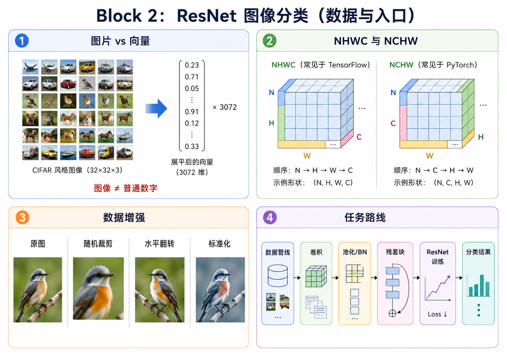
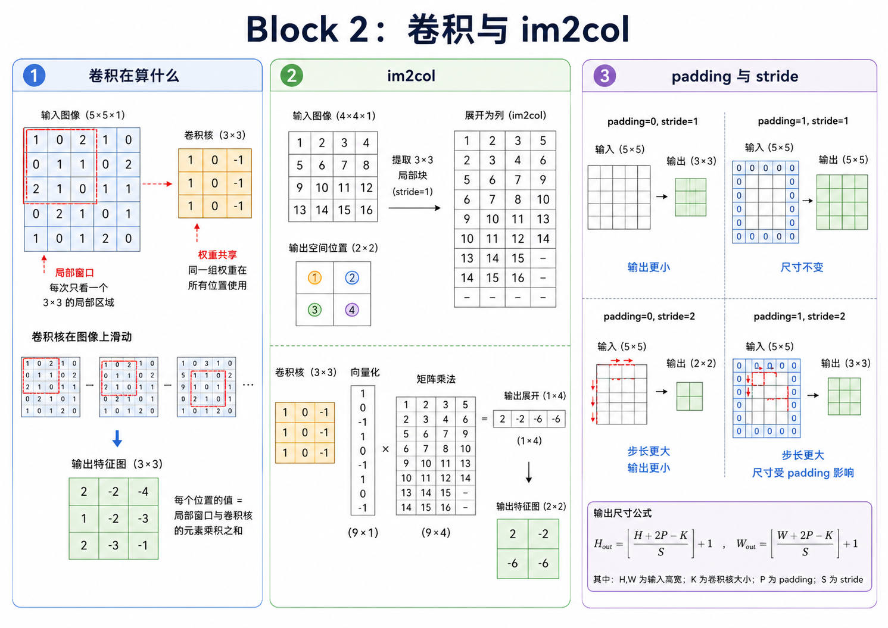
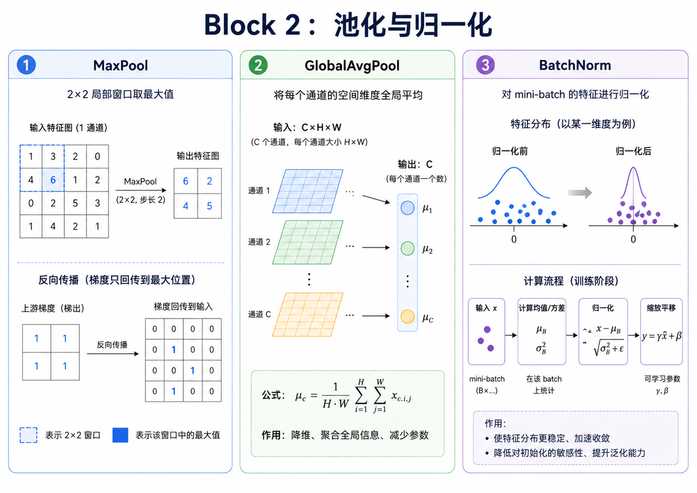
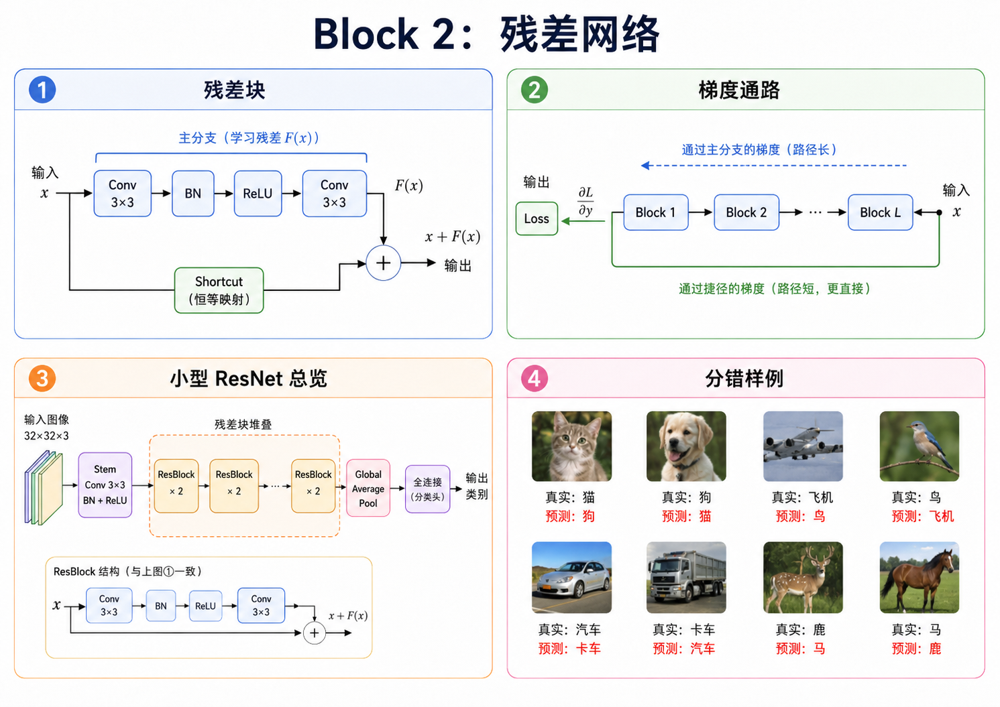

# 这是飞机还是轮船? 用 ResNet 分类物体!

前面几个任务里, 你已经从零写过线性回归、MLP、反向传播和一个小型深度学习库。现在我们把问题换成图片, 而且不是 MNIST 那种干净的黑底白字, 是 CIFAR-100 这种小小的彩色图片。一张图只有 $32\times 32$, 里面可能是飞机、轮船、花、鱼、杯子, 也可能是一个很难看清的动物。

这时如果继续把图片 flatten 成一串数字, MLP 当然还能跑, 但会很吃亏。图片不是普通的一维表格, 像素之间有位置关系, 有局部结构, 有边缘、纹理和形状。直接拉平成向量, 相当于把这些关系都拆散, 然后指望模型自己重新摸出来。不是完全做不到, 只是太浪费。

卷积神经网络(CNN)的想法很朴素: 既然图片的局部区域有意义, 那就让模型一次看一小块; 既然同一种边缘可能出现在不同位置, 那就让同一个卷积核在整张图上滑动。这不是技巧堆砌, 而是把我们对图片的认识写进模型结构里。

---

## 一. 为什么不能继续只用 MLP?

MNIST 的数字很干净, 背景简单, 图片也小。你把 $28\times 28$ 拉平成 784 维向量, MLP 还能学。CIFAR-100 就不一样了: 它有 100 个类别, 主体可能很小, 背景可能很乱, 同一个类别内部差异也很大。

如果继续 flatten, 相邻像素的空间关系会被拆散。左上角的一条边和右下角的一条边会被当成完全不同的输入位置, 模型还得自己学会“平移后的同一个特征仍然相似”。参数量也会变大, 但这些参数没有利用图片的局部性。

卷积就是为了解决这些问题。一个 $3\times 3$ 卷积核只看局部窗口, 而且同一个卷积核会在整张图上共享使用。这样它学到的“边缘检测器”不只在某个固定位置有效, 而是在很多位置都能用。

---

## 二. 这一块会做什么?

第一步是数据管线。图片数据有通道、高度、宽度, 你要知道 `NHWC` 和 `NCHW` 的区别, 知道为什么要标准化, 也要知道随机裁剪和水平翻转为什么只在训练时用。很多图像模型的 bug 不在模型结构里, 而在数据进模型之前就已经埋好了。

第二步是卷积。卷积不是魔法, 它就是一个小窗口在图片上滑动。为了算得快, 我们会用 `im2col` 把很多局部窗口展开成矩阵, 再用矩阵乘法完成卷积。这样写虽然比直接四层循环绕一点, 但你会更接近真实框架里的计算方式。

第三步是 CNN 常用层。池化负责降采样, GlobalAvgPool 负责把空间维汇聚掉, BatchNorm 负责让训练更稳。它们看起来不像卷积那样“核心”, 但少了这些层, 真正训练起来经常会很难受。

第四步是残差块。网络变深后, 不一定更好训练。ResNet 的 shortcut 让输入可以绕过几层直接往后走, 也让梯度多一条路回去。这个想法很简单, 但影响非常大。

最后是训练。这里不要一上来就跑完整 CIFAR-100, 先做小样本过拟合测试。如果几百张图片都学不住, 不要急着调大模型, 先回去查数据、算子和训练循环。训练深度模型时, 这种小范围排错比盲目调参可靠得多。

---

## 三. 任务路线

| 任务                                                                                           | 你会遇到的问题           | 你会写出的东西                                |
| ---------------------------------------------------------------------------------------------- | ------------------------ | --------------------------------------------- |
| [task_10 图像数据管线](../exercises/block_02_resnet/task_10_image_data_pipeline/README.md)     | 图片怎么进入训练循环     | `NCHW`、标准化、随机裁剪、batch               |
| [task_11 Conv2D 与 im2col](../exercises/block_02_resnet/task_11_conv2d_im2col/README.md)       | 卷积怎么高效计算         | `im2col`、`col2im`、`Conv2D`                  |
| [task_12 池化与 BatchNorm](../exercises/block_02_resnet/task_12_pooling_and_bn/README.md)      | CNN 还缺哪些基础层       | `MaxPool2D`、`GlobalAvgPool2D`、`BatchNorm2D` |
| [task_13 残差块](../exercises/block_02_resnet/task_13_residual_block/README.md)                | 深层网络为什么难训       | `BasicBlock` 和 shortcut                      |
| [task_14 NumPy ResNet 训练](../exercises/block_02_resnet/task_14_numpy_resnet_train/README.md) | 怎么把模块组装成训练项目 | 轻量 ResNet、日志、小样本过拟合               |
| [task_15 实验记录](../exercises/block_02_resnet/task_15_experiment_notes/README.md)            | 怎么观察训练现象         | 几条能回看的实验笔记                          |

---
