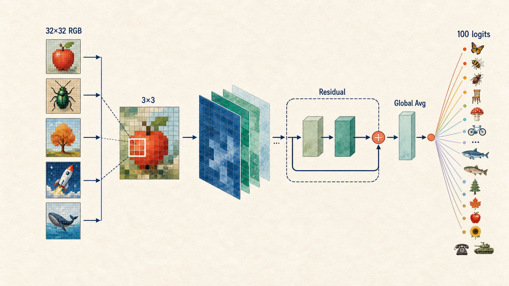
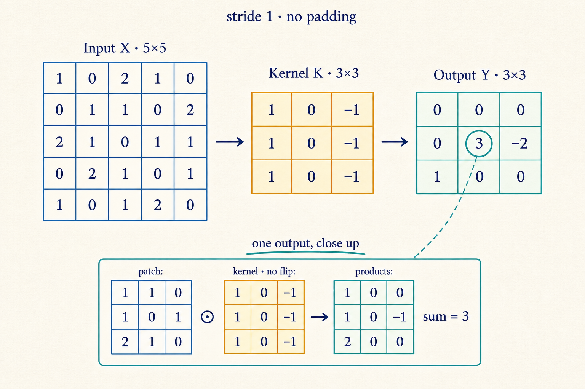
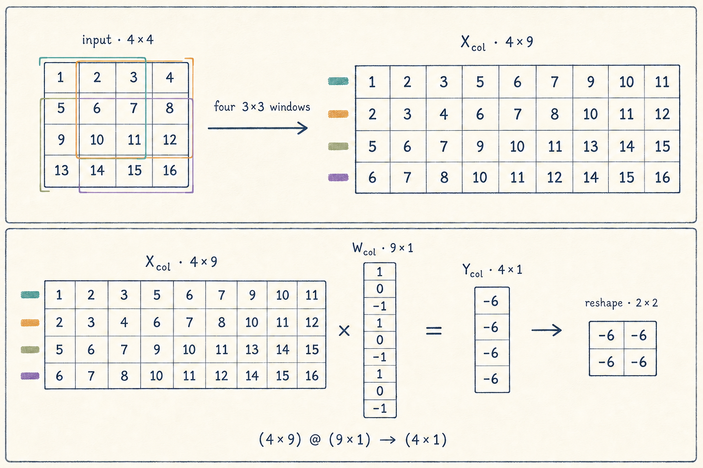
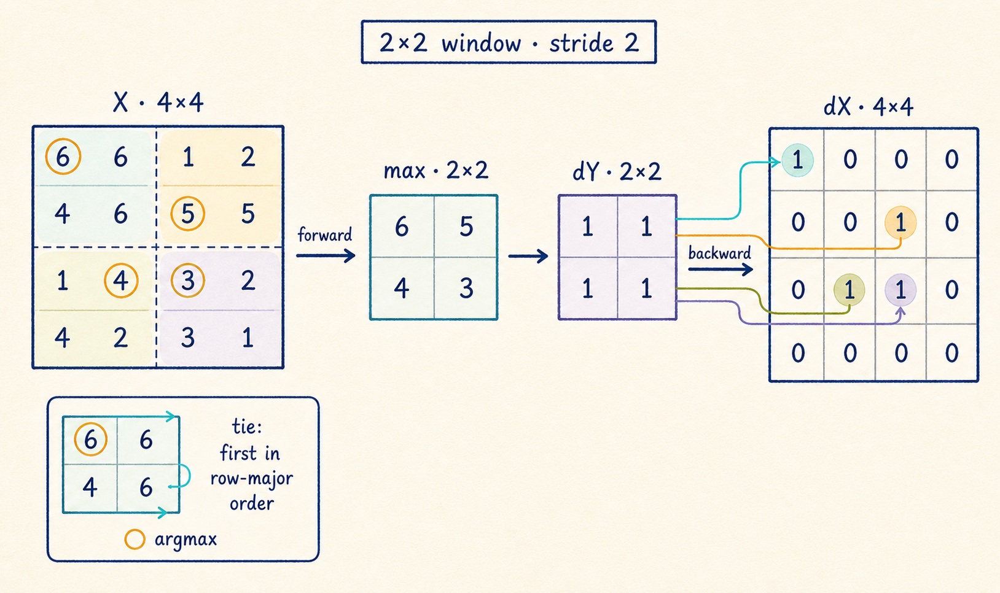
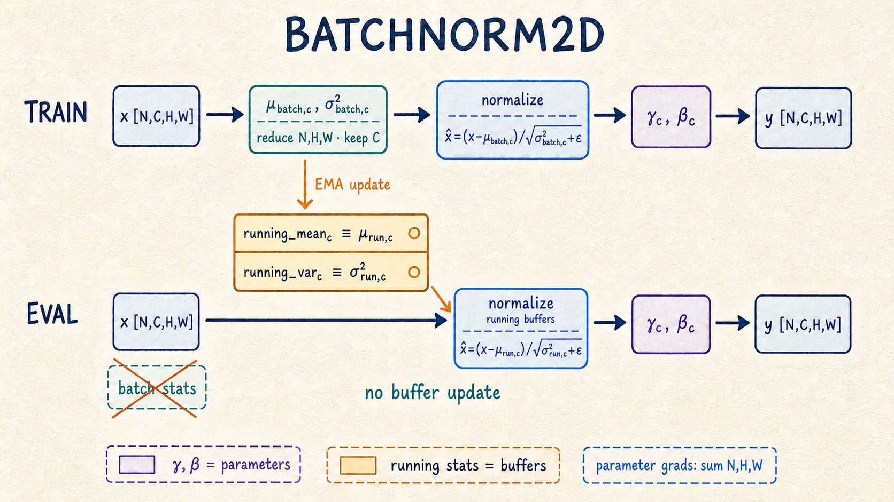

# 这是哪一种物体？从 MLP 走到 ResNet

上一章最后，MNIST 图片被直接展开成 784 个数字。这样做能训练，但也丢掉了一件很重要的东西：像素原本住在二维平面上。

一条边缘由相邻像素共同形成；同样的边缘出现在左上角或右下角，本质上仍是同一种局部结构。普通 MLP 不知道这些，它会为每个位置学习独立权重。卷积要解决的第一个问题，就是怎样把“局部”和“重复出现”写进模型。

这一章使用 CIFAR-100：60,000 张 $32\times32$ RGB 图片，分成 100 个细类别。它比 MNIST 多了颜色，也更难仅凭轮廓分类。代码从 50,000 张官方训练图片中划出训练集与验证集，官方测试集只留给最终评估。



---

## 图片进入模型前，先把约定说清楚

一张 RGB 图片有三个轴：高、宽、通道。许多图片文件把通道放在最后：

```text
NHWC: (batch, height, width, channel)
      (N, 32, 32, 3)
```

本章的卷积把通道放在空间维之前：

```text
NCHW: (batch, channel, height, width)
      (N, 3, 32, 32)
```

两种布局没有优劣之分，但代码必须始终知道每个轴代表什么。若把 NHWC 误当 NCHW，程序有时不会立刻报错，只会在错误的维度上做统计或卷积。

<div class="widget-mount" data-widget="image-batch" data-title="点开一张图，看 RGB 与 NCHW"></div>

像素值还会从 `0..255` 缩放到 `0..1`，再按 RGB 通道标准化：

$$
x'_{nchw}=\frac{x_{nchw}/255-\mu_c}{\sigma_c}.
$$

这里的 $\mu_c,\sigma_c$ 来自训练数据。验证和测试只能复用它们，不能各自重新统计，否则评估阶段会偷偷利用待评估数据的信息。

### 数据增强为什么只放在训练分支

一只动物向右看和向左看，类别通常不变；图片略微平移，也不应改变标签。因此训练时会随机裁剪和水平翻转，让模型看到同一语义的不同外观。

验证集的职责却是提供一把稳定的尺子。如果每次评估都随机改变图片，指标的变化会混入增强随机性。因此：

```text
train:      normalize + random crop + random flip
validation: normalize
test:       normalize
```

这一部分看起来还没有“模型”，却决定了后面指标是否可信。[图像数据管线](../exercises/block_02_resnet/task_10_image_data_pipeline/README.md)详细说明了分层划分、共享索引和增强的随机数边界。

---

## 从观察一个小窗口开始发明卷积

假设要找竖直边缘。与其让一个神经元同时看整张图，不如只看一个 $3\times3$ 窗口，并给窗口里的九个位置一组权重：

$$
K=
\begin{bmatrix}
1&0&-1\\
1&0&-1\\
1&0&-1
\end{bmatrix}.
$$

窗口左侧像素较亮、右侧较暗时，逐元素相乘再求和会得到较大的正值；明暗相反时会得到负值。这组权重因此对竖直亮度变化敏感。



把同一个 kernel 从左到右、从上到下滑过图片，就得到一张新的特征图。这里出现了卷积的两个关键约束：

1. **局部连接**：每个输出只读附近的像素；
2. **参数共享**：同一个 kernel 在所有位置复用。

所以同样的边缘换一个位置，仍由同一组参数识别。深度学习库通常不翻转 kernel，严格说这里计算的是二维互相关，但习惯上仍称为卷积层。

### 多通道时 kernel 多了什么

RGB 输入有三个通道，一个输出通道的 kernel 不能只看其中一个颜色。它的 shape 是：

```text
(C_in, K_h, K_w)
```

若希望产生 `C_out` 张特征图，就需要 `C_out` 组这样的 kernel：

```text
X: (N, C_in, H, W)
W: (C_out, C_in, K_h, K_w)
b: (C_out,)
Y: (N, C_out, H_out, W_out)
```

stride 决定窗口一次移动几格，padding 决定边缘外补几圈。输出空间大小为：

$$
H_{out}=\left\lfloor\frac{H+2P_h-K_h}{S_h}\right\rfloor+1,
\qquad
W_{out}=\left\lfloor\frac{W+2P_w-K_w}{S_w}\right\rfloor+1.
$$

先用这个公式算 shape，再写循环，比从报错中猜维度可靠得多。

---

## 为什么一个卷积会变成矩阵乘法

最直观的实现有很多层循环：遍历样本、输出通道、输出行、输出列，再对窗口求和。它适合核对公式，却没有利用 NumPy 擅长的大块矩阵运算。

`im2col` 做的事情很机械：把每个滑动窗口拉直，放成矩阵的一行。

以 $4\times4$ 单通道输入、$3\times3$ kernel、stride 1 为例，窗口左上角只能落在四个位置，所以得到 4 行；每个窗口有 9 个元素，所以得到 9 列：

```text
X_col: (4, 9)
W_col: (9, C_out)
Y_col: (4, C_out)
```



一般情形是：

$$
X_{col}\in\mathbb R^{(NH_{out}W_{out})\times(C_{in}K_hK_w)},
$$

$$
Y_{col}=X_{col}W_{col}+b.
$$

这不是换了一种卷积定义，只是把原来的所有局部点积排进同一次矩阵乘法。

<div class="widget-mount" data-widget="conv-sweep" data-title="拖动卷积核，看特征图补满"></div>

### backward 为什么不能直接 reshape 回去

相邻窗口会重叠。输入中间的一个像素可能参与多个输出，因此反向时也会收到多条梯度。`col2im` 必须把这些贡献**累加**回原位置，而不是把列矩阵直接 reshape。

<div class="widget-mount" data-widget="im2col-grad" data-title="im2col 与梯度累加"></div>

权重梯度则与上一章的 Linear 很像：

$$
\mathrm dW_{col}=X_{col}^{\top}\mathrm dY_{col},
\qquad
\mathrm db=\sum\mathrm dY_{col}.
$$

本仓库还有一个不太显眼但很关键的约定：优化器会保存梯度数组的引用。`backward()` 因此要用 `dW[...] = ...` 原位写入；若重新绑定 `dW = ...`，优化器仍会读到旧数组，看起来就像“梯度非零但权重不更新”。

[Conv2D 与 im2col](../exercises/block_02_resnet/task_11_conv2d_im2col/README.md)包含完整的手算矩阵、有限差分和 `col2im` 重叠示例。

---

## 特征图变小以后，怎样保留有用信息

卷积产生的仍是空间网格。网络越往后，常会逐步缩小 $H,W$，让后层用更大的感受野描述更抽象的结构。

### MaxPool：保留窗口里最强的响应

MaxPool 在每个通道的局部窗口取最大值。forward 不只要保存输出，还要记住最大值来自哪里；backward 才能把上游梯度送回那个位置。

<div class="widget-mount" data-widget="pool-sweep" data-title="池化窗口扫描与梯度路由"></div>



若最大值并列，本实现按 NumPy `argmax` 的行优先顺序，把梯度交给第一个最大值。这个规则没有唯一的数学答案，但 forward 与 backward 必须采用同一约定。

### Global Average Pool：每个通道最后只留一个数

$$
y_{nc}=\frac{1}{HW}\sum_{h,w}x_{nchw},
\qquad
(N,C,H,W)\rightarrow(N,C).
$$

它把“这个通道在整张图上出现了多少”压成一个数，再交给最后的分类器。SmallResNet 最终使用 GlobalAvgPool；空间降采样则由 stage 开头的 stride-2 卷积完成。

---

## 网络变深后，激活尺度也会跟着漂移

上一层参数一更新，下一层看到的输入分布也会变化。层数增加后，这种变化让学习率和初始化更难选择。

BatchNorm 在训练时对每个通道，沿 `(N,H,W)` 统计均值和方差：

$$
\hat x=\frac{x-\mu_{batch,c}}{\sqrt{\sigma^2_{batch,c}+\varepsilon}},
\qquad
y=\gamma\hat x+\beta.
$$

$\gamma,\beta$ 让层可以重新学习合适的缩放和平移。与此同时，训练过程用指数移动平均维护 `running_mean` 和 `running_var`。



为什么要维护两套统计量？推理时可能只有一张图片，当前 batch 的均值和方差并不稳定。因此：

```text
train(): 当前 batch 统计 + 更新 running buffers
eval():  running statistics + 不更新 buffers
```

这也解释了为什么 checkpoint 不能只保存“可训练参数”。漏掉 running buffers，新模型即使恢复了相同权重，eval 输出仍会不同。

[池化与 BatchNorm](../exercises/block_02_resnet/task_12_pooling_and_bn/README.md)把三个层的 forward、backward、缓存和模式接口分别展开。

---

## 既然层越多表达能力越强，为什么还需要 ResNet

直觉上，更深的网络至少可以让多出来的层学习恒等映射，从而不比浅层差。实际训练普通深网时，却可能看到训练误差也随深度上升。这不是典型过拟合，因为连训练集都没有拟合好；它首先是优化困难。

ResNet 不要求一串卷积直接学目标映射 $H(x)$，而是让主分支学习相对输入还需要补多少：

$$
H(x)=F(x)+x.
$$

若当前最合适的操作接近恒等映射，主分支只需把 $F(x)$ 学到接近 0。


本章的 BasicBlock 是：

```text
main:     Conv3x3 -> BN -> ReLU -> Conv3x3 -> BN
shortcut: identity 或 Conv1x1 -> BN
output:   ReLU(main + shortcut)
```

当 shape 相同，shortcut 就是 $S(x)=x$。当通道数变化或 stride 为 2 时，原输入无法与主分支逐元素相加，于是用 `Conv1x1 + BN` 做 projection：

$$
y=\operatorname{ReLU}(F(x)+S(x)).
$$

### 加法节点的梯度会分成两路

忽略最后 ReLU 的记号，若 $y=F(x)+S(x)$：

$$
\frac{\partial L}{\partial x}
=\frac{\partial L}{\partial y}
\left(J_F(x)+J_S(x)\right).
$$

identity shortcut 的 $J_S=I$，所以梯度多了一条直接路径；projection shortcut 的 Jacobian 则来自 `Conv1x1 + BN`。残差连接改善了梯度流动，但它不是“梯度永远不会消失”的证明，后面的激活、参数和数值范围仍然重要。

<div class="widget-mount" data-widget="residual-block" data-title="两分支结构与梯度直通路"></div>

[残差块](../exercises/block_02_resnet/task_13_residual_block/README.md)说明了两种 shortcut 的 shape、缓存顺序和反向合流。

---

## 把这些部件接成 SmallResNet

完整数据流现在可以读成：

```text
NCHW image
  -> Conv3x3 -> BN -> ReLU
  -> stage 1
  -> stage 2 (stride 2)
  -> stage 3 (stride 2)
  -> GlobalAvgPool
  -> Linear
  -> 100 logits
```

类的默认配置是 `channels=(16,32,64)`、每个 stage 两个块；命令行默认使用更小的 `(8,16,32)` 和每个 stage 一个块，便于用 NumPy 检查训练链路。它不是 ImageNet ResNet-18，也不是原论文的 CIFAR ResNet-20。

训练脚本先提供合成数据 smoke test，再允许读取 CIFAR-100 子集。合成数据只用于确认 forward、backward 和 update 已接通，不能用它的准确率代表真实分类能力。

checkpoint 则保存：

- 命名参数与 BatchNorm running buffers；
- optimizer 的动量等状态；
- epoch、配置、历史指标与 train/eval 模式。

恢复是否忠实，不靠“文件能打开”判断，而是比较新旧模型的 eval logits，并继续一步训练看参数轨迹是否一致。

- [NumPy ResNet 的训练闭环](../exercises/block_02_resnet/task_14_numpy_resnet_train/README.md)
- [怎样记录一次可复现的实验](../exercises/block_02_resnet/task_15_experiment_notes/README.md)

这一章从“flatten 丢了什么”开始，依次得到局部连接、参数共享、空间汇聚、运行统计和残差路径。下一章会换到序列数据：那里真正困难的不再是二维邻域，而是一个位置怎样读取很远的上下文。
