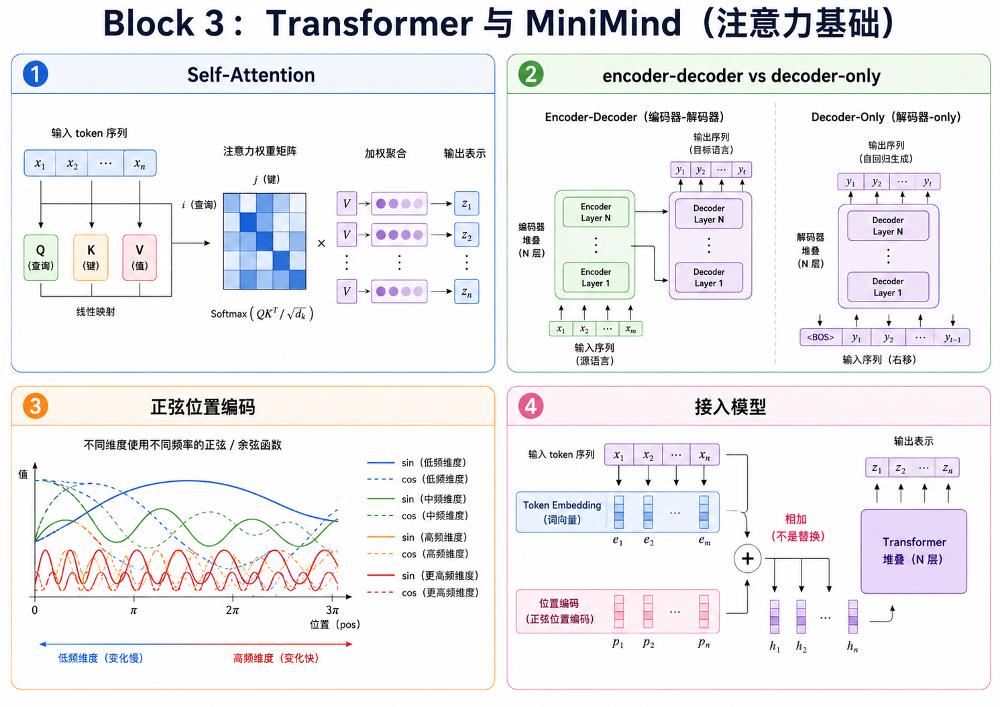
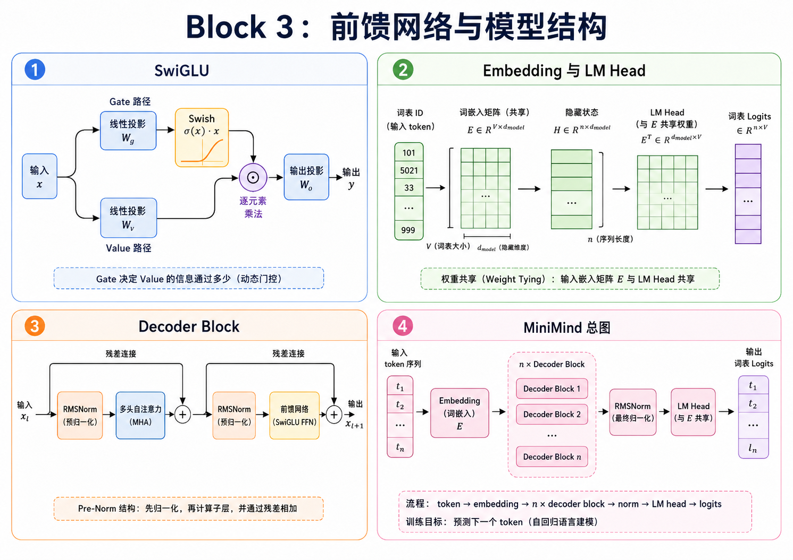
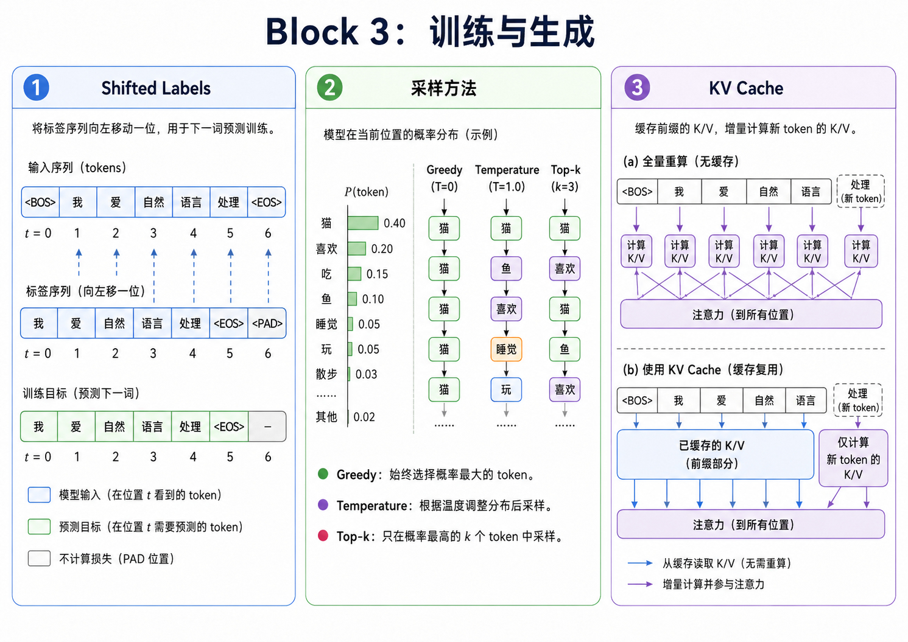

# Attention Is All You Need 到 MiniMind

第三块进入文本生成。前面我们处理的是数字和图片, 输入长度基本固定, 输出也比较明确; 到文本这里, 问题会变得不一样。一个 token 的含义往往取决于它前后出现了什么, 而模型生成时又必须一个 token 一个 token 往后写, 不能提前看到答案。

这一块先看 Attention Is All You Need 里的基本想法: token 怎么互相读取信息, 为什么需要位置编码, 为什么要多头, decoder 为什么要 mask。然后再把这些想法收束到 MiniMind/LLaMA 这一类 decoder-only 小模型: RoPE、GQA、RMSNorm、SwiGLU、next-token training、generate 和 KV cache。

这一章中我们会先介绍最经典Attention is all you need 然后从头训练一个比较现代的decoder式的llm MiniMind



---

## 一. 原始 Transformer

Attention Is All You Need 做的事, 可以先粗略理解成: 让每个 token 都能根据当前上下文去“看”别的 token。以前处理序列常用 RNN, 信息要一步一步往后传; self-attention 则允许序列中的位置直接建立联系。对语言来说, 这件事很有吸引力, 因为一个词该怎么理解, 经常取决于离它很远的词。

原始 Transformer 里还有几个必须补上的东西。第一是位置编码, 因为 attention 本身不天然知道顺序, “我喜欢你”和“你喜欢我”如果没有位置信息, 就会少掉很关键的区别。第二是 multi-head attention, 它让模型可以从多个子空间看上下文, 有的头可能更关注局部搭配, 有的头可能更关注长距离关系。第三是 causal mask, decoder 生成第 $t$ 个 token 时不能偷看第 $t+1$ 个 token, 否则训练就变成作弊了。

原论文里的 Transformer 是 encoder-decoder 结构, 机器翻译场景里很自然。但 MiniMind 主线更接近 GPT/LLaMA 这类 decoder-only 模型, 所以后面的实现会往这个方向收。

---

## 二. MiniMind

MiniMind 风格的小模型可以先写成这样:

```text
token -> embedding -> decoder blocks -> logits -> next token
```

每个 decoder block 里大致是:

```text
RMSNorm -> Causal Attention + RoPE/GQA -> Residual
RMSNorm -> SwiGLU FFN -> Residual
```

你会用 PyTorch 写这些模块。可以用 `nn.Linear`、`nn.Embedding` 这种基础层, 但不要直接调用一个现成的大 Transformer 模块糊过去。这里真正要练的是看懂每个 shape: token id 进来以后怎么变成 embedding, Q/K/V 怎么拆 head, attention score 为什么是 `(batch, heads, seq, seq)`, logits 又怎么回到词表大小。

语言模型训练的目标也很直接: 给定前面的 token, 预测下一个 token。比如输入是:

```text
我 喜欢 深度
```

模型要学会预测下一个词可能是“学习”。训练时把一段文本错开一位, 前半段做输入, 后半段做标签, 这就是 next-token training。听起来简单, 但大模型的很多能力都是从这个目标里长出来的。



---

## 三. 任务路线

| 任务                                                                               | 问题                                     | 重点                             |
| ---------------------------------------------------------------------------------- | ---------------------------------------- | -------------------------------- |
| [task_20](../exercises/block_03_transformer/task_20_transformer_theory/README.md)  | Attention Is All You Need 到底发明了什么 | token、QKV、self-attention、mask |
| [task_21](../exercises/block_03_transformer/task_21_sinusoidal_position/README.md) | 原始 Transformer 怎么表示位置            | sinusoidal position encoding     |
| [task_22](../exercises/block_03_transformer/task_22_rope_position/README.md)       | MiniMind 为什么换成 RoPE                 | 旋转 Q/K、相对位置               |
| [task_23](../exercises/block_03_transformer/task_23_causal_attention/README.md)    | token 怎么看前文                         | causal self-attention、MHA、GQA  |
| [task_24](../exercises/block_03_transformer/task_24_swiglu_ffn/README.md)          | attention 后还要什么                     | SwiGLU FFN                       |
| [task_25](../exercises/block_03_transformer/task_25_embedding_lm_head/README.md)   | token 怎么进出模型                       | embedding、LM head、weight tying |
| [task_26](../exercises/block_03_transformer/task_26_decoder_blocks/README.md)      | block 怎么堆                             | RMSNorm、残差、Pre-Norm          |
| [task_27](../exercises/block_03_transformer/task_27_minimind_core/README.md)       | MiniMind Core 怎么搭                     | config、decoder-only、小模型     |
| [task_28](../exercises/block_03_transformer/task_28_next_token_training/README.md) | 怎么训练它                               | next-token loss、toy training    |
| [task_29](../exercises/block_03_transformer/task_29_generate_sampling/README.md)   | 怎么让它生成                             | temperature、top-k               |
| [task_30](../exercises/block_03_transformer/task_30_kv_cache/README.md)            | 推理怎么加速                             | KV cache                         |

---

## 四. 最容易误解的地方

第一个误解是把 attention 当成“注意力权重图”来背。权重图当然能画, 但实现时更重要的是 Q、K、V 的矩阵乘法。Q 像是在问“我需要什么信息”, K 像是在描述“我这里有什么信息”, V 才是真正被加权汇总的内容。这个比喻不完美, 但写代码时很有用。

第二个误解是以为位置编码只是给 embedding 加一串数字。Sinusoidal position encoding 是原始 Transformer 的做法, RoPE 则把位置信息放进 Q/K 的旋转里, 这会影响 attention 分数本身。理解 RoPE 之前先看 sinusoidal, 会顺很多。

第三个误解是低估 mask。decoder-only 模型训练时, 第一个 token 只能看自己, 第二个 token 只能看前两个, 以此类推。mask 一错, loss 可能很好看, 但模型学到的是偷看答案。

第四个误解是生成时每一步都重新算全部上下文。这样当然能生成, 但会越来越慢。KV cache 缓存的是历史 token 已经算好的 K/V, 新 token 来了以后只需要补上新的一段, 推理速度会好很多。



---

## 五. 做完以后

做完这一块, 你应该能说清楚 self-attention 为什么能让 token 互相读信息, sinusoidal position encoding 和 RoPE 分别在解决什么, decoder-only 模型为什么需要 causal mask, MHA 和 GQA 的区别在哪里, RMSNorm 和 SwiGLU 在 MiniMind 里分别做什么。

最后, 你应该能把 embedding、decoder blocks、LM head、next-token loss 和 generate 串成一条完整链路。到了这一步, 再去看更大的语言模型, 至少不会只剩下“好多层 Transformer”这一种印象。
