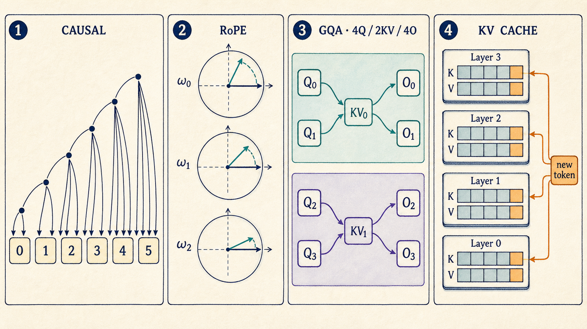
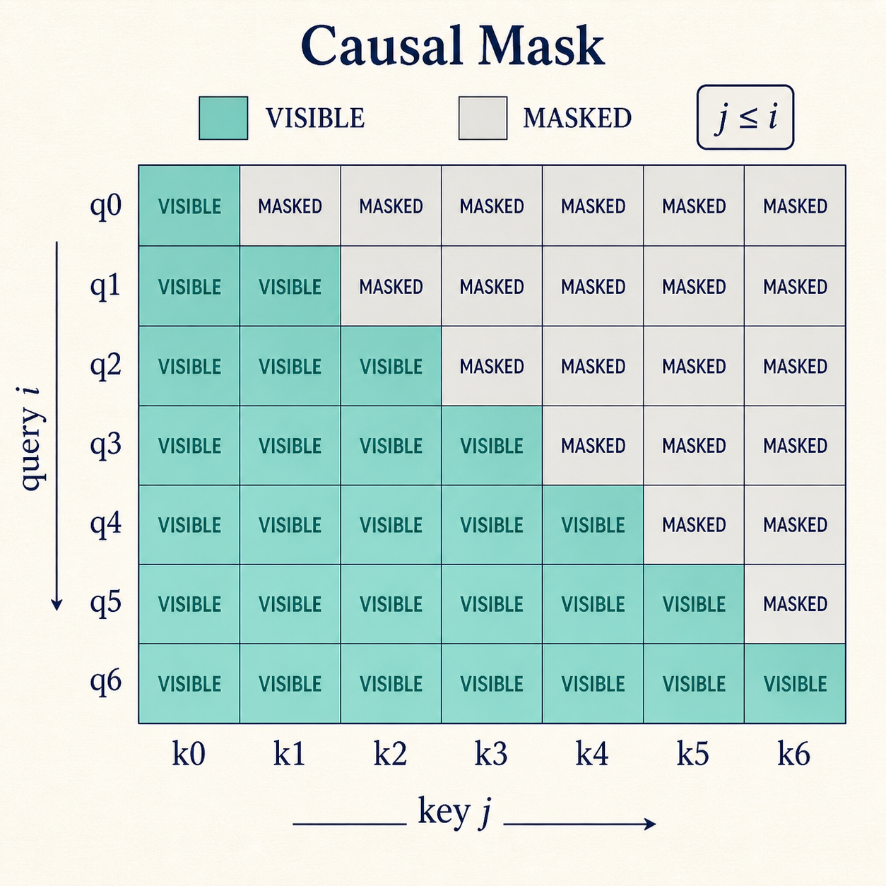
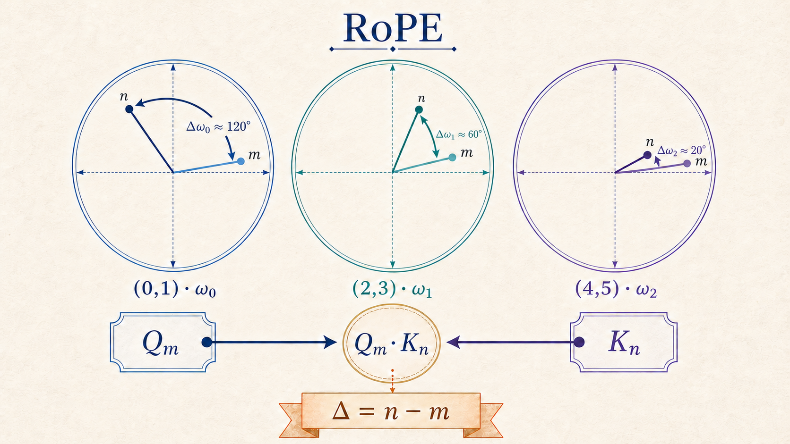
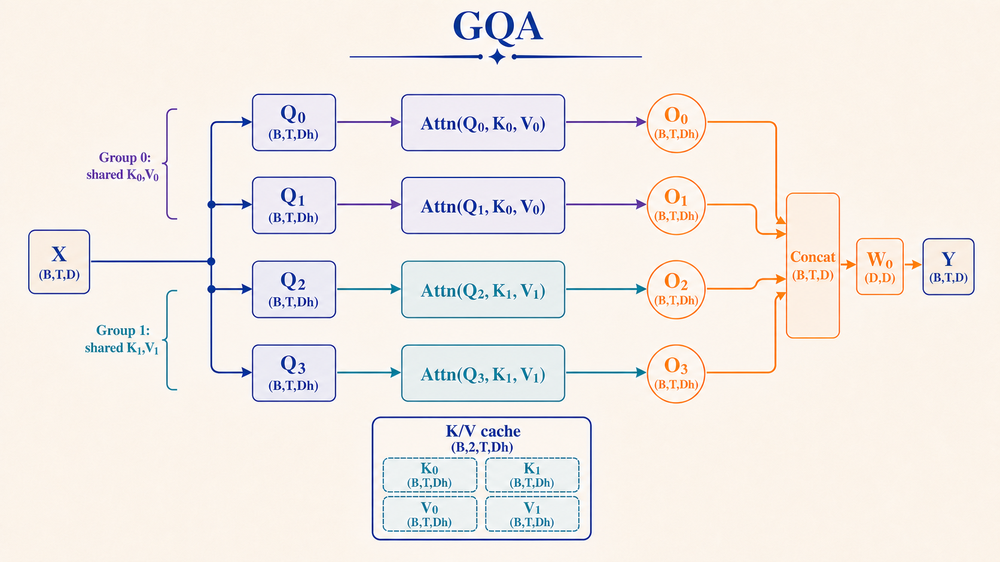
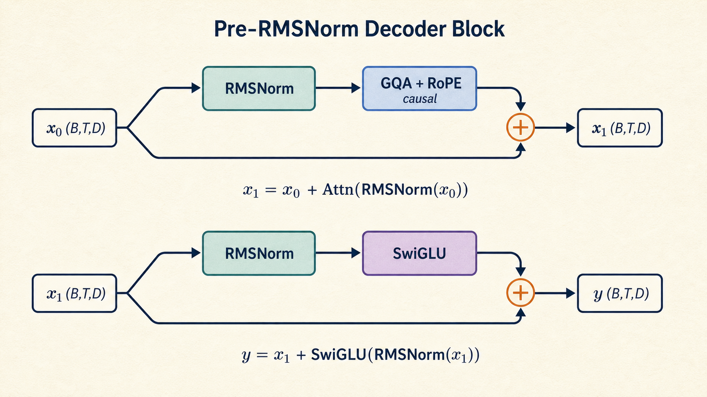
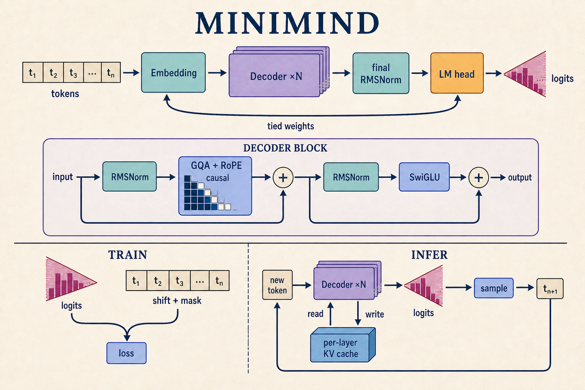
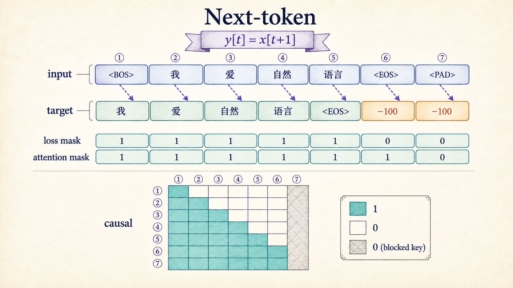
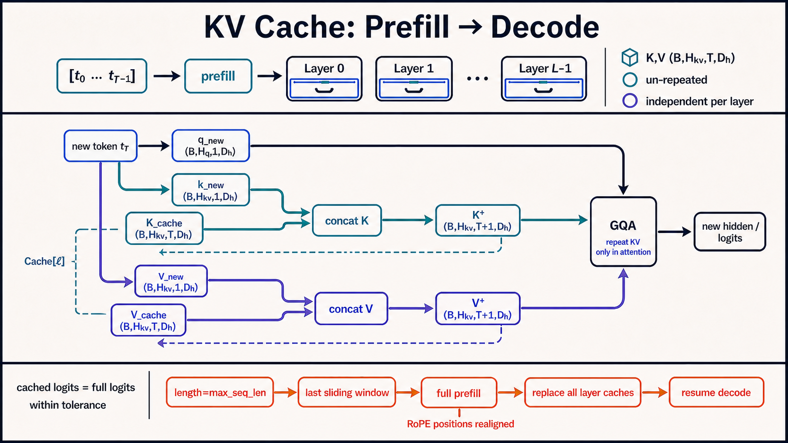

# `apple is __`：从上下文预测下一个 token

语言模型最小的训练目标并不神秘：给出一段前文，预测下一个 token。

```text
apple is  ->  red
深度 学习 需要  ->  数据
```

如果只看最后一个 token，“is” 后面可以接很多词；真正缩小答案范围的是它前面的上下文。于是这一章的核心问题变成：当前位置怎样读取前面不同位置的信息？

这里实现的是一个两层 decoder-only 小模型。语料是一小段内置中文，tokenizer 是字符表。它能把 Transformer 的数据流、训练、采样和缓存连起来，但不等于从头训练了一个通用大语言模型。



---

## 先把文本变成模型能处理的编号

模型不能直接对字符串做矩阵乘法。tokenizer 先把文本切成 token，再把每个 token 映射到整数 id：

```text
"小猫睡觉" -> [12, 37, 81, 94]
```

Embedding 矩阵 $E\in\mathbb R^{V\times D}$ 像一张可训练的查找表。$V$ 是词表大小，$D$ 是模型维度；用 token id 取出对应行后：

```text
input_ids: (B, T)
hidden:    (B, T, D)
```

现在每个位置都有一个 $D$ 维向量，但这些向量还互不交流。若直接对每个位置独立做 MLP，最后一个位置只能看到自己的 token，改变前文不会改变它的输出。这正是旧版占位模型曾经暴露的问题：保留末尾 token、完全替换前文，末位 logits 一点不变。

语言模型需要一个让 token 读取上下文的部件。

---

## Attention 从三个问题开始

读到一句话末尾的“它”时，可以把信息检索过程拆成三件事：

1. 当前位置想找什么？
2. 前文每个位置提供什么索引？
3. 匹配后真正取回什么内容？

这三件事对应 Query、Key、Value。输入 hidden states $X$ 经过三组不同参数：

$$
Q=XW_Q,\qquad K=XW_K,\qquad V=XW_V.
$$

Q 与 K 的点积衡量匹配程度，softmax 把分数变成权重，再按权重汇总 V：

$$
\operatorname{Attention}(Q,K,V)
=\operatorname{softmax}\left(\frac{QK^\top}{\sqrt{d_{head}}}+M\right)V.
$$

其中 $M$ 是加法掩码：可见位置取 $0$，禁止位置取 $-\infty$，这样被禁位置在 softmax 之前就已经被排除。训练时为什么必须遮住某些位置，下一节展开。


逐步看 shape 会更清楚。先忽略 batch 和多头，设序列长为 $T$、每个 head 的维度为 $d_{head}$（下文 shape 表记作 `Dh`，代码里是 `head_dim`）：

```text
Q:       (T, Dh)
K.T:     (Dh, T)
scores:  (T, T)
V:       (T, Dh)
output:  (T, Dh)
```

`scores[t, j]` 表示位置 $t$ 对位置 $j$ 的关注程度。softmax 沿每一行进行，因此每个 query 都得到一组“从所有 key 取多少”的权重。

为什么除以 $\sqrt{d_{head}}$？维度增加时，点积的量级也会增大，softmax 很容易变得过尖，梯度集中在极少数位置。缩放把分数维持在较稳定的范围。

[从一个 head 到 decoder-only](../exercises/block_03_transformer/task_20_transformer_theory/README.md)

---

## 训练时为什么必须遮住未来

假设序列是：

```text
input:  [BOS, 小, 猫, 睡]
label:  [小,   猫, 睡, 觉]
```

位置“猫”的目标是“睡”。如果它在 self-attention 中能直接读取右边的“睡”，训练损失会很好看，模型却只是偷看答案。decoder-only 模型因此使用下三角 causal mask：

```text
query 0 -> key 0
query 1 -> key 0..1
query 2 -> key 0..2
query 3 -> key 0..3
```



被禁止的位置要在 softmax **之前**从 score 中排除。若先做 softmax 再把权重乘 0，未来位置仍然分走过概率，留下的权重也不再和为 1。

causal 性质可以直接做数值实验：固定序列前缀，只改变未来 token，前缀位置的输出应保持不变。它比目测三角矩阵更接近模型真正需要满足的条件。

---

## Attention 还不知道谁在前、谁在后

如果只交换 K/V 的行，并同步交换对应内容，attention 本身没有固定的先后概念。“小猫追小狗”和“小狗追小猫”包含相同 token，顺序却改变了含义。

### 先从正弦位置编码理解频率

原始 Transformer 为每个整数位置生成一个固定向量：

$$
PE(pos,2i)=\sin\left(pos/10000^{2i/D}\right),
$$

$$
PE(pos,2i+1)=\cos\left(pos/10000^{2i/D}\right).
$$

低编号维度变化快，高编号维度变化慢；不同频率共同提供短程与长程的位置刻度。位置 0 总是 `[0,1,0,1,...]`，这是很方便的实现检查点。


生成出的 `(T,D)` 位置表增加一个 batch 轴后成为 `(1,T,D)`，再与 `(B,T,D)` embedding 相加。

[正弦位置编码](../exercises/block_03_transformer/task_21_sinusoidal_position/README.md)

### RoPE 把位置放进 Q/K 的旋转角

本章主线不再把位置向量加到 embedding，而是把 Q、K 的相邻两维看成平面坐标，并按位置旋转：

$$
R(m\theta)=
\begin{bmatrix}
\cos(m\theta)&-\sin(m\theta)\\
\sin(m\theta)& \cos(m\theta)
\end{bmatrix}.
$$



每一对维度使用不同 $\theta_i$。同一个向量在位置 $m$ 和位置 $n$ 采用不同旋转角，而旋转后的 Q/K 点积会依赖相对位移 $n-m$。准确的说法是“点积中出现相对位移”，而不是位置向量本身具有某种绝对不变性。

V 不旋转，因为位置关系要改变的是“query 与哪个 key 匹配”；V 负责提供匹配后取回的内容。

`start_pos` 会在缓存解码时重新出现：处理第 20 个 token 时，旋转角必须从位置 20 接着算，而不能每一步都从 0 开始。

[RoPE 的二维推导与实现](../exercises/block_03_transformer/task_22_rope_position/README.md)

---

## 一个 head 不必承担所有关系

有的 head 可能更关注相邻 token，有的可能连接主语与谓语。Multi-head attention 把模型维度拆成多个子空间：

```text
(B, T, D) -> (B, H, T, Dh)
D = H * Dh
```

每个 query head 独立产生一个输出，最后拼回 `(B,T,D)`。

标准 MHA 为每个 query head 都准备自己的 K/V。GQA 则让一组 query heads 共享 K/V：

```text
Hq = 4, Hkv = 2
Q0, Q1 -> KV0 -> O0, O1
Q2, Q3 -> KV1 -> O2, O3
```



输出仍有 4 个 query heads；减少的是 K/V 投影与后面的缓存量。以 `D=32, Hq=4, Hkv=2` 为例：

```text
Q: (B, 4, T, 8)
K: (B, 2, T, 8)
V: (B, 2, T, 8)
O: (B, 4, T, 8) -> (B, T, 32)
```

RoPE、causal mask、padding mask 和 GQA 在这一层真正汇合。[Causal Attention 与 GQA](../exercises/block_03_transformer/task_23_causal_attention/README.md)给出了完整数据流和 causal 数值检查。

---

## Attention 交换信息，FFN 改造每个 token

Attention 让不同位置互相读取，但一次加权求和并不足以完成所有特征变换。FFN 对每个位置独立使用同一组参数：

```text
(B, T, D) -> (B, T, hidden_dim) -> (B, T, D)
```

中间维度 `hidden_dim` 通常大于 `D`，与 `ffn.py` 中的参数同名。FFN 不混合序列位置，所以不会破坏 causal 性质。本章使用 SwiGLU：

$$
g=W_{gate}x,\qquad u=W_{up}x,
$$

$$
\operatorname{SwiGLU}(x)
=W_{down}\left(\operatorname{SiLU}(g)\odot u\right).
$$


这里必须有两次独立的上投影：gate 决定哪些特征通过，up 提供被门控的内容。只写 `Linear -> SiLU -> Linear` 是普通 FFN，不是真正的 SwiGLU。

[SwiGLU 前馈网络](../exercises/block_03_transformer/task_24_swiglu_ffn/README.md)

---

## 为什么要用 Norm、Residual，再重复很多层

Attention 和 FFN 的输入输出都是 `(B,T,D)`，因此都能接一条残差连接。本章采用 Pre-RMSNorm：

```text
x1 = x0 + CausalRoPEGQA(RMSNorm(x0))
x2 = x1 + SwiGLU(RMSNorm(x1))
```



两条 shortcut 分别从各自子层的输入出发，不能共用一条跨越整个 block 的捷径。RMSNorm 只根据均方根缩放，不减均值：

$$
\operatorname{RMSNorm}(x)
=\gamma\odot\frac{x}{\sqrt{\operatorname{mean}(x^2)+\varepsilon}}.
$$

Norm 控制进入子层的尺度，residual 保留原表示并提供额外梯度路径。重复 $N$ 个 block 后，模型逐层把局部 token 表示变成包含上下文的信息。

[Decoder Block 的两段 PreNorm residual](../exercises/block_03_transformer/task_26_decoder_blocks/README.md)

---

## hidden state 怎样变回词表概率

经过最后一层 RMSNorm，模型用 LM head 把 $D$ 维 hidden 投影成 $V$ 个 logits：

```text
(B, T, D) @ (D, V) -> (B, T, V)
```

Embedding 已经有一个 `(V,D)` 矩阵。weight tying 直接让 LM head 使用它的转置视角，而不是再创建一份独立参数：

```python
model.lm_head.weight is model.token_embedding.weight
```

输入时，第 $i$ 行表示 token $i$ 的向量；输出时，同一行与 hidden 做点积，成为 token $i$ 的分数。这能减少参数量，也让输入和输出使用同一表示空间。

[Embedding、LM Head 与 weight tying](../exercises/block_03_transformer/task_25_embedding_lm_head/README.md)

完整 MiniMind 现在可以顺着读完：

```text
input_ids (B,T)
  -> token embedding
  -> N × decoder block
  -> final RMSNorm
  -> tied LM head
  -> logits (B,T,V)
```



[MiniMind Core](../exercises/block_03_transformer/task_27_minimind_core/README.md)将 Attention、RoPE、GQA、RMSNorm 和 SwiGLU 接成了真正读取上下文的模型。

---

## 一段文本怎样产生许多训练样本

Next-token 训练把同一段 token 错开一位：

```text
tokens: [BOS, t0, t1, t2, EOS, PAD]
input:  [BOS, t0, t1, t2, EOS]
label:  [t0,  t1, t2, EOS, PAD]
```



模型在一次 forward 中为每个位置同时预测下一个 token。causal mask 保证这些并行位置没有偷看各自的未来。

Padding 需要处理两次：

- attention mask 屏蔽 PAD key，避免有效 token 读取填充值；
- loss mask 把 PAD target 标成 `-100`，交给交叉熵忽略。

只做第二项，loss 看起来正常，但前面的表示仍可能受到 PAD 影响。

语料也先切 train/validation，再只用训练文本建立字符表，避免验证集字符提前进入词表统计。相邻固定长度 block 共享一个边界 token，但预测边不会重复。

[Next-token 数据、验证与 checkpoint](../exercises/block_03_transformer/task_28_next_token_training/README.md)

---

## 训练给出分布，生成还要决定怎样选

生成时只取最后位置 `logits[:, -1]`。最直接的 greedy 每次选择最大值；它可复现，但容易反复落在同一条高概率路径。

其他采样方法只改变“怎样从 logits 选 token”，不会重新训练模型：

- temperature 小于 1 时分布更尖，大于 1 时更平；
- top-k 只保留最高的 $k$ 个候选；
- top-p 保留累计概率达到阈值的最小候选集。


[生成循环与采样](../exercises/block_03_transformer/task_29_generate_sampling/README.md)

---

## 为什么生成越长，重复计算越多

生成第一个新 token 时，模型处理整个 prompt。得到新 token 后，朴素实现把“prompt + 新 token”再次全部送入模型；下一步又重算更长的前缀。

旧 token 在每一层的 K/V 不会变化，可以把它们保存下来：

```text
K_cache, V_cache: (B, Hkv, past_len, Dh)
```

新一步只计算新 token 的 Q/K/V，再把新 K/V 接到当前层缓存：

```text
q_new -> 与 [K_cache; k_new] 做 attention
v     -> 从 [V_cache; v_new] 汇总内容
K+,V+ -> 写回当前层 cache
```



缓存不是一份全模型共享数组，而是每层各有一对 K/V；GQA 缓存保持 `Hkv` 个 heads，只在计算 attention 时复用到 `Hq`。RoPE 的位置从 `past_len` 接着走。

当长度超过 `max_seq_len`，本实现保留最后一个窗口，并对窗口做一次完整 prefill，重新对齐 RoPE 位置和所有层缓存。它不是简单地从数组左侧删掉几列。

缓存实现是否正确，可以比较两条路径：

1. 每步完整重算上下文；
2. prefill 一次，再逐 token 使用 cache。

相同输入下，二者的 logits 与 greedy token 序列应在浮点误差内一致。[KV Cache](../exercises/block_03_transformer/task_30_kv_cache/README.md)把这项等价检查写进了可运行代码。

这一章最终连成的是一个小型而完整的实验闭环：文本切分、tokenizer、Transformer、validation、checkpoint、采样和缓存推理都真实存在；它仍然只在小语料上验证机制，不把 smoke test 的几步下降包装成通用语言能力。
