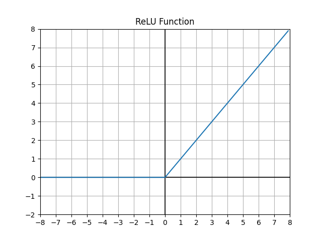
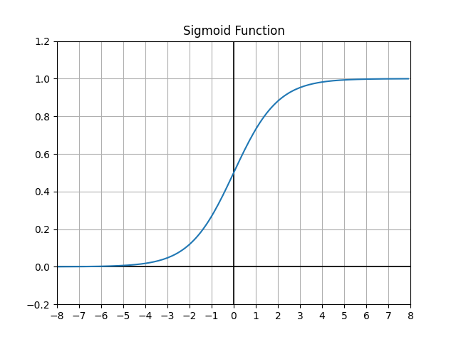
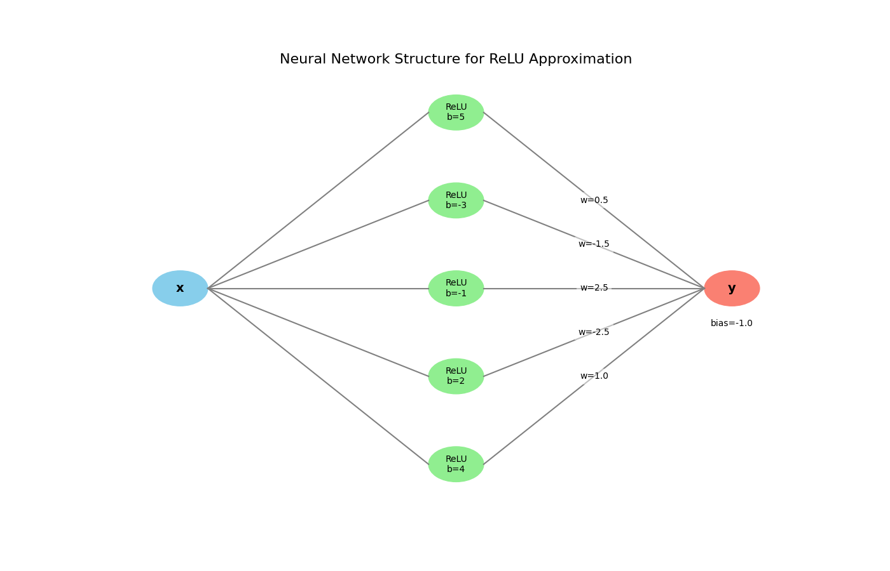
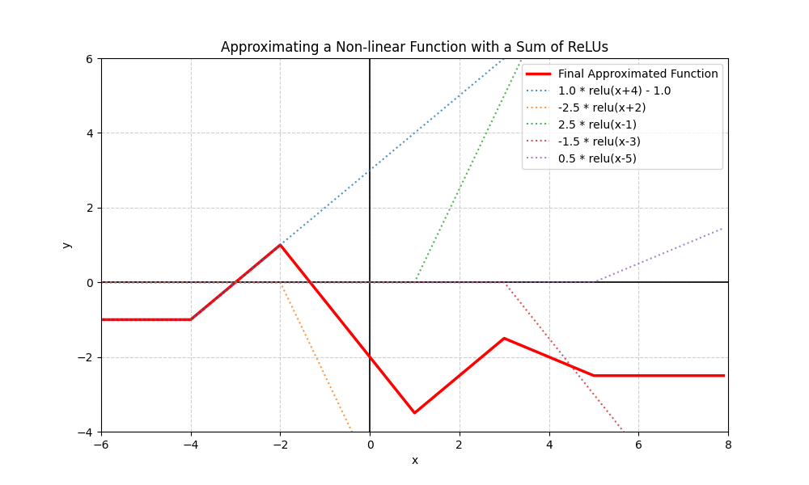

# 任务二: 使用神经网络预测点在圆形内还是圆形外

在第一个任务中, 你让电脑学会了画一条最合适的线. 但是现在的任务可没那么容易了.

我们要做的是:

给定一个平面上的点 $(x,y)$, 让神经网络告诉我们这个点是在圆内还是圆外.

想象一下, 你在纸上画了一个圆, 然后在上面撒了很多点. 点如果在圆里面就标 1, 在外面就标 0. 你的任务就是让电脑自动判断点的归属.


看起来像是图形分类, 对吧? 那我们先看看能不能用上次的思路来解决.

---

## 一. 为什么线性模型不行了?

在任务一中, 我们用了一个线性函数 $y = ax + b$, 它能画出一条直线.

那现在我们能不能用一个类似的函数, 比如 $f(x,y) = ax + by + c$ 来判断点在不在圆内呢? 如果 $f(x,y) > 0$, 我们就说点在圆内; 否则在外.

看起来挺合理, 但你很快发现问题: 圆的边界是个曲线, 而上面这个函数的边界是直线. 这意味着无论你怎么调 $a,b,c$, 它都画不出圆, 只能画出一条线.

所以问题来了: 怎么让模型变得会弯?

---

## 二. 你决定加一层非线性层

那怎么让模型变得弯起来? 你想到, 如果我们能让输入先经过一个扭一扭的函数, 再加上线性, 就可能出现曲线边界.

这就是激活函数(activation function).

常见的激活函数有:

- ReLU(Rectified Linear Unit):

  $$\mathrm{ReLU}(x) = \max(0, x)$$

  它会把小于 0 的数都变成 0, 让模型产生折线的效果.

  

- Sigmoid:

  $$\sigma(x) = \frac{1}{1 + e^{-x}}$$

  它把输入压缩到 0 到 1 之间, 通常用于分类任务.

  

- Softmax:

  $$\mathrm{softmax}(z_i) = \frac{e^{z_i}}{\sum_j e^{z_j}}$$

  它把一组输入变成概率分布, 通常用于多分类任务.

你可以理解为:

- ReLU 让模型能学出弯曲的边界.
- Sigmoid 让输出变成是/否的概率.
- Softmax 让输出变成多类别的概率分布.

让我们把一个线性函数和 ReLU 结合起来, 看看会发生什么.

这是一个有一层隐藏层、神经元数量为 5 的简单神经网络结构:





这条曲线看起来就不像直线了, 而是有折角的曲线.

那如果隐藏层的神经元足够多, 并且用多个隐藏层去堆叠, 使得曲线更加复杂, 是不是就能画出接近圆形的边界了?

---

## 三. 交叉熵损失与分类输出

在这个二分类问题里, 模型需要输出在圆内的概率. 线性层给出的是任意实数 logits($-\infty, +\infty$), 但概率必须在 $[0,1]$.

所以我们需要:

- 一个把 logits 变成概率的门.
- 一个能衡量概率预测好坏的损失函数.

为什么不用 MSE?

MSE 更适合回归. 对概率来说, 它不够自然. 分类任务里, 我们更希望模型不仅预测对, 还要在对的时候足够自信, 错的时候受到明显惩罚.

二分类交叉熵(BCE, 单样本)是:

$$L = -\big[y\log(\hat{y}) + (1-y)\log(1-\hat{y})\big]$$

其中 $y\in\{0,1\}$, $\hat{y}$ 是在圆内的概率.

你可以把不同的预测值和真实值带入公式中, 体会 BCE 如何衡量预测的好坏.

| 真实值 y | 预测值 $\hat{y}$ | BCE 损失 L |
| --- | --- | --- |
| 1 | 0.9 | 0.1054 |
| 1 | 0.6 | 0.5108 |
| 0 | 0.4 | 0.5108 |
| 0 | 0.1 | 0.1054 |

现在直接用我们任务中的例子让你直观了解 loss 如何计算.

你的最后一层全连接层输出了一个 logit 值 $z$, 让我们假定它是 2.0 吧.

我们想知道这个点在圆内的概率是多少, 于是用 sigmoid 函数把 $z$ 变成概率:

$$\hat{y} = \sigma(z) = \frac{1}{1 + e^{-z}} = \frac{1}{1 + e^{-2.0}} \approx 0.8808$$

假设这个点实际上是在圆内的, 所以真实标签 $y$ 是 1.

现在我们可以计算 BCE 损失:

$$L = -[y\log(\hat{y}) + (1-y)\log(1-\hat{y})]$$

$$= -[1\log(0.8808) + (1-1)\log(1-0.8808)]$$

$$= -\log(0.8808) \approx 0.1269$$

看着很复杂, 仔细一看会发现这是很符合直觉的.

预测是 0.8808, 标签是 1, 模型猜得挺对, 所以 loss 比较小.

多分类交叉熵(CE)是:

$$L = -\sum_k y_k\log(p_k)$$

其中 $\mathbf{p} = \mathrm{softmax}(\mathbf{z})$, $\mathbf{y}$ 为 one-hot.

虽然这里是二分类, 但还是举个三分类例子, 因为大部分任务最后都会走向多分类.

假设模型的最后一层输出了三个 logit 值:

$$\mathbf{z} = [2.0, 1.0, 0.1]$$

我们想把这些 logit 变成概率分布, 于是使用 softmax:

$$p_k = \frac{e^{z_k}}{\sum_j e^{z_j}}$$

计算得到:

$$p_0 = \frac{e^{2.0}}{e^{2.0} + e^{1.0} + e^{0.1}} \approx 0.6590$$

$$p_1 = \frac{e^{1.0}}{e^{2.0} + e^{1.0} + e^{0.1}} \approx 0.2424$$

$$p_2 = \frac{e^{0.1}}{e^{2.0} + e^{1.0} + e^{0.1}} \approx 0.0986$$

所以概率分布为:

$$\mathbf{p} \approx [0.6590, 0.2424, 0.0986]$$

假设真实标签是类别 1, 对应的 one-hot 编码为:

$$\mathbf{y} = [0, 1, 0]$$

现在计算 CE 损失:

$$L = -\sum_k y_k\log(p_k) = -[0\log(0.6590) + 1\log(0.2424) + 0\log(0.0986)]$$

$$= -\log(0.2424) \approx 1.4170$$

这个损失值表示模型在这个样本上的预测与真实标签之间的差距. 损失值越小, 说明模型越自信地做出了正确的预测.

在二分类任务中也可以使用多分类交叉熵, 只不过需要把输出变成两维:

- 输出层: 2 维 logits.
- 概率: $\mathbf{p} = \mathrm{softmax}([z_0, z_1])$.
- 标签: one-hot 编码, 如 [1,0] 或 [0,1].

从 logits 变成概率有两条常见路径:

1. Sigmoid: $\sigma(z) = 1/(1+e^{-z})$, 用于单输出的二分类.
2. Softmax: $p_k = e^{z_k}/\sum_j e^{z_j}$, 用于多输出的多分类, 也包括二分类的 2 类特例.

二分类的两种实现:

1. 方案 A: 单输出 + Sigmoid + BCE.
2. 方案 B: 双输出 + Softmax + CE.

它们在二分类上是等价建模, 只是表达不同. 后续任务约定使用方案 B, 也就是 2 维 logits + Softmax + CE, 便于扩展到多类.

现代框架常用带 logits 的损失:

- 二分类: 线性输出 + BCEWithLogits, 内部自带 sigmoid 与稳定项.
- 多分类: 线性输出 + CrossEntropy, 内部自带 softmax 与稳定项.

本任务的明确选择:

- 输出层: 2 维 logits, 再转为 softmax 概率.
- 损失: 交叉熵, 对 batch 取均值.
- 隐藏层: ReLU.
- 标签: 转换为 one-hot, 例如 [1,0] 或 [0,1].

---

## 四. 实现多层感知机(MLP)

既然一条线画不出圆, 那如果让多条“线”先各自处理输入, 再把结果混在一起, 或许就能画出弯曲的边界.

这就得到一个最简单的两层网络:

- 输入层: 输入两个值 $(x,y)$.
- 隐藏层: 有 $h$ 个神经元, 第 $i$ 个神经元计算

  $$z_i = \mathrm{ReLU}(a_i x + b_i y + c_i)$$

- 输出层: 将这些隐藏单元的输出线性组合得到 2 维 logits, 再用 softmax 变成概率.

不过手写每个神经元既笨又容易出错, 我们更推荐矩阵化的表达.

矩阵化写法(单隐藏层):

- 设一个 batch 的输入为 $\mathbf{X} \in \mathbb{R}^{m\times 2}$, 隐藏层宽度为 $h$.
- 参数:

  $$\mathbf{W}_1 \in \mathbb{R}^{2\times h},\quad \mathbf{b}_1 \in \mathbb{R}^{1\times h}$$

  $$\mathbf{W}_2 \in \mathbb{R}^{h\times 2},\quad \mathbf{b}_2 \in \mathbb{R}^{1\times 2}$$

- 前向:

  $$\mathbf{Z}_1 = \mathbf{X}\mathbf{W}_1 + \mathbf{b}_1\;(m\times h), \quad \mathbf{H}_1 = \mathrm{ReLU}(\mathbf{Z}_1)$$

  $$\mathrm{logits} = \mathbf{H}_1\mathbf{W}_2 + \mathbf{b}_2\;(m\times 2), \quad \hat{\mathbf{y}} = \mathrm{softmax}(\mathrm{logits})$$

如果一层不够, 我们可以再叠一层. 例如我们把结构定为 2-4-4-2:

- 输入: $\mathbf{X}=(x,y)$.
- 第 1 层: $\mathbf{Z}_1 = \mathbf{X}\mathbf{W}_1 + \mathbf{b}_1,\; \mathbf{H}_1 = \mathrm{ReLU}(\mathbf{Z}_1)$.
- 第 2 层: $\mathbf{Z}_2 = \mathbf{H}_1\mathbf{W}_2 + \mathbf{b}_2,\; \mathbf{H}_2 = \mathrm{ReLU}(\mathbf{Z}_2)$.
- 输出层: $\mathrm{logits} = \mathbf{H}_2\mathbf{W}_3 + \mathbf{b}_3,\; \hat{\mathbf{y}} = \mathrm{softmax}(\mathrm{logits})$.

### 权重矩阵到底是什么?

把任务一中的 $y = ax + b$ 推广到多维输入: 当输入是向量/矩阵时, 标量 $a$ 就要“长成”一个矩阵, 这样才能一次性对所有维度做线性组合. 这就是权重矩阵的由来.

形状规则:

$$\mathbf{W}\text{ 的形状始终是 in\_dim }\times \text{ out\_dim}$$

矩阵乘法会把 $(m\times \text{in})$ 变成 $(m\times \text{out})$.

列就是“一个神经元”的权重. $\mathbf{W}_1 \in \mathbb{R}^{2\times h}$ 的第 $i$ 列 $[w_{1i}, w_{2i}]^\top$ 对应隐藏层第 $i$ 个神经元对输入两个特征的线性加权.

以 2 到 4 为例, 一条样本 $\mathbf{x}=[x, y]$ 的第一层计算是:

$$
\mathbf{W}_1 = \begin{bmatrix}
w_{11} & w_{12} & w_{13} & w_{14} \\
w_{21} & w_{22} & w_{23} & w_{24}
\end{bmatrix}
$$

$$
\mathbf{b}_1 = [b_1, b_2, b_3, b_4]
$$

$$
\mathbf{z} = \mathbf{x}\mathbf{W}_1 + \mathbf{b}_1 = [z_1, z_2, z_3, z_4]
$$

随后 $\mathbf{h}=\mathrm{ReLU}(\mathbf{z})$ 进入下一层.

多层网络就是把“线性投影 + 非线性”反复堆叠, 例如 2-4-4-2, 逐层拉伸或折叠输入空间, 以刻画更复杂的决策边界.

这就是多层感知机(Multi-Layer Perceptron, MLP).

---

## 五. 批次(batch), 轮数(epoch)和训练集

### batch 和 epoch

上次的任务里, 你可能直接用几个点训练. 可这次你有几千个点. 要是每次都计算所有点的梯度, 会非常慢.

假设你有 10000 个点, 每次计算梯度都要算 10000 次, 太慢了, 不知道要到什么时候才会收敛.

那我是不是可以对每个点单独计算梯度, 然后更新参数?

显然也不行. 因为每个点的梯度都不一样, 你更新完一个点的参数, 下一个点的梯度就不对了. 这就像你在爬山, 每次只能看见一个点的坡度, 结果走着走着就迷路了.

于是你决定, 那我每次只用一小部分点更新参数不就行了?

我把这些点叫做一个 batch(批次). 计算这个 batch 上的平均梯度, 然后更新参数. 这样既能保证每次更新的方向大致正确, 又能加快训练速度.

比如你有 1000 个点, 每次拿 100 个来训练, 那就要分 10 个 batch. 这里的 batch_size 就是 100.

训练完这 1000 个点一遍, 叫一个 epoch(轮次). 训练 100 个 epoch, 就是把数据看了 100 遍.

### 训练集和测试集

当你训练完一个 epoch 时, 通常会想看看模型训得怎么样了.

怎么看? 看 loss 的值当然可以, 但更直观的是看准确率(accuracy). 比如, 你有 1000 个点, 模型预测对了 850 个, 那准确率就是 85%.

但是你会发现一个问题: 你真正要解决的问题通常不会和训练集上的数据完全一致. 训练集准确率并不能完全代表模型的真实能力.

这就需要引入测试集或验证集来评估模型的泛化能力.

训练集(train set)用来更新模型参数, 验证集(val set)用来评估模型性能. 你可以把数据随机分成训练集和验证集, 每次训练完一个 epoch 后, 在验证集上计算准确率, 这样就能看到模型在未见过的数据上的表现.

当前任务里, `starter.py` 会调用 `data_creater.py` 生成:

- `train_data.csv`: 训练数据.
- `val_data.csv`: 验证数据.

---

## 六. 训练过程(完整逻辑)

好了, 现在你的脑子里的神经网络完整了. 它的训练流程大致是这样的:

1. 初始化参数: 给每个神经元的权重和偏置随机赋值.
2. 前向传播:

   $$\mathbf{z}_1 = \mathbf{X}\mathbf{W}_1 + \mathbf{b}_1,\quad \mathbf{h}_1=\mathrm{ReLU}(\mathbf{z}_1)$$

   $$\mathbf{z}_2 = \mathbf{h}_1\mathbf{W}_2 + \mathbf{b}_2,\quad \mathbf{h}_2=\mathrm{ReLU}(\mathbf{z}_2)$$

   $$\mathrm{logits} = \mathbf{h}_2\mathbf{W}_3 + \mathbf{b}_3$$

   $$\mathbf{p} = \mathrm{softmax}(\mathrm{logits})$$

3. 计算损失: 使用交叉熵, 对 batch 取均值.
4. 反向传播: 计算损失对每个参数的梯度.
5. 参数更新:

   $$\mathbf{W} \leftarrow \mathbf{W} - \eta\, \mathrm{d}\mathbf{W},\quad \mathbf{b} \leftarrow \mathbf{b} - \eta\, \mathrm{d}\mathbf{b}$$

6. 重复以上步骤: 对每个 batch 都做同样的操作, 一轮结束后再开始下一轮.
7. 预测: 训练结束后, 输入一个新点, 看 softmax 输出哪个类别概率更大.

训练好后, 你的模型可以在坐标平面上画出一条分界线. 它会自动学出一个接近圆形的边界.

你刚刚从线性模型一步步发明出了非线性神经网络, 并掌握了 batch、epoch、ReLU、Softmax、Loss、Gradient Descent 这些核心概念.

---

## 七. 动手实现

请完成当前文件夹中的代码:

- `data_creater.py`: 生成点数据.
- `Model.py`: 实现 MLPClassifier.
- `starter.py`: 组织数据生成、训练和可视化.

运行方式:

```bash
cd exercises/block_01_basics/task_01_circle_classifier
python starter.py
```

本任务建议:

- 输入: 点的坐标 $(x,y)$.
- 输出: Softmax 分类器输出的 2 维概率, 取 argmax 得到类别 0/1.
- 结构: 两层全连接层, 中间使用 ReLU 激活.
- 损失函数: 交叉熵.
- 优化: 梯度下降.
- 训练/验证: 训练集用来更新参数, 验证集用来观察泛化效果.

你还可以把 `starter.py` 里的条件改掉:

```python
condition = "(x**2 + y**2) <= 1.0**2"
```

比如改成三角形、正方形或其他形状, 看看模型还能不能学出来.

---

# 任务二实践引导

这一节按“先搭网络 -> 再讲损失与梯度 -> 最后反向传播与实现”来层层递进.

读完你应当清楚每个权重矩阵的含义、形状, 以及每一步张量计算在做什么.

---

## 一. 先把网络搭起来: 权重矩阵与维度

以固定结构 2-4-4-2 为例, 输入 2 维, 隐藏层各 4 维, 输出 2 维. 设一个 batch 大小为 $m$.

- 输入: $\mathbf{X} \in \mathbb{R}^{m\times 2}$
- 第 1 层:
  - $\mathbf{W}_1 \in \mathbb{R}^{2\times 4}$, $\mathbf{b}_1 \in \mathbb{R}^{1\times 4}$
  - $\mathbf{z}_1 = \mathbf{X}\mathbf{W}_1 + \mathbf{b}_1 \Rightarrow (m\times 4)$
  - $\mathbf{h}_1 = \mathrm{ReLU}(\mathbf{z}_1) \Rightarrow (m\times 4)$
- 第 2 层:
  - $\mathbf{W}_2 \in \mathbb{R}^{4\times 4}$, $\mathbf{b}_2 \in \mathbb{R}^{1\times 4}$
  - $\mathbf{z}_2 = \mathbf{h}_1\mathbf{W}_2 + \mathbf{b}_2 \Rightarrow (m\times 4)$
  - $\mathbf{h}_2 = \mathrm{ReLU}(\mathbf{z}_2) \Rightarrow (m\times 4)$
- 输出层:
  - $\mathbf{W}_3 \in \mathbb{R}^{4\times 2}$, $\mathbf{b}_3 \in \mathbb{R}^{1\times 2}$
  - $\mathrm{logits} = \mathbf{h}_2\mathbf{W}_3 + \mathbf{b}_3 \Rightarrow (m\times 2)$
  - $\mathbf{p} = \mathrm{softmax}(\mathrm{logits}) \Rightarrow (m\times 2)$
- 标签: $\mathbf{y}_{\text{onehot}} \in \mathbb{R}^{m\times 2}$.

为什么这些形状是这样?

直观地把列看作输入维度, 行看作输出维度: $\mathbf{W}$ 的形状就是“输入维度 × 输出维度”, 矩阵乘法自然把 $m\times \text{in}$ 变成 $m\times \text{out}$.

---

## 二. 前向传播

前向传播就是把输入一路算到输出.

- $\mathbf{z}_1 = \mathbf{X}(m\times 2)\cdot\mathbf{W}_1(2\times 4) + \mathbf{b}_1(1\times 4) \Rightarrow m\times 4$
- $\mathbf{h}_1 = \mathrm{ReLU}(\mathbf{z}_1) \Rightarrow m\times 4$
- $\mathbf{z}_2 = \mathbf{h}_1(m\times 4)\cdot\mathbf{W}_2(4\times 4) + \mathbf{b}_2(1\times 4) \Rightarrow m\times 4$
- $\mathbf{h}_2 = \mathrm{ReLU}(\mathbf{z}_2) \Rightarrow m\times 4$
- $\mathrm{logits} = \mathbf{h}_2(m\times 4)\cdot\mathbf{W}_3(4\times 2) + \mathbf{b}_3(1\times 2) \Rightarrow m\times 2$
- $\mathbf{p} = \mathrm{softmax}(\mathrm{logits}) \Rightarrow m\times 2$
- 损失: $L = \mathrm{CE}(\mathbf{p}, \mathbf{y}_{\text{onehot}})$, 对 batch 求均值.

---

## 三. 损失与激活的搭配

经典案例是二分类里的 Sigmoid + 交叉熵.

对最后一层线性输出 $z$ 的导数为:

$$\frac{\partial L}{\partial z} = \hat{y} - y$$

这个值正好是预测值减真实值. 这是链式法则下 Sigmoid 与 BCE 导数相互抵消的结果. 请自己推导一下.

为什么如今很少用 Sigmoid 作为隐藏层激活?

- 梯度消失严重.
- 输出不以 0 为中心.
- 收敛慢.

现代主流一般是:

- 多分类: 线性输出 + CrossEntropy.
- 二分类: 线性输出 + BCEWithLogits.
- 隐藏层: ReLU、LeakyReLU、GELU 等.

还要学 Sigmoid 和 Softmax 的理由也很简单: 它们历史上很重要, 很多论文和教程都会出现; 特殊场景里也还常见, 比如多标签分类、注意力权重、需要压到 $[0,1]$ 的概率值.

---

## 四. 反向传播的本质: 一条局部导数相乘的流水线

根据导数的链式法则:

$$
\frac{\partial L}{\partial x} = \frac{\partial L}{\partial y} \cdot \frac{\partial y}{\partial x}
$$

我们可以把复杂的导数计算拆成一系列局部导数的乘积.

反向传播就是沿着计算图从输出层往输入层逐层计算梯度的过程. 每一层的梯度计算都遵循:

```text
当前梯度 = 上游梯度 × 本层局部梯度
```

以 2-4-4-2 为例, batch 大小为 $m$.

最后一层, softmax + CE 给出优雅梯度:

$$\mathrm{d}\,\mathrm{logits} = (\mathbf{p} - \mathbf{y}_{\text{onehot}}) / m$$

形状是 $m\times 2$.

然后:

$$\mathrm{d}\mathbf{W}_3 = \mathbf{h}_2^\top\,\mathrm{d}\,\mathrm{logits}$$

形状是 $4\times 2$.

$$\mathrm{d}\mathbf{b}_3 = \text{按行求和}(\mathrm{d}\,\mathrm{logits})$$

形状是 $1\times 2$.

传到隐藏层 2:

$$\mathrm{d}\mathbf{h}_2 = \mathrm{d}\,\mathrm{logits}\,\mathbf{W}_3^\top$$

形状是 $m\times 4$.

ReLU 的反向传播要看激活前的值是否大于 0:

$$\mathrm{d}\mathbf{h}_2^{\text{pre}} = \mathrm{d}\mathbf{h}_2 \odot 1[\mathbf{z}_2>0]$$

然后:

$$\mathrm{d}\mathbf{W}_2 = \mathbf{h}_1^\top\,\mathrm{d}\mathbf{h}_2^{\text{pre}}$$

$$\mathrm{d}\mathbf{b}_2 = \text{按行求和}(\mathrm{d}\mathbf{h}_2^{\text{pre}})$$

继续传到隐藏层 1:

$$\mathrm{d}\mathbf{h}_1 = \mathrm{d}\mathbf{h}_2^{\text{pre}}\mathbf{W}_2^\top$$

$$\mathrm{d}\mathbf{h}_1^{\text{pre}} = \mathrm{d}\mathbf{h}_1 \odot 1[\mathbf{z}_1>0]$$

最后:

$$\mathrm{d}\mathbf{W}_1 = \mathbf{X}^\top\,\mathrm{d}\mathbf{h}_1^{\text{pre}}$$

$$\mathrm{d}\mathbf{b}_1 = \text{按行求和}(\mathrm{d}\mathbf{h}_1^{\text{pre}})$$

更新参数:

$$\mathbf{W} \leftarrow \mathbf{W} - \eta\,\mathrm{d}\mathbf{W}$$

$$\mathbf{b} \leftarrow \mathbf{b} - \eta\,\mathrm{d}\mathbf{b}$$

你会发现, 反向传播并不是一个黑魔法. 它只是把链式法则按层拆开, 从后往前算.

最容易出错的地方通常不是公式, 而是 shape. 如果你写代码时不知道某个变量的 shape, 基本上就是快要出 bug 了.
