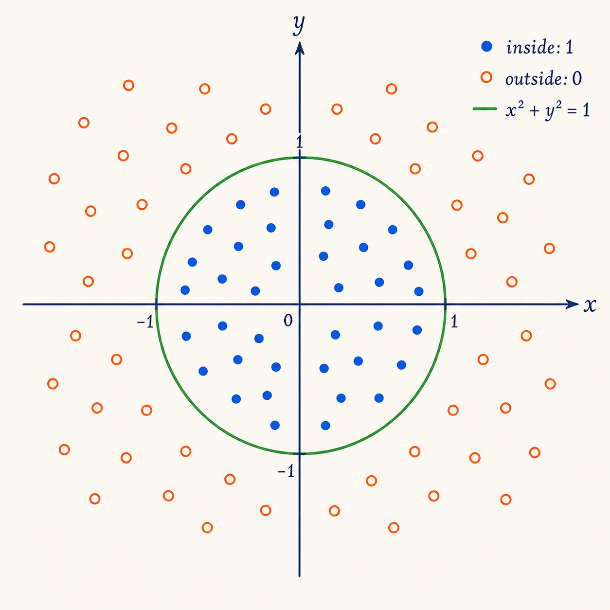
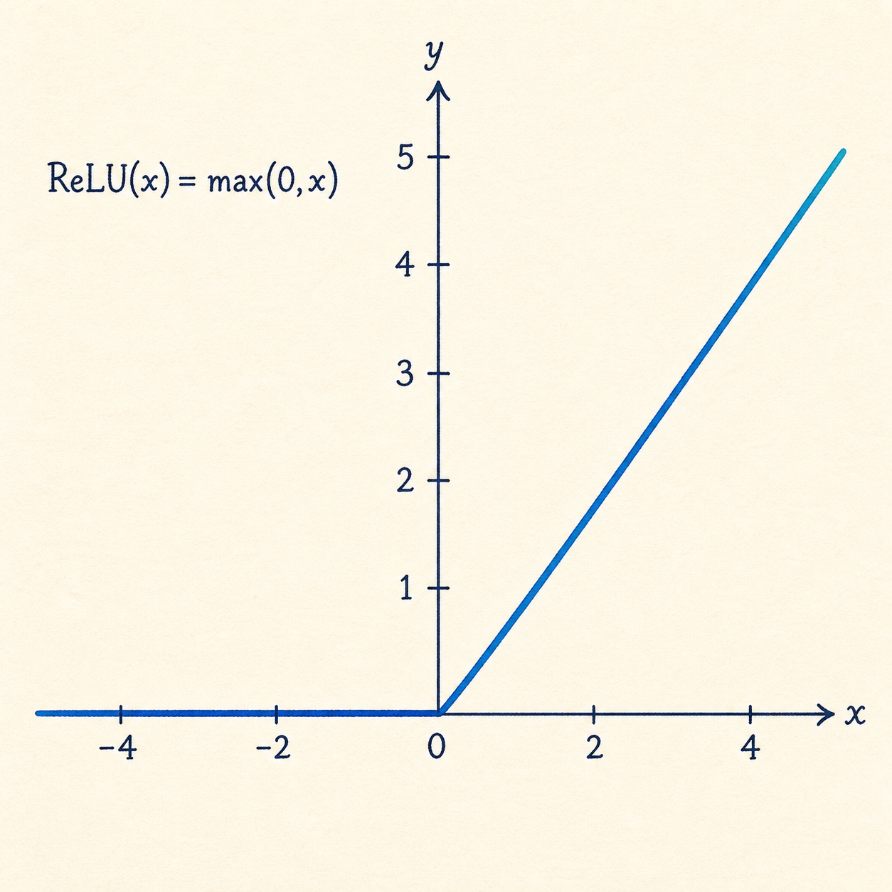
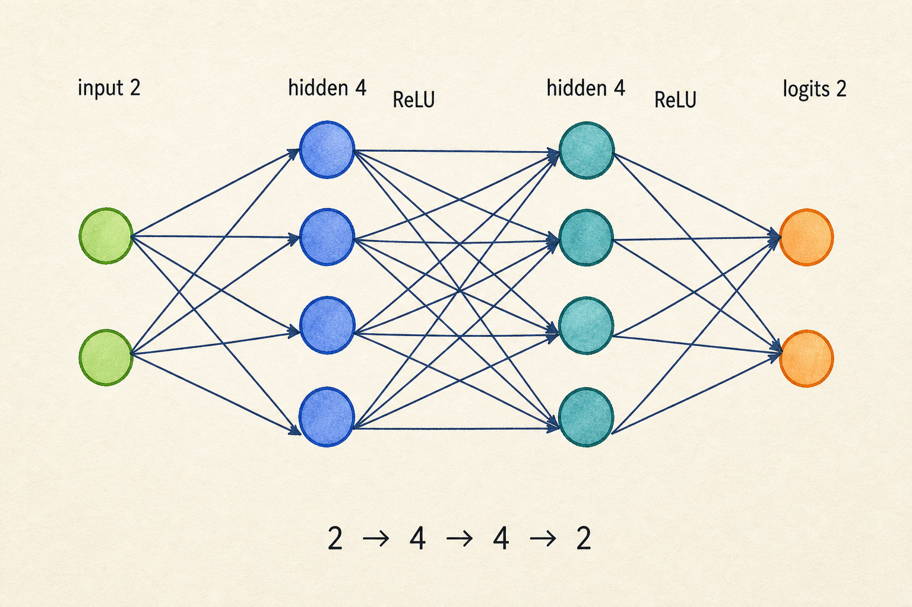
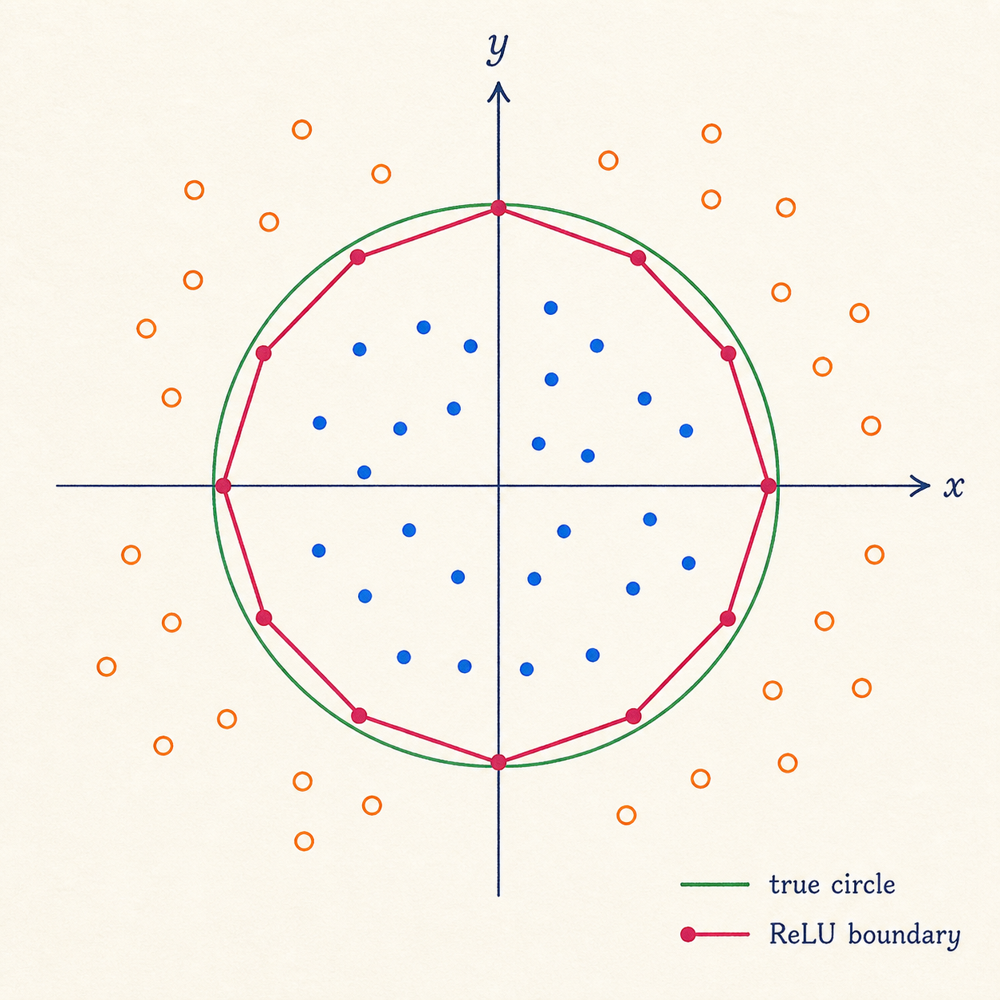

# 第二节：判断点在圆内还是圆外

给定平面上的点 $(x,y)$，标签由下面的规则确定：

$$
\text{label}=\begin{cases}
1,&x^2+y^2\le 1,\\
0,&x^2+y^2>1
\end{cases}
$$



上一节的 $y=ax+b$ 只能画直线。圆形分类需要一条封闭、弯曲的决策边界，因此多层线性变换之间还要加入非线性。

## 从线性层到 MLP

设一个 batch 有 $m$ 个点，输入为 $\mathbf X\in\mathbb R^{m\times2}$。`Model.py` 使用 2-4-4-2 的网络：

$$
\begin{aligned}
\mathbf Z_1 &= \mathbf X\mathbf W_1+\mathbf b_1,
&\mathbf H_1&=\mathrm{ReLU}(\mathbf Z_1),\\
\mathbf Z_2 &= \mathbf H_1\mathbf W_2+\mathbf b_2,
&\mathbf H_2&=\mathrm{ReLU}(\mathbf Z_2),\\
\mathbf Z_3\;(\text{logits}) &= \mathbf H_2\mathbf W_3+\mathbf b_3
\end{aligned}
$$

参数和中间量的 shape 是：

| 名称 | shape | 含义 |
| --- | --- | --- |
| $\mathbf X$ | $(m,2)$ | 一批点的 $x,y$ 坐标 |
| $\mathbf W_1,\mathbf b_1$ | $(2,4),(1,4)$ | 第一层参数 |
| $\mathbf H_1$ | $(m,4)$ | 第一层激活 |
| $\mathbf W_2,\mathbf b_2$ | $(4,4),(1,4)$ | 第二层参数 |
| $\mathbf H_2$ | $(m,4)$ | 第二层激活 |
| $\mathbf W_3,\mathbf b_3$ | $(4,2),(1,2)$ | 输出层参数 |
| logits | $(m,2)$ | 圆外、圆内两个类别分数 |

对本仓库采用的“样本放在行上”的写法，Linear 权重总是

$$
(\text{in\_dim},\text{out\_dim})
$$

于是 $(m,\text{in})@(\text{in},\text{out})$ 正好得到 $(m,\text{out})$，偏置 $(1,\text{out})$ 沿 batch 维广播。

### ReLU 带来了什么

$$\mathrm{ReLU}(z)=\max(0,z)$$

如果没有 ReLU，多层线性变换仍可合并成一次线性变换，决策边界依旧是直线。ReLU 在不同区域保留或截断线性响应，使网络得到分段线性的边界；宽度和层数增加后，可以组合出更细的多边形近似。







Sigmoid 也提供非线性，并把单个数压到 $(0,1)$：

$$\sigma(z)=\frac{1}{1+e^{-z}}$$


它常与单输出的二分类交叉熵搭配。这里为了与后面的多分类写法一致，采用两个输出加 softmax，隐藏层仍使用 ReLU。

## softmax 与交叉熵

logit 是未归一化的类别分数，可以为任意实数。softmax 将每行分数转成和为 1 的概率：

$$
p_{ik}=\frac{\exp(z_{ik})}{\sum_j\exp(z_{ij})}
$$

实际计算前先减去该行最大值：

$$
\mathrm{softmax}(\mathbf z)=
\frac{\exp(\mathbf z-\max(\mathbf z))}
{\sum_j\exp(z_j-\max(\mathbf z))}
$$

加减同一个常数不会改变结果，却能避免较大 logit 在 `exp` 中溢出。标签在代码里写成 one-hot：类别 0 为 `[1, 0]`，类别 1 为 `[0, 1]`。

batch 平均交叉熵为：

$$
L=-\frac{1}{m}\sum_{i=1}^{m}\sum_{k=1}^{2}y_{ik}\log p_{ik}
$$

因为 one-hot 每行只有一个 1，单个样本的损失就是正确类别概率的负对数。正确类别概率越接近 1，损失越接近 0。

softmax 与交叉熵合在一起求导后，网络末端的梯度可化简为：

$$
\mathrm d\mathbf Z_3=\frac{\mathbf P-\mathbf Y}{m}
$$

除以 $m$ 是因为前向损失对 batch 取了平均。重复除一次会让梯度多缩小 $m$ 倍，完全不除则会让有效学习率随 batch size 改变。

## 反向传播怎样穿过三层网络

线性层 $\mathbf Z=\mathbf X\mathbf W+\mathbf b$ 收到上游梯度 $\mathrm d\mathbf Z$ 后：

$$
\mathrm d\mathbf W=\mathbf X^\top\mathrm d\mathbf Z,
\qquad
\mathrm d\mathbf b=\sum_{i=1}^{m}\mathrm d\mathbf Z_i,
\qquad
\mathrm d\mathbf X=\mathrm d\mathbf Z\mathbf W^\top
$$

ReLU 只让前向时大于 0 的位置通过梯度：

$$
\mathrm d\mathbf Z=\mathrm d\mathbf H\odot\mathbb{1}[\mathbf Z>0]
$$

套到当前模型，反向顺序如下：

$$
\begin{aligned}
\mathrm d\mathbf W_3 &= \mathbf H_2^\top\mathrm d\mathbf Z_3,
&\mathrm d\mathbf b_3 &= \sum_i\mathrm d\mathbf Z_{3,i},\\
\mathrm d\mathbf H_2 &= \mathrm d\mathbf Z_3\mathbf W_3^\top,
&\mathrm d\mathbf Z_2 &= \mathrm d\mathbf H_2\odot\mathbb{1}[\mathbf Z_2>0],\\
\mathrm d\mathbf W_2 &= \mathbf H_1^\top\mathrm d\mathbf Z_2,
&\mathrm d\mathbf b_2 &= \sum_i\mathrm d\mathbf Z_{2,i},\\
\mathrm d\mathbf H_1 &= \mathrm d\mathbf Z_2\mathbf W_2^\top,
&\mathrm d\mathbf Z_1 &= \mathrm d\mathbf H_1\odot\mathbb{1}[\mathbf Z_1>0],\\
\mathrm d\mathbf W_1 &= \mathbf X^\top\mathrm d\mathbf Z_1,
&\mathrm d\mathbf b_1 &= \sum_i\mathrm d\mathbf Z_{1,i}
\end{aligned}
$$

shape 为这些公式提供了直接的核对方法。例如 $(m,4)^{\top}@(m,2)=(4,2)$，正好与 $\mathbf W_3$ 相同。`Model.py` 的 `backward()` 算完这些量后直接更新参数；下一节会把“计算梯度”和“更新参数”拆成 Layer 与 Optimizer。

## batch、epoch 与验证集

`batch_size=20` 表示每次用 20 个训练样本的平均梯度更新参数。800 个训练样本完整走一遍是一个 epoch，共有 40 次更新。每个 epoch 开始前，代码会用固定随机数生成器打乱训练顺序。

训练日志还会计算验证指标。验证集不参加 `backward()`，它回答的是模型在另一批未参与更新的样本上能否保持表现。若训练准确率继续提高而验证准确率下降，通常说明模型正在更贴合训练样本，未必能更好地泛化。

数据管线有几条明确约束：

- `starter.py` 每次运行都按当前 `condition` 重建 CSV，不沿用旧标签；
- 1000 个候选点来自同一个随机样本池，再按类别分层为 800 条训练数据和 200 条验证数据；
- 两个集合坐标无交集，各自内部也没有重复坐标；
- 每条标签都重新按半径 1 的条件验算；
- 两个集合都包含 0、1 两类，类别比例近似一致。

这些检查在训练前完成。标签过期、集合泄漏或 condition 写错 shape 时，程序会直接报错。

## 运行与核对

```bash
cd exercises/block_01_basics/task_01_circle_classifier
python starter.py
```

正常开头类似：

```text
data check passed: train=800, val=200, overlap=0, positive_ratio=0.401/0.400
Epoch    1 | train_loss=... train_acc=... | val_loss=... val_acc=...
```

固定默认参数下，最终验证准确率通常在 `0.95` 以上；具体数值会受运行环境影响。日志中的几个关键信号是：

- 数据检查通过，train/val 各为 800/200，且 `overlap=0`；
- 损失总体下降，没有 `nan` 或 `inf`；
- 验证准确率明显超过只猜多数类的基线（当前数据约为 60%）；
- 每个 $\mathrm dW$、$\mathrm db$ 的 shape 与对应参数一致。

仓库测试会单独检查标签、分层和集合泄漏：

```bash
python -m unittest tests.test_block1 -v
```

边界由 `starter.py` 中的向量化条件控制。例如，轴对齐方形可以写成：

```python
condition = "(np.abs(x) <= 0.8) & (np.abs(y) <= 0.8)"
```

下一次运行会用同一批坐标重算标签并重建划分，方便比较“只换目标边界”带来的变化。

## 参考资料

- [Stanford CS231n：二维数据上的 softmax 与两层神经网络](https://cs231n.github.io/neural-networks-case-study/)
- [PyTorch：gradcheck 的有限差分原理](https://docs.pytorch.org/docs/stable/notes/gradcheck.html)
