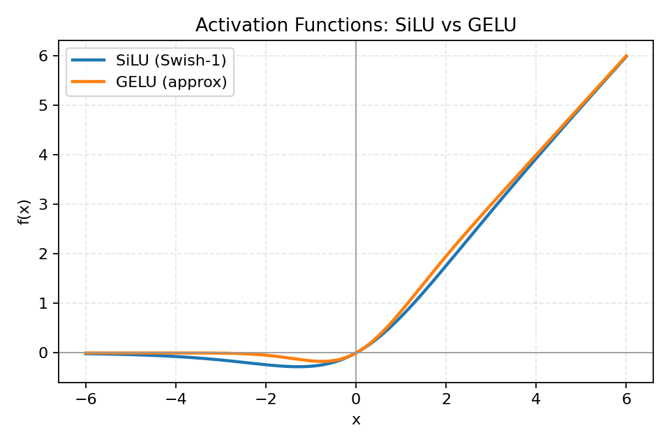

# 任务三 完善你的深度学习库

你现在已经完成前两个任务了, 但是目前模型收敛速度和效果还不够好.

你将完善你的深度学习小库, 依次引入: 新的激活函数(SiLU/GELU) -> 优化器(mini-batch SGD、Momentum、Adagrad、RMSProp、Adam) -> 归一化(BatchNorm/LayerNorm) -> 正则化(Dropout) -> 模型初始化.

我们先看你会遇到的典型现象:

- 问题 A: 损失下降很慢, 一段时间后几乎不动; 有时一大片神经元都学不到东西.
- 问题 B: 损失忽上忽下, 对学习率非常敏感, 稳不住.
- 问题 C: 训练集准确率很高, 测试集却很差, 也就是过拟合.
- 问题 D: batch 改小就不稳定, 同样的学习率今天能收敛, 明天又发抖.

下面我们先从改动最简单也最直观的激活函数开始.

---

## 一. 激活函数

回忆任务二: 我们用了 ReLU. 它简单高效, 但也有两个常见问题:

- Dead ReLU 问题: ReLU 神经元在训练时比较容易“死亡”. 在训练时, 如果参数在一次不恰当的更新后, 第一个隐藏层中的某个 ReLU 神经元在所有训练数据上都不能被激活, 那么这个神经元自身参数的梯度永远都会是 0, 以后也很难再被激活. 这种现象称为死亡 ReLU 问题, 并且也有可能发生在其他隐藏层.
- 不以零为中心: 和 Sigmoid 激活函数类似, ReLU 函数的输出不以零为中心. ReLU 的输出为 0 或正数, 会给后一层神经网络引入偏置偏移, 影响梯度下降的效率.

为了解决这些问题, 在 ReLU 的基础上发展出了几种改进的激活函数. 其中 SiLU 和 GELU 在现代深度学习中应用较为广泛.

### SiLU

SiLU(Sigmoid Linear Unit)也叫 Swish, 是 ReLU 的平滑版本. 它由 Sigmoid 函数和线性变换结合而成:

$$\mathrm{SiLU}(x) = x \cdot \sigma(x)$$

其中:

$$\sigma(x) = \frac{1}{1 + e^{-x}}$$

简单来说, SiLU 将输入 $x$ 与其通过 Sigmoid 函数的输出相乘. 这种设计既保留了非线性特性, 又引入了平滑性.

### GELU

GELU(Gaussian Error Linear Unit)是更“平滑”的门, 在 0 附近软过渡, 现代 Transformer 广泛使用.

GELU 基于高斯分布的累积分布函数(CDF), 定义为:

$$\mathrm{GELU}(x) = x \cdot \Phi(x)$$

其中 $\Phi(x)$ 是标准正态分布的累积分布函数.

由于直接计算 $\Phi(x)$ 较为复杂, 实践中通常使用近似公式:

$$\mathrm{GELU}(x) \approx x \cdot \sigma(1.702x)$$

或者更精确的近似:

$$\mathrm{GELU}(x) \approx 0.5x \left(1 + \tanh\left(\sqrt{\frac{2}{\pi}}(x + 0.044715x^3)\right)\right)$$

GELU 的灵感来源于高斯分布, 因此它在处理输入时具有一定的概率特性.



[更多激活函数和数学原理](https://zhuanlan.zhihu.com/p/364620596)

### 如何选择?

实际上你应该一开始就用 GELU, Transformer 和很多现代架构在经过实验验证后都采用了 GELU 作为默认激活函数.

不过这不是说 ReLU 没用了. 小模型、小任务、教学实现里, ReLU 依然非常合适. 当你实在想不到模型哪里可以改动时, 可以更换激活函数试试.

---

## 二. 优化器(Optimizer)

在训练神经网络时, 我们最先接触的就是最基本的 mini-batch SGD. 它的更新规则很简单:

$$\theta \leftarrow \theta - \eta g_t$$

这里的 $\theta$ 是参数, $\eta$ 是学习率, $g_t$ 是当前批次的平均梯度.

SGD 的思路直接有效, 但在地形复杂的损失函数上, 比如那种像峡谷一样的曲面, 它常常在两边摇摆, 很难顺利下降到低谷.

### 1. 带动量的 SGD(Momentum)

带动量的版本在原始 SGD 的基础上加入了"惯性".

可以想象一个小球在山谷中滚动, 它不会每次都完全听从当前的梯度方向, 而是保留了一部分之前的速度:

$$v_t = \beta v_{t-1} + (1-\beta) g_t$$

$$\theta \leftarrow \theta - \eta v_t$$

动量帮助模型沿着平均方向前进, 减少震荡, 也能加速收敛. 参数 $\beta$ 控制惯性的大小, 常取 0.9.

### 2. Adagrad

Adagrad 的想法是: 对不同参数使用不同的学习率.

如果某个方向上梯度一直很大, 算法会记下来, 并逐渐减小那一方向的步长; 反之, 如果梯度很小, 就保持较大的步长:

$$s_t = s_{t-1} + g_t \odot g_t$$

$$\theta \leftarrow \theta - \eta \frac{g_t}{\sqrt{s_t + \varepsilon}}$$

这种机制让 Adagrad 在稀疏数据上表现不错, 比如自然语言处理任务. 但它的缺点是学习率会不断变小, 后期几乎停止更新.

### 3. RMSProp

RMSProp 解决了 Adagrad 步长衰减过快的问题.

它不再把所有历史梯度都累加, 而是对最近的梯度平方做指数加权平均:

$$s_t = \rho s_{t-1} + (1-\rho) g_t \odot g_t$$

$$\theta \leftarrow \theta - \eta \frac{g_t}{\sqrt{s_t + \varepsilon}}$$

这样既能自适应不同方向的学习率, 又能保持更新的灵活性, 常被用于训练循环神经网络.

### 4. Adam

Adam 是目前最常用的优化器之一, 它结合了 Momentum 和 RMSProp 的优点.

它既记录了梯度的平均趋势, 又跟踪了每个方向上梯度大小的变化, 还在更新时加上了偏置修正:

$$m_t = \beta_1 m_{t-1} + (1-\beta_1) g_t$$

$$v_t = \beta_2 v_{t-1} + (1-\beta_2) g_t \odot g_t$$

$$\hat{m_t} = \frac{m_t}{1-\beta_1^t}, \quad \hat{v_t} = \frac{v_t}{1-\beta_2^t}$$

$$\theta \leftarrow \theta - \eta \frac{\hat{m_t}}{\sqrt{\hat{v_t}} + \varepsilon}$$

Adam 在训练初期能快速下降, 同时在后期保持较稳定的收敛, 是深度学习中的默认选择.

### 5. AdamW

AdamW 是 Adam 的改进版本. 它重新处理了权重衰减(weight decay)的方式.

传统 Adam 是把衰减混进梯度更新中, 而 AdamW 则直接在参数上施加衰减, 更符合正则化的理论意义:

$$m_t = \beta_1 m_{t-1} + (1-\beta_1) g_t$$

$$v_t = \beta_2 v_{t-1} + (1-\beta_2) g_t \odot g_t$$

$$\hat{m_t} = \frac{m_t}{1-\beta_1^t}, \quad \hat{v_t} = \frac{v_t}{1-\beta_2^t}$$

$$\theta \leftarrow \theta - \eta \frac{\hat{m_t}}{\sqrt{\hat{v_t}} + \varepsilon} - \eta \lambda \theta$$

AdamW 通常在大模型训练中表现更好, 比如 Transformer 系列模型, 已成为许多框架中的默认配置.

这里的讲述会有点难以理解, 你可以观看讲解视频: [十分钟搞明白 Adam 和 AdamW, SGD, Momentum, RMSProp, Adam, AdamW](https://www.bilibili.com/video/BV1NZ421s75D/?share_source=copy_web&vd_source=4232eb286ab50446fa5cf1c3eb74b04c)

### 如何选择优化器?

- 如果只是做实验或训练通用模型: Adam 或 AdamW 是安全而高效的选择.
- 想严格复现早期论文或控制理论收敛性质: 可以尝试 Momentum-SGD.
- 面对稀疏特征或特定任务, 比如 NLP 的词嵌入: Adagrad 仍然值得一试.

---

## 三. 归一化(Normalization)

在训练神经网络时, 你可能会发现: 同样的学习率、同样的结构, 有时训练非常稳, 有时却抖得厉害.

一个常见原因是层输入的分布在不断漂移.

因为每个 batch 的数据不同, 每一层看到的输入分布也会跟着变化, 这被称为 Internal Covariate Shift(内部协变量偏移).

一个直观例子:

- batch0: [0.1, 0.2, 0.3, 0.4, 0.5] -> 均值 0.3, 方差 0.02
- batch1: [0.5, 0.6, 0.7, 0.8, 0.9] -> 均值 0.7, 方差 0.02

如果不归一化, 第一层可能这次看到范围是 [0.1, 0.5], 下次变成 [0.5, 0.9]. 模型就像在追着漂移的目标学习, 训练不稳定.

归一化把每个 batch 的输入都调整到均值约 0、方差约 1, 各层看到的分布稳定, 训练更平滑.

为什么归一化能抑制梯度消失或爆炸?

关键在缩放不变性与梯度的链式传导. 设每层为:

$$h_{l+1} = f(W_l h_l + b_l)$$

若 $h_l$ 的尺度过大或过小, 多层叠加后, 梯度在反传中要么指数放大, 要么被压扁到 0 附近. 归一化把每层的输出拉回到合适的尺度, 会带来几个直接收益:

- 梯度传播更稳定.
- 允许更大的学习率.
- 激活保持在有效区间.

### Batch Normalization(BN)

在一个 batch 内, 对每个通道或特征维做标准化, 再学习可训练的缩放和平移参数 $\gamma,\beta$:

$$\mu_B = \mathrm{mean}(x),\quad \sigma_B^2 = \mathrm{var}(x)$$

$$\hat{x} = \frac{x - \mu_B}{\sqrt{\sigma_B^2 + \varepsilon}},\quad y = \gamma\hat{x} + \beta$$

推理阶段使用滑动平均累计的全局 $\mu,\sigma^2$.

常见放置:

```text
线性/卷积 -> BN -> 激活
```

优点: 训练更稳更快, 抑制梯度消失, 可用更大学习率.

缺点: 对 batch 大小敏感, batch 太小统计不准.

详细的数学推导可以看李沐老师的视频: [28 批量归一化【动手学深度学习v2】](https://www.bilibili.com/video/BV1X44y1r77r/?share_source=copy_web&vd_source=4232eb286ab50446fa5cf1c3eb74b04c)

### Layer Normalization(LN)

LayerNorm 对每个样本自身在特征维上做标准化, 与 batch 大小无关:

$$\mu = \mathrm{mean}_{\text{feature}}(x),\quad \sigma^2 = \mathrm{var}_{\text{feature}}(x)$$

$$\hat{x} = \frac{x - \mu}{\sqrt{\sigma^2 + \varepsilon}},\quad y = \gamma\hat{x} + \beta$$

它适合小 batch、RNN、Transformer. Transformer 里你会反复看见 LayerNorm.

### 如何选择?

- CNN / 大 batch: 优先 BN.
- 小 batch / MLP / Transformer / RNN: 优先 LN.

---

## 四. 正则化(Regularization)

在训练神经网络时, 你可能会发现: 模型在训练集上表现很好, 但在测试集上却很差.

这就是过拟合(Overfitting).

过拟合的原因是模型学到了训练数据中的噪声和细节, 而不是数据的整体趋势. 为了防止过拟合, 我们可以使用正则化技术.

### Dropout

Dropout 是一种简单而有效的正则化方法.

它的基本思想很简单: 在训练过程中, 随机“丢弃”一部分神经元, 使得模型不能过度依赖某些特定的神经元.

举例来说, 这是一个权重矩阵:

$$
\mathbf{W} = \begin{bmatrix}
w_{11} & w_{12} & w_{13} & w_{14} \\
w_{21} & w_{22} & w_{23} & w_{24}
\end{bmatrix}
$$

现在把 dropout 率设为 0.1, 那经过随机丢弃后, 可能变成:

$$
\mathbf{W'} = \begin{bmatrix}
w_{11} & 0 & w_{13} & w_{14} \\
0 & w_{22} & w_{23} & w_{24}
\end{bmatrix}
$$

具体来说, 在每次前向传播时, 对每个神经元以概率 $p$ 将其输出设为 0. 更新权重时, 也只计算未被丢弃的神经元的梯度.

这样, 模型在训练时会变得更加鲁棒, 因为它不能依赖于某个特定的神经元.

在测试时, 我们不进行 Dropout, 而是使用完整网络. 现代实现一般会在训练阶段用 inverted dropout 处理缩放, 这样测试时就不用再额外乘东西.

### L2 正则化

L2 正则化, 也称为权重衰减(weight decay), 是另一种常用的正则化方法.

它通过在损失函数中添加一个与权重平方成正比的惩罚项, 来限制模型的复杂度.

如果原始损失函数为 $L$, 则加入 L2 正则化后的损失函数为:

$$L' = L + \lambda \sum_i w_i^2$$

举个例子, 假设有一个简单的线性回归模型, 其损失函数为均方误差:

$$L = \frac{1}{N} \sum_{j=1}^N (y_j - \hat{y}_j)^2$$

加入 L2 正则化后, 损失函数变为:

$$L' = \frac{1}{N} \sum_{j=1}^N (y_j - \hat{y}_j)^2 + \lambda \sum_i w_i^2$$

其中 $\lambda$ 是正则化强度的超参数, $w_i$ 是模型的权重参数.

通过最小化 $L'$, 模型不仅要拟合训练数据, 还要保持权重较小, 从而防止过拟合.

### 如何选择?

- Dropout: 适用于大模型和小数据集, 可以减少过拟合.
- L2 正则化: 适用于各种模型, 是一种通用方法.
- 两者结合: 很多情况下可以一起用.

---

## 五. 参数初始化(Weight Initialization)

参数初始化是深度学习中的一个重要环节. 合适的初始化方法可以帮助模型更快收敛, 避免梯度消失或爆炸的问题.

### 1. 为何初始化很重要

目标是让信号与梯度在层间传播时方差不至于指数放大或衰减.

对于线性层:

$$z = xW + b$$

若 $x$ 的各维独立同分布, 希望 $\mathrm{Var}[z]$ 与 $\mathrm{Var}[x]$ 同一量级.

对 ReLU 一类非线性, 约有:

$$\mathrm{Var}[\mathrm{ReLU}(z)] \approx \frac{1}{2}\mathrm{Var}[z]$$

因为负半轴被截断. 据此就能推导出合适的权重方差.

### 2. fan_in / fan_out

- fan_in: 每个神经元所连接的输入数目. 对形状为 $(\text{in\_dim}, \text{out\_dim})$ 的全连接权重 $W$, fan_in = in_dim.
- fan_out: 输出维度. 对全连接权重 $W$, fan_out = out_dim.
- 卷积层: fan_in = in_channels × kernel_h × kernel_w, fan_out = out_channels × kernel_h × kernel_w.

### 3. 常用初始化

Xavier/Glorot 适合 Sigmoid/Tanh 等对称激活:

- 正态: $W \sim N(0, 2/(\text{fan\_in}+\text{fan\_out}))$
- 均匀: $W \sim U(-\sqrt{6/(\text{fan\_in}+\text{fan\_out})}, +\sqrt{6/(\text{fan\_in}+\text{fan\_out})})$

He/Kaiming 适合 ReLU/LeakyReLU/GELU 等激活:

- 正态: $W \sim N(0, 2/\text{fan\_in})$
- 均匀: $W \sim U(-\sqrt{6/\text{fan\_in}}, +\sqrt{6/\text{fan\_in}})$

偏置 $b$ 通常初始化为 0.

以 Kaiming 初始化为例:

现在有一个全连接层, 输入维度为 256, 输出维度为 512. 那么 fan_in = 256.

根据 Kaiming 初始化的正态分布公式, 可以计算出权重矩阵的标准差:

$$\sigma = \sqrt{\frac{2}{\text{fan\_in}}} = \sqrt{\frac{2}{256}} = \sqrt{\frac{1}{128}} \approx 0.0884$$

因此, 我们可以从均值为 0, 标准差为 0.0884 的正态分布中随机采样, 来初始化权重矩阵 $W$. 偏置 $b$ 则初始化为 0.

> He 和 Kaiming 初始化的名称都来自同一个人, 他就是何恺明. 顺带一提, 我们之后要搭的 ResNet 网络, 也是何恺明等人提出的. 希望以后在 PyTorch 库中也能看到以你的名字命名的函数.

实践建议:

- MLP/CNN + ReLU/GELU: 用 He(Kaiming) 初始化.
- 用 Sigmoid/Tanh 的隐藏层: 用 Xavier 初始化.
- 输出层(logits): 仍可用与隐藏层一致的初始化. 若训练初期不稳定, 可将最后一层权重再整体缩小一到两个数量级.
- 归一化层: BN/LN 的缩放 $\gamma \leftarrow 1$, 平移 $\beta \leftarrow 0$.

---

## 六. 实现建议

这一关不是要你一次性把 PyTorch 全部复刻出来.

当前小库里先实现这些就够了:

```text
Linear
ReLU
GELU
CrossEntropyLoss
Sequential
SGD
Momentum
```

它们分别对应:

- 激活函数: 提供前向与反向对输入的梯度.
- 优化器: 将“计算梯度”和“如何用梯度更新参数”解耦.
- 损失函数: 负责比较预测和标签, 并给出最后一层梯度.
- 模型容器: 把多层 forward 和 backward 串起来.

旧稿里提到的 Adagrad、RMSProp、Adam、AdamW、BatchNorm、LayerNorm、Dropout、L2 正则化, 你现在不一定都要写完. 但至少要知道它们分别在解决什么问题.

后面到 ResNet 时, 你会再碰 BatchNorm. 到 Transformer 时, 你会再碰 LayerNorm、GELU、AdamW.

也就是说, 这一节不是把所有工具讲完, 而是先把工具箱的格子分出来.

---

## 七. 动手实现

请在当前文件夹中完成:

- `my_dl_lib.py`: 保存你的小型深度学习库.
- `mission_2.py`: 调用小库重新完成圆形分类实验.

运行方式:

```bash
cd exercises/block_01_basics/task_02_mini_dl_lib
python mission_2.py
```

做到这里, 你就拥有了一套能训练、能稳定、能继续扩展的小型深度学习库雏形.

下一步, 我们将使用它来处理 MNIST, 再进入经典的 ResNet 网络, 识别图片中的物体.
