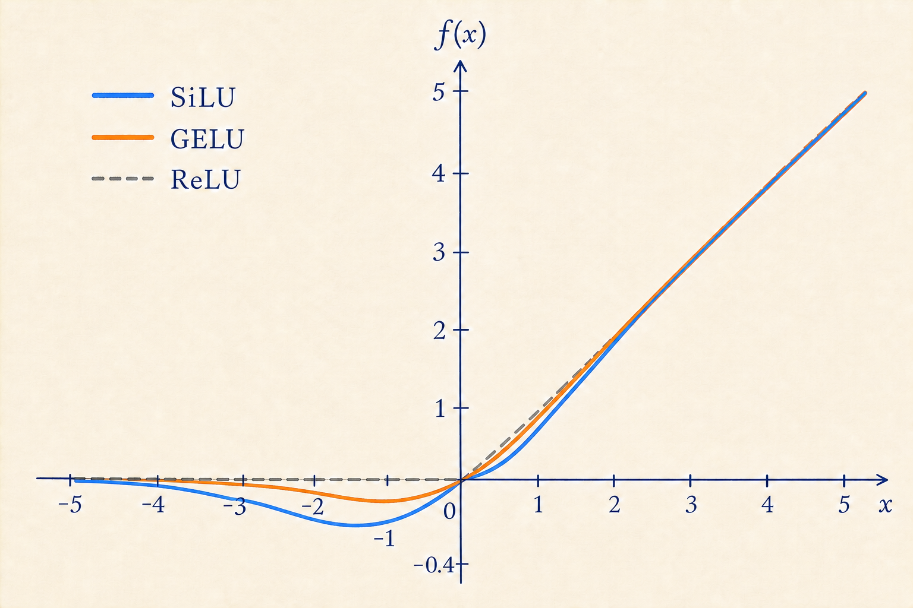

# 第三节：整理一个小型深度学习库

圆形分类已经跑通，但 `Model.py` 同时负责线性计算、激活、损失、反向传播和参数更新。想多加一层或更换优化器时，几乎每一段都要跟着改。

这里把这些职责拆开：


- `Sequential` 保存一组 Layer；
- Layer 的 `forward` 产生激活，`backward` 接收上游梯度并继续向前传；
- Loss 比较 logits 与标签，给出反向传播的起点；
- Optimizer 持有参数与梯度的引用，负责更新 Layer 中的参数。

起始文件 `my_dl_lib.py` 为七类组件保留了实现位置：`Linear`、`ReLU`、`GELU`、`CrossEntropyLoss`、`Sequential`、`SGD` 和 `Momentum` 的前向、反向或更新方法。`mission_2.py` 用这些组件重新训练圆形分类器。

## 组件接口

一个层至少要回答两个问题：

```python
out = layer.forward(x)
dx = layer.backward(dout)
```

`forward` 可以缓存反向所需的量，例如 Linear 的输入、ReLU 的正值 mask。`backward` 不需要知道整个损失函数，只使用上游传来的 `dout` 和自己的缓存。

有参数的层还返回 `(参数, 梯度)` 对：

```python
[(W, dW), (b, db)]
```

优化器在初始化时保存了这些 NumPy 数组的引用。因此 `backward` 采用原地写入，保留现有梯度数组：

```python
self.dW[...] = self.x.T @ dout
self.db[...] = np.sum(dout, axis=0, keepdims=True)
```

如果改成 `self.dW = ...` 并换掉整个数组，优化器可能仍指向旧的 `dW`：日志里梯度非零，参数却不更新。后面的卷积层也会遇到同样的引用问题。

## Linear 与 ReLU

Linear 的前向计算为：

$$
\mathbf Y=\mathbf X\mathbf W+\mathbf b
$$

其中 $\mathbf X:(B,D_{in})$，$\mathbf W:(D_{in},D_{out})$，$\mathbf b:(1,D_{out})$，输出为 $(B,D_{out})$。

收到 $\mathrm d\mathbf Y$ 后：

$$
\mathrm d\mathbf W=\mathbf X^\top\mathrm d\mathbf Y,
\qquad
\mathrm d\mathbf b=\sum_{i=1}^{B}\mathrm d\mathbf Y_i,
\qquad
\mathrm d\mathbf X=\mathrm d\mathbf Y\mathbf W^\top
$$

ReLU 的计算更短：

$$
y=\max(0,x),\qquad
\frac{\partial y}{\partial x}=\mathbb{1}[x>0]
$$

前向保存 `x > 0` 的布尔 mask，反向返回 `dout * mask`。在 $x=0$ 处导数没有唯一值，本项目与常见框架一样取 0。

## GELU 与 SiLU

ReLU 在负半轴输出 0，计算便宜，也很适合这一章的小模型。GELU 和 SiLU 让门控变化更平滑，在 Transformer 等架构中很常见。

$$
\mathrm{SiLU}(x)=x\sigma(x)
$$

$$
\mathrm{GELU}(x)=x\Phi(x)
\approx\frac{x}{2}\left[1+\tanh\left(\sqrt{\frac{2}{\pi}}
\,(x+0.044715x^3)\right)\right]
$$



`GELU` 在这份实现中采用上面的 tanh 近似，前向缓存 `x`。将中间量写开后，链式法则可以直接展开：

$$
u=\sqrt{\frac{2}{\pi}}(x+0.044715x^3),\qquad t=\tanh(u)
$$

$$
\frac{\mathrm d\,\mathrm{GELU}}{\mathrm dx}
=\frac12(1+t)+\frac{x}{2}(1-t^2)
\sqrt{\frac{2}{\pi}}(1+3\cdot0.044715x^2)
$$

激活函数没有统一的优先级，选择会受模型结构和初始化影响。这里的 MLP 使用 ReLU 已经足够，Block 3 的前馈网络则会用到 SiLU。

## CrossEntropyLoss

Loss 接收 logits 和 one-hot targets。先按行减去最大 logit，再计算 softmax：

$$
\mathbf P=\mathrm{softmax}(\mathbf Z-\max(\mathbf Z,\text{axis}=1))
$$

前向返回 batch 平均交叉熵：

$$
L=-\frac1B\sum_{i=1}^{B}\sum_k y_{ik}\log p_{ik}
$$

反向返回：

$$
\frac{\partial L}{\partial\mathbf Z}=\frac{\mathbf P-\mathbf Y}{B}
$$

`CrossEntropyLoss.backward()` 不接收 `dout`，因为损失是计算图末端的标量。它使用前向缓存的 `probs`、`targets` 产生第一份梯度。

这段计算有四个容易混淆的细节：

- softmax 的归一化轴是类别轴 `axis=1`；
- `max` 和 `sum` 都要保留维度 `keepdims=True`；
- `log` 前加一个很小的 `eps`，避免 `log(0)`；
- 平均损失只除一次 batch size。

## Sequential 怎样串起各层

前向按保存顺序调用：

```python
for layer in self.layers:
    x = layer.forward(x)
```

反向传播按逆序调用各层：

```python
for layer in reversed(self.layers):
    dout = layer.backward(dout)
```

`parameters()` 已经给出，它只收集实现了 `parameters` 的层，所以 ReLU、GELU 这类无参数层会被自然略过。以 `2 → 16 → 16 → 2` 为例，返回列表应含 6 对数组：三层 Linear 各有一对权重和一对偏置。

## SGD 与 Momentum

最基本的 SGD 对每个 `(value, grad)` 做原地更新：

$$\theta\leftarrow\theta-\eta g_t$$

Momentum 还为每个参数保存一个同 shape 的速度。当前代码采用下面的约定：

$$
v_t=\beta v_{t-1}+(1-\beta)g_t,
\qquad
\theta\leftarrow\theta-\eta v_t
$$

有些教材写成 $v_t=\beta v_{t-1}+g_t$。两种定义的缩放不同；这份实现采用前一种定义，与构造函数中 `beta` 的语义保持一致。

SGD 不保存历史状态，Momentum 则让连续多个 batch 中方向一致的梯度逐步积累，并平滑相互抵消的方向。Momentum 的收益取决于损失曲面以及学习率、$\beta$ 的组合。

## 如何检查 backward

shape 正确只能排除一部分错误。更可靠的做法是把解析梯度与有限差分比较。对某个标量参数 $\theta_j$：

$$
g_j^{\text{numeric}}\approx
\frac{L(\theta_j+\varepsilon)-L(\theta_j-\varepsilon)}{2\varepsilon}
$$

有限差分检查通常采用下面的设置：

1. 输入规模很小，并使用双精度；
2. Dropout 等随机操作处于关闭状态；
3. 参数避开 ReLU 的 0 点；
4. 每次只扰动一个参数，以中心差分估计梯度；
5. 数值梯度与 `backward` 写入的解析梯度相互比较。

$\varepsilon$ 通常从 `1e-5` 或 `1e-6` 试起。它过大会带来截断误差，过小会受到浮点舍入影响。PyTorch 的 `gradcheck` 也采用有限差分与解析梯度对比，并建议默认检查使用双精度。

## `common/` 里的后续组件

完整版的 `common/my_dl_lib.py` 还提供下面这些实现，后续章节会继续用到它们。

### Adagrad、RMSProp、Adam 与 AdamW

Adagrad 累加历史梯度平方：

$$
s_t=s_{t-1}+g_t^2,
\qquad
\theta\leftarrow\theta-\eta\frac{g_t}{\sqrt{s_t}+\varepsilon}
$$

RMSProp 将累加改为指数移动平均，避免分母只增不减：

$$s_t=\rho s_{t-1}+(1-\rho)g_t^2$$

Adam 同时维护一阶矩 $m_t$ 和二阶矩 $v_t$，并在训练初期做偏差修正：

$$
m_t=\beta_1m_{t-1}+(1-\beta_1)g_t,
\qquad
v_t=\beta_2v_{t-1}+(1-\beta_2)g_t^2
$$

$$
\hat m_t=\frac{m_t}{1-\beta_1^t},
\qquad
\hat v_t=\frac{v_t}{1-\beta_2^t},
\qquad
\theta\leftarrow\theta-\eta\frac{\hat m_t}{\sqrt{\hat v_t}+\varepsilon}
$$

AdamW 将 weight decay 与自适应梯度步骤解耦。对 SGD，L2 惩罚与常见的 weight decay 写法可以等价；对 Adam 这类自适应优化器，两者一般不等价，这正是 AdamW 单独处理衰减的原因。

### BatchNorm 与 LayerNorm

`BatchNorm1D` 面向 $(B,F)$ 输入，对 batch 轴统计每个特征的均值和方差：

$$
\hat x=\frac{x-\mu_B}{\sqrt{\sigma_B^2+\varepsilon}},
\qquad
y=\gamma\hat x+\beta
$$

训练时使用当前 batch 的统计量并更新 `running_mean`、`running_var`；`eval()` 后使用运行统计量。小 batch 的统计噪声较大，验证前忘记切换模式也会改变输出。

`LayerNorm` 对每个样本的最后一个特征维做标准化。对 $(B,T,F)$ 序列，它沿 $F$ 计算均值、方差；$\gamma,\beta$ 在所有 $B,T$ 位置共享，所以参数梯度要同时对 batch 轴和时间轴求和。它不依赖 batch 统计，适合序列模型和小 batch。

归一化往往让优化更稳定，但它并不等于“固定每层的数据分布”，也不保证消除梯度爆炸。它会改变信号尺度和损失曲面的参数化，具体收益依赖数据与模型。

### Dropout

标准 Dropout 遮蔽激活，不修改权重矩阵。设丢弃概率为 $p$，保留概率为 $q=1-p$，inverted dropout 在训练时计算：

$$
\mathbf H'=\frac{\mathbf M\odot\mathbf H}{q},
\qquad M_{ij}\sim\mathrm{Bernoulli}(q)
$$

因此 $\mathbb E[\mathbf H']=\mathbf H$。反向使用同一 mask；`eval()` 时直接返回输入，不再随机遮蔽，也不需要额外缩放。随机将权重元素置零是 DropConnect，不是这里实现的 Dropout。

### 初始化

`Linear` 当前使用：

$$W\sim\mathcal N\left(0,\frac{2}{\text{fan\_in}}\right),\qquad b=0$$

这是 Kaiming/He 正态初始化，适合本章以 ReLU 为主的网络。它用来避免层间激活与梯度尺度过快放大或衰减，但不会替代学习率调节；不同激活函数适合的初始方差也可能不同。

## 组件组成与核对

起始实现包含下面几组接口：

1. `Linear.forward/backward` 与 `ReLU.forward/backward`；
2. `CrossEntropyLoss.forward/backward`；
3. `Sequential.forward/backward`；
4. `SGD.step` 和 `Momentum.step`；
5. `GELU.forward/backward`，再用有限差分检查。

运行圆形分类：

```bash
cd exercises/block_01_basics/task_02_mini_dl_lib
python mission_2.py
```

`mission_2.py` 每轮把 2000 个合成点作为一个 full batch，只打印训练损失与训练准确率。它的用途是检查组件能否连起来更新参数；独立训练集/验证集的泛化观察仍以 task 01 为准。

日志每 50 轮打印一次：

```text
epoch=0 loss=... acc=...
epoch=50 loss=... acc=...
...
```

完整实现会呈现下面这些特征：

- 运行过程不再触发 `NotImplementedError`；
- 每个 `backward` 返回与对应输入相同的 shape；
- Linear、GELU 的解析梯度能通过有限差分检查；
- `optimizer.step()` 后参数确实变化，且梯度数组的对象引用保持不变；
- `mission_2.py` 的 loss 总体下降，最终准确率明显高于约 65% 的多数类基线。

仓库根目录的 `common/my_dl_lib.py` 是完整对照实现。其中值得核对的两个重点是：前向缓存了哪些中间量，以及参数梯度沿哪些轴求和。

## 参考资料

- [Stanford CS231n：初始化、正则化与梯度检查](https://cs231n.github.io/neural-networks-2/)
- [PyTorch：`gradcheck` 的数值与解析梯度比较](https://docs.pytorch.org/docs/stable/notes/gradcheck.html)
- [Dive into Deep Learning：Dropout 从零实现](https://d2l.ai/chapter_multilayer-perceptrons/dropout.html)
