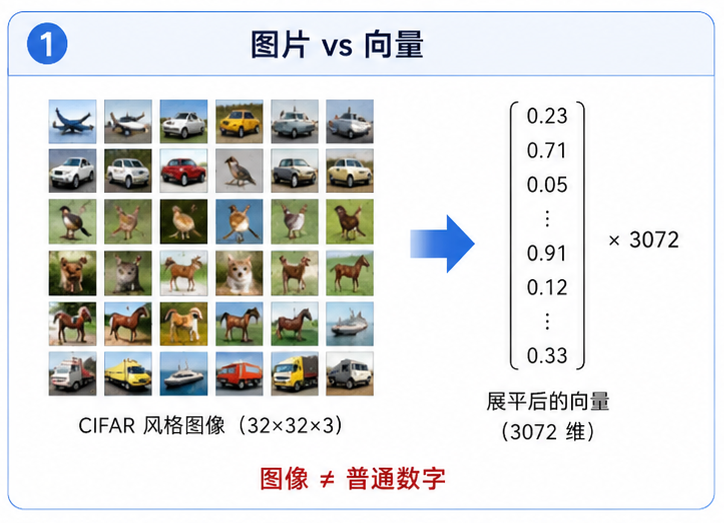
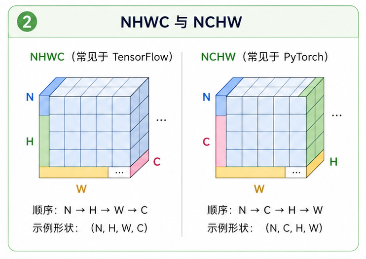
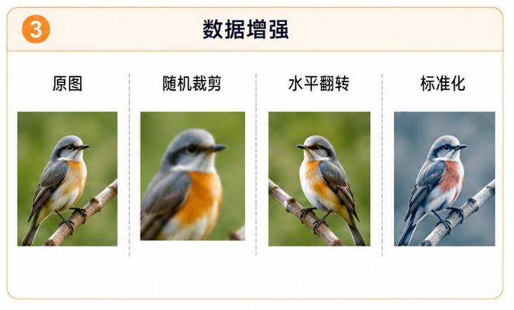
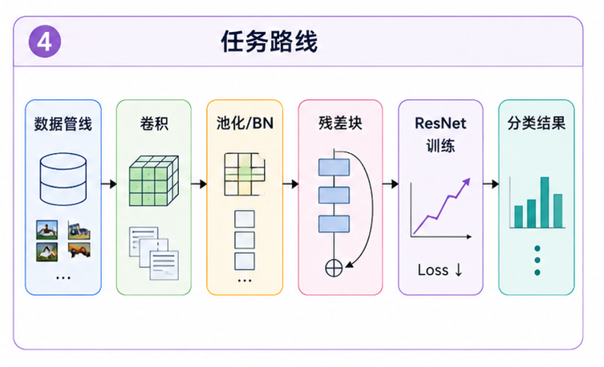

# task_10: 图像数据管线

上一关我们让 MLP 去识别 MNIST.

它能跑, 但那毕竟是灰度图, 还是很干净的手写数字. 现在我们要处理 CIFAR-100 这种彩色图片, 事情马上变麻烦.



图片不是一个二维点, 也不是一条直线. 一张 CIFAR 图片通常长这样:

```text
height = 32
width = 32
channels = 3
```

也就是 $32\times 32\times 3$ 个数字.

在真正写卷积之前, 先别急. 你要先让图片以正确的形状、正确的数值范围、正确的 batch 进入训练循环.

很多模型训练不起来, 不是因为网络结构多深奥, 而是数据一开始就喂错了.

---

## 一. 图片到底是什么形状?

如果你从常见图片库里读图, 经常会得到 `NHWC`:

```text
(N, H, W, C)
```

意思是:

- N: 一批图片的数量.
- H: 图片高度.
- W: 图片宽度.
- C: 通道数, 彩色图片通常是 3.

但很多深度学习实现更喜欢 `NCHW`:

```text
(N, C, H, W)
```

为什么?

因为卷积里我们经常按通道取一小块窗口. 用 `NCHW` 时, 通道维在前面, 后面的 $H,W$ 是空间维, 写卷积和池化会更顺手.

当前文件里的 `to_nchw(images)` 做的就是这件事:

```python
images.transpose(0, 3, 1, 2)
```

如果输入是 `(N, 32, 32, 3)`, 输出就会变成 `(N, 3, 32, 32)`.

这一步看起来只是换了个顺序, 但非常重要. 后面的卷积默认吃的就是 `NCHW`.



---

## 二. 为什么要标准化?

图片像素通常是 0 到 255 的整数.

如果直接把这些数喂给模型, 第一层看到的输入尺度会很大. 再经过几层矩阵乘法, 数值可能很快变得不稳定.

所以我们通常先做两件事:

1. 除以 255, 把像素变到 0 到 1.
2. 减去均值, 再除以标准差.

公式是:

$$x' = \frac{x / 255 - \mu}{\sigma}$$

这里的 $\mu$ 和 $\sigma$ 通常按通道统计. 对 RGB 图片来说, 它们各有 3 个数.

当前 `normalize(images, mean, std)` 里会把 `mean` 和 `std` reshape 成:

```text
(1, 3, 1, 1)
```

这样它就可以自动广播到整批图片的每一个像素位置.

你可以先不用记住“广播”这个词, 只要理解它在做什么: 每个通道用自己的均值和标准差去标准化.

---

## 三. 为什么训练时要随机裁剪和翻转?

假设一张图片里有一艘船.

船在左边还是右边, 轻微偏上还是偏下, 对类别本身通常没那么重要. 但如果训练数据太少, 模型可能会把这些位置细节也记住.

随机增强就是给模型一点扰动:

- 随机水平翻转: 让模型不要太依赖左右方向.
- padding 后随机裁剪: 让主体在图里轻微移动.

当前文件里有两个函数:

```python
random_horizontal_flip(images, p=0.5)
random_crop_with_padding(images, padding=4, crop_size=32)
```

注意, 增强一般只在训练集上做. 验证集和测试集不要随机增强, 不然你每次评估的东西都不一样.



还有一个小细节: 如果你想复现实验, 就给随机数生成器固定 seed.

---

## 四. batch 怎么产生?

Block 1 里已经讲过 batch.

图像这里也是一样. 你不可能每次都拿完整训练集更新参数, 也不应该每次只拿一张图. 所以我们把数据切成一批一批.

`iterate_minibatches(images, labels, batch_size, shuffle=True, seed=None)` 做的事很简单:

1. 生成所有样本的索引.
2. 如果 `shuffle=True`, 就打乱索引.
3. 每次取 `batch_size` 个索引.
4. 返回对应的图片和标签.

训练时通常要 shuffle. 验证时可以不 shuffle.

不要小看这一步. 如果图片和标签没有同步打乱, 模型会学得非常奇怪. 更糟的是, 代码可能不会报错.

---

## 五. 你要完成什么?

请完成或检查当前文件夹中的 `data_pipeline.py`.

你至少要确认这些函数行为正确:

```text
to_nchw
normalize
random_horizontal_flip
random_crop_with_padding
iterate_minibatches
```

可以自己写几行小测试:

```python
import numpy as np
from data_pipeline import to_nchw, normalize, iterate_minibatches

images = np.zeros((10, 32, 32, 3), dtype=np.uint8)
labels = np.arange(10)

x = to_nchw(images)
print(x.shape)  # (10, 3, 32, 32)

x = normalize(x, mean=[0.5, 0.5, 0.5], std=[0.5, 0.5, 0.5])
print(x.dtype, x.shape)

for xb, yb in iterate_minibatches(x, labels, batch_size=4):
    print(xb.shape, yb.shape)
```

这一关不需要训练模型. 它只负责一件事: 让图片干干净净地进入后面的网络.

下一关我们开始写卷积.


