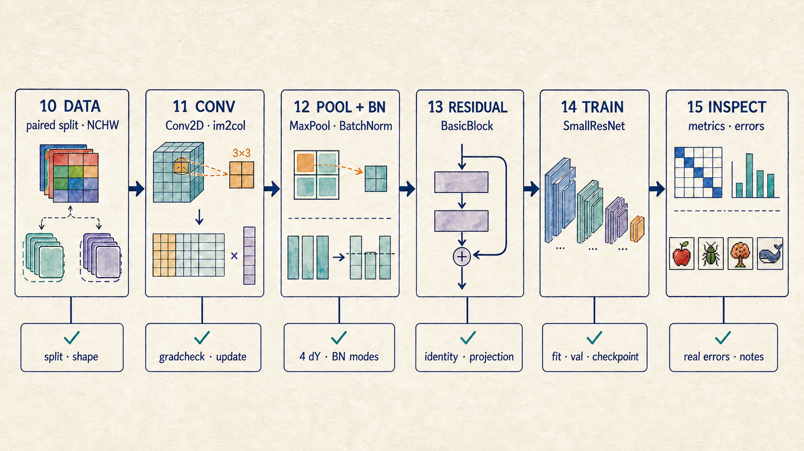
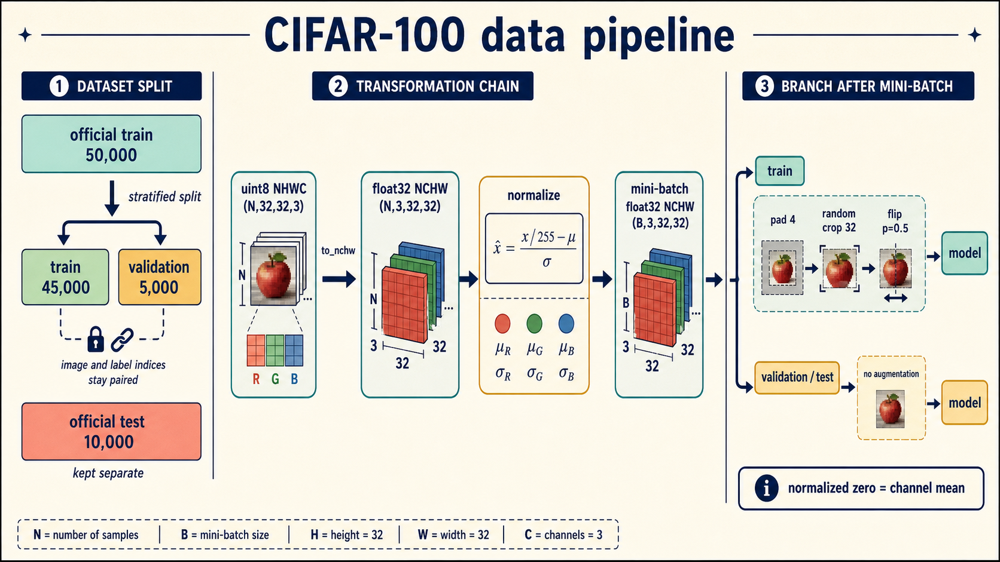
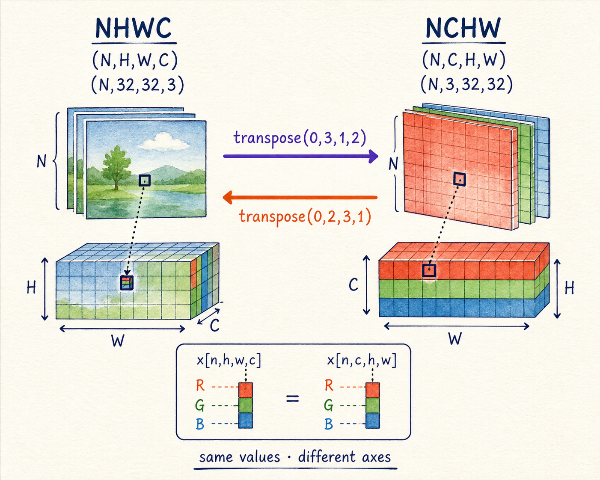
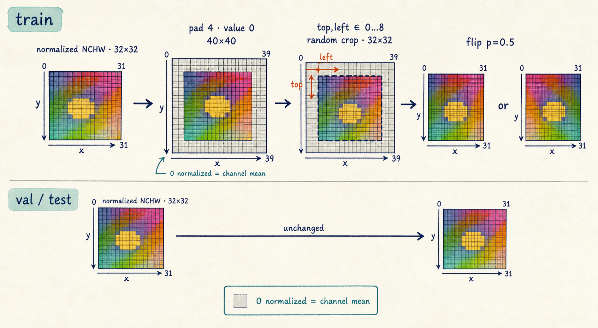

# task_10：图像数据管线

CIFAR-100 的单张图片是 $32\times32$ RGB 数组。进入卷积前，数据管线统一轴顺序和数值尺度，完成数据划分，并在训练分支中加入随机增强。这些约定直接影响后续 loss 是否具有可解释性。

代码入口是 [`data_pipeline.py`](./data_pipeline.py)。它不训练模型，只负责产生彼此隔离、shape 一致的 batch。





---

## CIFAR-100 的三份数据

[官方说明](https://www.cs.toronto.edu/~kriz/cifar.html)给出的 CIFAR-100 规模是：

```text
60,000 张 32×32 RGB 图片
100 个 fine classes
每类 500 张训练图片、100 张测试图片
```

官方只提供 train 和 test。训练时还需要 validation，本仓库采用下面的划分：

```text
官方 train 50,000
├── train       45,000（默认）
└── validation   5,000（默认）

官方 test       10,000
```

`stratified_train_val_split()` 按类别分配验证样本，并用独立索引构造两份数组。`load_cifar100_splits()` 始终从官方 train 产生 train/validation；官方 test 只进入返回值中的 test。

以下参数用于缩短运行时间：

```text
train_limit
val_limit
test_limit
```

三个 limit 分别在各自 split 内分层抽样，不会把测试图片挪入训练集。

### 数据划分的关键性质

- train 与 validation 的源索引无交集；
- 标签是一维整数，范围为 `[0, 100)`；
- 图片数量与标签数量相同；
- 本地或生成数据可用 `assert_disjoint_splits()` 检查完全相同的图片记录。

`assert_disjoint_splits()` 比较图片内容的指纹，适合没有原始索引的数组。官方 CIFAR 加载器则直接检查 train/validation 的源索引，test 来自另一份官方 split。

---

## NHWC 与 NCHW

`torchvision.datasets.CIFAR100.data` 的 shape 是：

```text
(N, H, W, C)
```

本章的算子接口是：

```text
(N, C, H, W)
```



`to_nchw()` 执行：

```python
images.astype("float32", copy=False).transpose(0, 3, 1, 2)
```

因此：

```text
(N, 32, 32, 3) -> (N, 3, 32, 32)
```

transpose 不会改变像素值，只改变各轴的含义。这里用 `N` 表示 batch 维；配图中的 `B` 表示同一件事。

---

## 按通道标准化

`normalize(images, mean, std)` 接收 NCHW 数组。它先把 `0..255` 像素缩放到 `0..1`，再对每个通道应用：

$$
x'_{nchw}=\frac{x_{nchw}/255-\mu_c}{\sigma_c}.
$$

仓库使用的常量是：

```python
CIFAR100_MEAN = (0.5071, 0.4867, 0.4408)
CIFAR100_STD  = (0.2675, 0.2565, 0.2761)
```

`mean` 和 `std` 会 reshape 为 `(1,3,1,1)`，通过广播作用到 batch 和空间位置。函数会拒绝通道数不匹配、非正或非有限的标准差。

标准化后的数值不再受 $[0,1]$ 限制，负数或大于 1 的值都很常见。输出的稳定约定是 `float32`、shape 不变，且所有元素有限。

---

## 随机增强只进入训练循环

代码实现了两种增强：

```python
random_crop_with_padding(images, padding=4, crop_size=32, rng=rng)
random_horizontal_flip(images, p=0.5, rng=rng)
```



随机裁剪先在高、宽两侧补值，再为每张图片独立采样左上角。水平翻转沿 NCHW 的最后一轴进行。两者都返回新数组，不修改传入数据。

图中按常见的数据准备顺序排列处理项。当前训练代码的实际调用顺序是：

1. `load_cifar100_splits()` 先完成 `to_nchw()` 和 `normalize()`；
2. `train_epoch(..., augment=True)` 再对已标准化的 batch 做裁剪和翻转；
3. 因而 padding 填入的数值 `0` 表示标准化坐标中的通道均值，不是原始 RGB 黑色；
4. `evaluate()` 不调用增强。

增强不改变标签，只作用于图片数组；shuffle 则用同一组索引同时选择图片和标签。

显式传入 `np.random.Generator`，或使用训练循环中的 seed，可以复现随机增强。相同 seed、输入和调用顺序会得到相同结果。

---

## minibatch 中的共享索引

`iterate_minibatches(images, labels, batch_size, shuffle=True, seed=None)` 的流程是：

```text
生成 indices
按需打乱 indices
images[batch_indices], labels[batch_indices]
```

最后一个 batch 不会被丢弃。例如 10 条样本、`batch_size=4` 会产生大小为 4、4、2 的三个 batch。epoch loss 按实际 batch 大小加权，task 14 已按这一规则实现。

一个最小示例：

```python
import numpy as np
from exercises.block_02_resnet.task_10_image_data_pipeline.data_pipeline import (
    iterate_minibatches,
    normalize,
    to_nchw,
)

images = np.zeros((10, 32, 32, 3), dtype=np.uint8)
labels = np.arange(10, dtype=np.int64)
x = normalize(to_nchw(images), [0.5] * 3, [0.5] * 3)

print(x.shape, x.dtype)
for xb, yb in iterate_minibatches(x, labels, batch_size=4, shuffle=False):
    print(xb.shape, yb.tolist())
```

预期：

```text
(10, 3, 32, 32) float32
(4, 3, 32, 32) [0, 1, 2, 3]
(4, 3, 32, 32) [4, 5, 6, 7]
(2, 3, 32, 32) [8, 9]
```

---

## 接口清单

| 接口 | 输入 | 输出 / 作用 |
| --- | --- | --- |
| `to_nchw(images)` | `(N,H,W,C)` | float32 `(N,C,H,W)` |
| `normalize(images, mean, std)` | NCHW | 同 shape 标准化数组 |
| `random_horizontal_flip(...)` | NCHW | 按样本随机翻转 |
| `random_crop_with_padding(...)` | NCHW | padding 后随机裁剪 |
| `iterate_minibatches(...)` | 图片、标签 | 保留末尾短 batch 的迭代器 |
| `stratified_train_val_split(...)` | 一份带标签数据 | 分层且无交集的 train/val |
| `stratified_subset(...)` | 一个 split | 指定大小的分层子集 |
| `load_cifar100_splits(...)` | 数据目录与限制 | NCHW train/val/test |
| `validate_splits(...)` | 三个 split | shape、标签范围、内容交集检查 |

---

## 运行与核对

模块可直接加载：

```bash
python exercises/block_02_resnet/task_10_image_data_pipeline/data_pipeline.py
```

文件没有 demo 主函数，成功时不打印内容，退出码为 0。

Block 2 的自动测试命令为：

```bash
python -m unittest discover -s tests -p 'test_block2.py' -v
```

其中与数据管线相关的检查包括：

- 分层拆分得到期望的每类数量；
- train/validation 源索引无交集；
- 官方 test 只出现在 test 返回值；
- batch 中图片和标签没有错位；
- 输入错误时抛出明确异常。

后续的 [task_11：Conv2D 与 im2col](../task_11_conv2d_im2col/README.md) 沿用这里的 NCHW 约定。

## 参考资料

- [CIFAR-10 and CIFAR-100 datasets](https://www.cs.toronto.edu/~kriz/cifar.html)
- [Stanford CS231n: Data Preprocessing and Augmentation](https://cs231n.github.io/neural-networks-2/)
