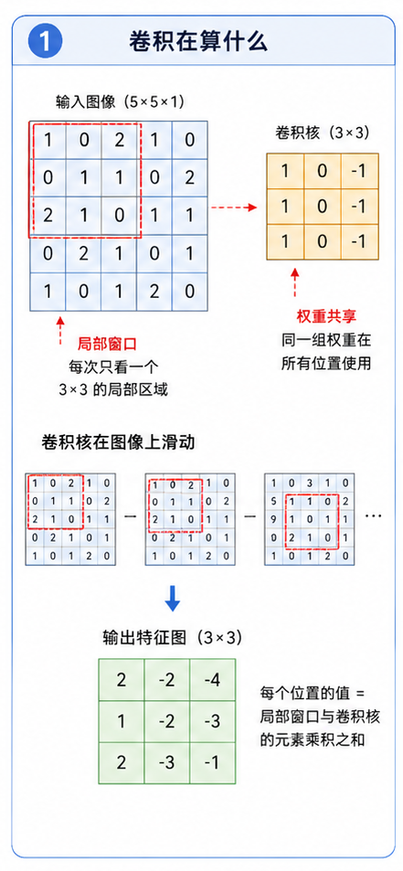
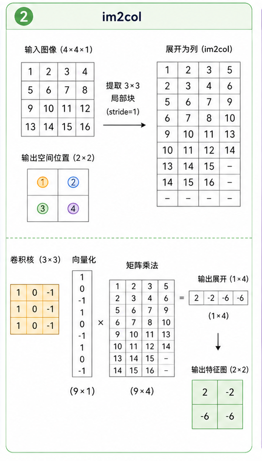
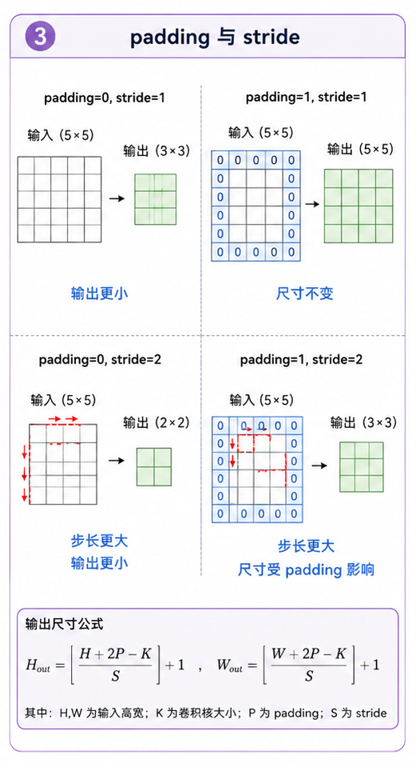

# task_11: Conv2D 与 im2col

现在图片已经能以 `NCHW` 的形状进入训练循环了.

接下来要解决真正的图像模型问题: 怎么让模型看局部区域?

MLP 看一张图片时, 会把所有像素摊平成一个长向量. 卷积不这样做. 卷积会拿一个小窗口, 比如 $3\times 3$, 在图片上滑动.

这个小窗口就是卷积核(kernel).

你可以把它想成一个很小的检测器. 有的卷积核可能对竖直边缘敏感, 有的可能对颜色变化敏感, 有的可能对某种纹理敏感. 当然, 它一开始什么都不会, 这些权重还是靠训练学出来的.



---

## 一. 卷积层在算什么?

假设输入是一批图片:

```text
X.shape = (N, C_in, H, W)
```

卷积核参数是:

```text
W.shape = (C_out, C_in, K, K)
b.shape = (C_out,)
```

这里:

- `C_in` 是输入通道数.
- `C_out` 是输出通道数, 也就是卷积核的个数.
- `K` 是卷积核大小, 常见是 3.

一个输出通道对应一个卷积核. 每个卷积核会同时看输入的所有通道, 在空间上取一个 $K\times K$ 的窗口, 做一次加权求和.

输出大小由这个公式决定:

$$H_{out} = \left\lfloor \frac{H + 2P - K}{S} \right\rfloor + 1$$

$$W_{out} = \left\lfloor \frac{W + 2P - K}{S} \right\rfloor + 1$$

其中:

- $P$ 是 padding.
- $S$ 是 stride.
- $K$ 是 kernel size.

如果输入是 $32\times 32$, 卷积核是 $3\times 3$, stride=1, padding=1, 那输出仍然是 $32\times 32$.

这就是很多 ResNet 里常见的 3x3 卷积.

---

## 二. 为什么要 im2col?

最直接的卷积写法是四五层循环:

```text
for n in N:
  for out_c in C_out:
    for i in H_out:
      for j in W_out:
        取窗口, 点乘, 加 bias
```

这样写当然能懂, 但很慢, 反向传播也麻烦.

`im2col` 的想法是: 把图片里每个要参与卷积的小窗口都展开成一行.



比如一个窗口原本形状是:

```text
(C_in, K, K)
```

展开以后长度就是:

```text
C_in * K * K
```

所有窗口排起来, 得到:

```text
cols.shape = (N * H_out * W_out, C_in * K * K)
```

卷积核也展开:

```text
W_col.shape = (C_in * K * K, C_out)
```

然后卷积就变成一次矩阵乘法:

$$Y_{col} = X_{col}W_{col} + b$$

最后再 reshape 回:

```text
(N, C_out, H_out, W_out)
```

这就是 `Conv2D.forward()` 里那几行代码在做的事.

---

## 三. padding 和 stride 不要靠感觉写

padding 是在图片边缘补 0.

如果没有 padding, 一个 $3\times 3$ 卷积每卷一次, 高和宽都会变小. 层数多了以后, 空间尺寸会掉得很快.

stride 是窗口每次移动几格.

- stride=1: 每次挪一格, 输出比较大.
- stride=2: 每次挪两格, 输出尺寸大约减半.

ResNet 里常用 stride=2 来降采样, 比如从 $32\times 32$ 变成 $16\times 16$.

写 `im2col` 时最容易错的就是边界.

建议你每次都先算:

```python
out_h = compute_output_size(h, kernel_size, stride, padding)
out_w = compute_output_size(w, kernel_size, stride, padding)
```

不要在循环里凭感觉写范围.



---

## 四. 反向传播怎么想?

卷积 forward 经过 `im2col` 后是:

$$Y_{col} = X_{col}W_{col} + b$$

这看起来就回到了任务一和任务二里熟悉的线性层.

所以反向传播也可以先按矩阵乘法理解:

$$dW_{col} = X_{col}^\top dY_{col}$$

$$dX_{col} = dY_{col} W_{col}^\top$$

$$db = \text{sum}(dY_{col})$$

区别在于 $dX_{col}$ 不是最终的输入梯度. 因为同一个输入像素可能出现在多个滑动窗口里, 所以你需要用 `col2im` 把这些窗口里的梯度加回原图位置.

这就是 `col2im` 的意义.

它不是 `im2col` 的简单逆变换. 更准确地说, 它要把重叠窗口产生的梯度累加回去.

---

## 五. 你要完成什么?

请完成 `conv2d.py` 里的:

```text
im2col
col2im
Conv2D.forward
Conv2D.backward
```

当前 `Conv2D.forward` 和 `backward` 的主体已经写好了, 但 `im2col` 和 `col2im` 还需要你实现.

建议先从很小的输入开始:

```python
x = np.arange(1 * 1 * 4 * 4).reshape(1, 1, 4, 4)
cols = im2col(x, kernel_size=3, stride=1, padding=0)
print(cols.shape)
print(cols)
```

你应该能亲眼看到每个 $3\times 3$ 窗口被拉成了一行.

再做一个更重要的检查: 数值梯度.

随便挑 `W` 里的一个元素, 手动加一个很小的 $\epsilon$, 看 loss 变化量和 `backward` 里的梯度是否接近.

```text
numerical_grad ≈ (loss(W + eps) - loss(W - eps)) / (2 * eps)
```

卷积反向传播第一次写错很正常. 真正重要的是你知道怎么查.

下一关我们补上 CNN 里另外几个常用层: 池化、GlobalAvgPool 和 BatchNorm.
