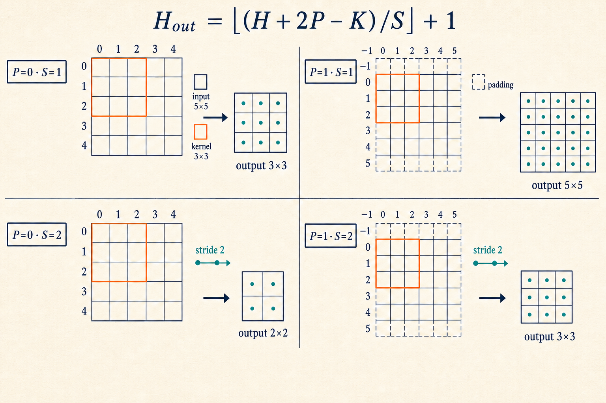

# task_11：Conv2D 与 im2col

卷积层从局部窗口计算特征，并在所有空间位置复用同一组权重。本节用 NumPy 实现 NCHW 卷积，代码入口是 [`conv2d.py`](./conv2d.py)。

深度学习框架通常不翻转 kernel，因此本文沿用惯例，把计算称为卷积层，实现的运算则是二维互相关（cross-correlation）。


---

## 核对一个输出元素

图中的输入和 kernel 为：

$$
X=
\begin{bmatrix}
1&0&2&1&0\\
0&1&1&0&2\\
2&1&0&1&1\\
0&2&1&0&1\\
1&0&1&2&0
\end{bmatrix},
\qquad
K=
\begin{bmatrix}
1&0&-1\\
1&0&-1\\
1&0&-1
\end{bmatrix}.
$$

`stride=1, padding=0` 时，中心输出使用输入的第 2～4 行、第 2～4 列：

$$
\begin{aligned}
y_{1,1}
&=1\cdot1+1\cdot0+0\cdot(-1)\\
&\quad+1\cdot1+0\cdot0+1\cdot(-1)\\
&\quad+2\cdot1+1\cdot0+0\cdot(-1)\\
&=3.
\end{aligned}
$$

完整输出是：

$$
Y=
\begin{bmatrix}
0&0&0\\
0&3&-2\\
1&0&0
\end{bmatrix}.
$$

这组数字也写在 `scripts/validate_figure_content.py` 中，用于独立验算配图。

---

## 多通道卷积的 shape

接口约定：

```text
X.shape = (N, C_in, H, W)
W.shape = (C_out, C_in, K_h, K_w)
b.shape = (C_out,)
Y.shape = (N, C_out, H_out, W_out)
```

对一个输出位置，先在 `C_in × K_h × K_w` 个元素上求加权和，再加该输出通道的 bias：

$$
Y_{n,o,i,j}
=b_o+
\sum_c\sum_u\sum_v
X_{n,c,iS_h+u-P_h,jS_w+v-P_w}W_{o,c,u,v}.
$$

越过原图边界的 $X$ 按零处理。输出空间尺寸为：

$$
H_{out}=\left\lfloor\frac{H+2P_h-K_h}{S_h}\right\rfloor+1,
\qquad
W_{out}=\left\lfloor\frac{W+2P_w-K_w}{S_w}\right\rfloor+1.
$$



例如 $H=W=5$、$K=3$：

| padding | stride | 输出空间 |
| ---: | ---: | ---: |
| 0 | 1 | $3\times3$ |
| 1 | 1 | $5\times5$ |
| 0 | 2 | $2\times2$ |
| 1 | 2 | $3\times3$ |

`compute_output_size()` 会拒绝非正的输入、kernel、stride，以及产生空输出的组合。`kernel_size`、`stride`、`padding` 在 `Conv2D` 中都可以传整数或二元组。

---

## im2col 的行表示窗口

直接实现卷积通常需要对样本、输出通道、输出行和输出列循环。`im2col` 将每个感受野展成一行，使核心计算变为矩阵乘法。

```text
X_col.shape = (N * H_out * W_out, C_in * K_h * K_w)
W_col.shape = (C_in * K_h * K_w, C_out)
Y_col.shape = (N * H_out * W_out, C_out)
```

$$
Y_{col}=X_{col}W_{col}+b.
$$

行顺序是“样本 → 输出行 → 输出列”，一行内部是“通道 → kernel 行 → kernel 列”。


图中的 $4\times4$ 输入为：

$$
\begin{bmatrix}
1&2&3&4\\
5&6&7&8\\
9&10&11&12\\
13&14&15&16
\end{bmatrix}.
$$

使用 $3\times3$ kernel、`stride=1, padding=0`，合法窗口只有四个：

$$
X_{col}=
\begin{bmatrix}
1&2&3&5&6&7&9&10&11\\
2&3&4&6&7&8&10&11&12\\
5&6&7&9&10&11&13&14&15\\
6&7&8&10&11&12&14&15&16
\end{bmatrix}.
$$

所以 shape 是 `(4,9)`，不是 `(9,4)`。将上面的 kernel 按行展开为 `(9,1)` 后：

```text
(4, 9) @ (9, 1) -> (4, 1)
```

四个输出都是 `-6`，reshape 后为：

$$
\begin{bmatrix}
-6&-6\\
-6&-6
\end{bmatrix}.
$$

这里没有 padding，所有窗口都完整落在输入内部，不需要补位符号。

---

## col2im 对重叠位置累加

一个输入像素可能同时属于多个窗口。`im2col` 会在多行中复制它；反向传播时，这些副本对原像素的梯度都要相加。

因此：

```text
col2im(im2col(X)) != X              # 一般不相等
col2im(im2col(X)) == X * coverage   # coverage 是覆盖次数
```

`col2im()` 的职责是 scatter-add，不是求 `im2col()` 的普通逆变换。这一性质在测试 `test_im2col_rows_are_windows_and_col2im_accumulates_overlap` 中直接检查。

---

## 用矩阵乘法求梯度

将 `dY` 调整成 `dY_col` 后：

$$
dW_{col}=X_{col}^{\mathsf T}dY_{col},
$$

$$
dX_{col}=dY_{col}W_{col}^{\mathsf T},
$$

$$
db=\sum_{n,i,j}dY_{n,:,i,j}.
$$

最后用 `col2im(dX_col, ...)` 得到 `dX`。三个梯度保持与原数组相同的 shape：

```text
dX.shape == X.shape
dW.shape == W.shape
db.shape == b.shape
```

### 梯度数组采用原位更新

仓库中的 optimizer 在创建时保存 `(parameter, gradient)` 数组引用。如果 backward 写成：

```python
self.dW = computed_gradient
```

optimizer 仍指向旧数组，`step()` 看不到新梯度。实现使用：

```python
self.dW[...] = computed_gradient
self.db[...] = computed_bias_gradient
```

自动测试在 backward 之前创建 optimizer，然后比较：

- `id(layer.dW)` 保持不变；
- `dW` 与中心有限差分一致；
- `optimizer.step()` 后 `W` 确实改变。

---

## Conv2D 接口

```python
layer = Conv2D(
    in_channels,
    out_channels,
    kernel_size,
    stride=1,
    padding=0,
)
```

主要方法：

| 方法 | 作用 |
| --- | --- |
| `forward(x)` | 缓存 `x`、`cols` 和输出 shape |
| `backward(dout)` | 计算 `dX/dW/db` |
| `parameters()` | 返回 `(W,dW)`、`(b,db)` |
| `named_parameters(prefix)` | 返回稳定的参数名称 |
| `named_buffers(prefix)` | Conv2D 没有 buffer，返回空列表 |
| `train()` / `eval()` | 保持统一的层接口 |

`backward()` 依赖前一次 `forward()` 留下的缓存；通道数或 `dout.shape` 不匹配时会抛出异常。

---

## 运行与核对

```bash
python exercises/block_02_resnet/task_11_conv2d_im2col/conv2d.py
python -m unittest discover -s tests -p 'test_block2.py' -v
python tests/test_im2col_figure.py -v
```

第一条命令成功时不打印内容。后两条测试正常结束时显示 `OK`。

测试覆盖以下性质：

- 整数和二元组形式的 kernel/stride/padding 都得到正确 shape；
- `im2col` 每行对应一个窗口，示例矩阵为 `4×9`；
- `col2im` 对重叠位置累加；
- `dW` 通过有限差分；
- optimizer 创建在 backward 之前仍能更新权重；
- 配图中的卷积输出和四个 `-6` 通过独立数值检查。

[task_12：池化与 BatchNorm](../task_12_pooling_and_bn/README.md) 继续使用相同的 NCHW 层接口。

## 参考资料

- [Dive into Deep Learning: Convolutions for Images](https://d2l.ai/chapter_convolutional-neural-networks/conv-layer.html)
- [Dive into Deep Learning: Padding and Stride](https://d2l.ai/chapter_convolutional-neural-networks/padding-and-strides.html)
- [Stanford CS231n: Convolutional Networks](https://cs231n.github.io/convolutional-networks/)
