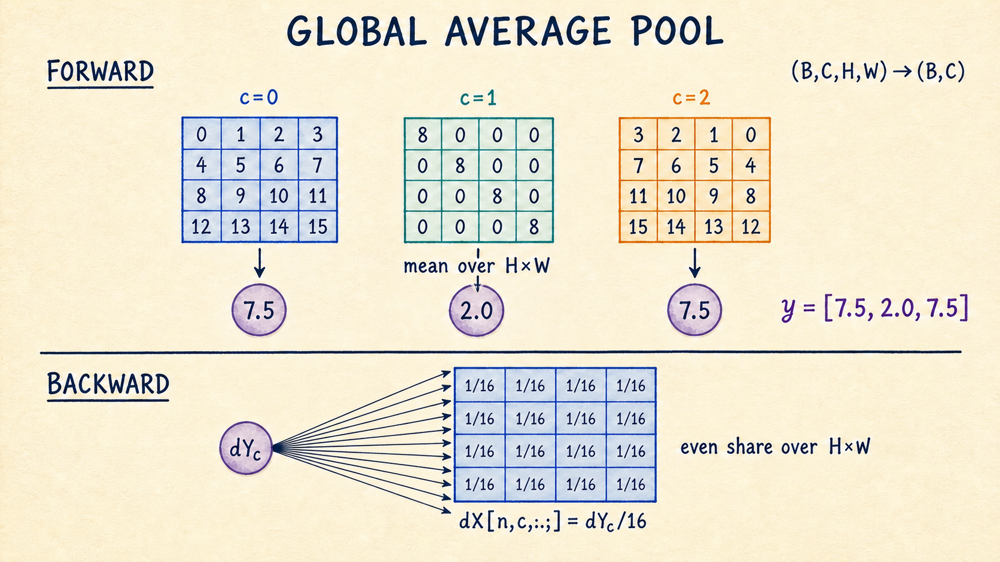

# task_12：池化与 BatchNorm

本节包含三个 NCHW 层：`MaxPool2D` 缩小局部特征图，`GlobalAvgPool2D` 把空间维汇聚成通道向量，`BatchNorm2D` 管理训练和评估时使用的不同统计量。代码入口是 [`layers.py`](./layers.py)。

最终的 `SmallResNet` 使用 GlobalAvgPool 和 BatchNorm；它不使用 MaxPool，而是在残差 stage 开头用 stride-2 卷积降采样。MaxPool 作为一个独立算子保留在同一模块中。

---

## MaxPool2D：forward 中的 argmax 缓存

对每个样本、每个通道，MaxPool 在局部窗口内取最大值。若输入为 `(N,C,H,W)`，无 padding 时：

$$
H_{out}=\left\lfloor\frac{H-K_h}{S_h}\right\rfloor+1,
\qquad
W_{out}=\left\lfloor\frac{W-K_w}{S_w}\right\rfloor+1.
$$

输出 shape 是 `(N,C,H_out,W_out)`，通道数不变。


图中使用 `kernel_size=2, stride=2`。四个窗口各产生一个最大值，所以输出和上游梯度都是 `2×2`；backward 把四份上游梯度分别送回四个获胜位置。

### 并列最大值

最大值不一定唯一。本实现使用 NumPy `argmax` 的规则：

1. 将窗口按行优先顺序展平；
2. 选择第一个最大值；
3. 一份上游梯度只送到这个位置。

例如：

$$
\begin{bmatrix}
6&6\\
4&6
\end{bmatrix}
$$

三个 `6` 并列，左上角的 `6` 获得梯度。配图左下角单独标出了这条约定。

### backward 的缓存

`forward()` 保存：

```text
x_shape
argmax: (N, C, H_out, W_out)
output_shape
```

`backward(dout)` 创建全零 `dX`，再用 `np.add.at` 写入获胜位置。使用 add 而不是赋值，还能正确处理重叠池化窗口：同一个输入位置从多个窗口收到的梯度会累加。

---

## GlobalAvgPool2D：每个通道留下一个数

Global Average Pooling 对全部空间位置求均值：

$$
y_{n,c}=\frac{1}{HW}\sum_{h=1}^{H}\sum_{w=1}^{W}x_{n,c,h,w}.
$$

shape 变化为：

```text
(N, C, H, W) -> (N, C)
```



backward 将 `dout[n,c]` 均分到该通道的 $H\times W$ 个位置：

$$
\frac{\partial L}{\partial x_{n,c,h,w}}
=\frac{1}{HW}\frac{\partial L}{\partial y_{n,c}}.
$$

因此 `GlobalAvgPool2D` 只需缓存输入 shape，没有参数和 buffer。

---

## BatchNorm2D 的统计轴

输入 shape 为 `(N,C,H,W)`。每个通道独立统计，归约轴是 `(N,H,W)`：

$$
\mu_c=\frac{1}{NHW}\sum_{n,h,w}x_{n,c,h,w},
$$

$$
\sigma_c^2=\frac{1}{NHW}\sum_{n,h,w}(x_{n,c,h,w}-\mu_c)^2.
$$

然后标准化，并恢复可学习的尺度与偏移：

$$
\hat{x}=\frac{x-\mu}{\sqrt{\sigma^2+\varepsilon}},
\qquad
y=\gamma\hat{x}+\beta.
$$


参数 shape 为：

```text
gamma, beta: (1, C, 1, 1)
```

训练分支用当前 mini-batch 的统计量做标准化，同时用 EMA 更新 `running_mean` 和 `running_var`；评估分支只读这两个 buffer，不再用当前 batch 重新估计。标准化后还会乘 `gamma`、加 `beta`，因此最终的 `y` 不必保持零均值、单位方差。

原始 BatchNorm 论文用“降低 internal covariate shift”解释设计动机。这里把重点放在可直接对照代码的四个部分：统计轴、仿射参数、running buffers 和模式切换。

---

## train 与 eval 使用不同统计量

### 训练模式

`train()` 后，forward 使用当前 batch 的 `mean/variance`，并原位更新：

$$
\text{running\_mean}
\leftarrow m\,\text{running\_mean}+(1-m)\mu_B,
$$

$$
\text{running\_var}
\leftarrow m\,\text{running\_var}+(1-m)\sigma_B^2.
$$

代码默认 `momentum=0.9`。这里的 $m$ 是旧统计量的权重；不同框架对参数名 `momentum` 的定义可能相反，移植配置时以更新公式为准。

### 评估模式

`eval()` 后，forward 使用 `running_mean/running_var`：

```text
当前 batch 的内容不会改变统计量
running buffers 不再更新
```

如果验证前没有调用 `model.eval()`，验证 batch 会参与统计并改变模型状态。下一轮 `train_epoch()` 会再次切换到 train 模式。

### 参数与 buffer

```text
parameters:
  gamma, dgamma
  beta, dbeta

buffers:
  running_mean
  running_var
```

buffer 不参与梯度下降，但会影响 eval 输出。只保存 `parameters()` 的 checkpoint 无法忠实恢复 BatchNorm 模型。

---

## BatchNorm backward

先求两个参数梯度：

$$
d\beta=\sum_{n,h,w}dY,
\qquad
d\gamma=\sum_{n,h,w}dY\odot\hat{X}.
$$

令 $M=NHW$、$d\hat{X}=dY\odot\gamma$，训练模式下输入梯度可写成：

$$
dX=\frac{1}{\sqrt{\sigma_B^2+\varepsilon}}
\left(
d\hat{X}
-\frac{1}{M}\sum d\hat{X}
-\frac{\hat{X}}{M}\sum(d\hat{X}\odot\hat{X})
\right).
$$

求和都沿 `(N,H,W)`，并保留通道轴。评估模式把 running statistics 当常数，因此：

$$
dX=dY\odot\gamma\,/\sqrt{\text{running\_var}+\varepsilon}.
$$

`dgamma`、`dbeta` 和两个 running buffer 都使用 `array[...] = ...` 原位写入，保持 optimizer 和 checkpoint 代码持有的引用有效。

---

## 接口清单

三个类都提供统一的层接口：

```text
forward(x)
backward(dout)
parameters()
named_parameters(prefix)
named_buffers(prefix)
train()
eval()
```

各层状态如下：

| 层 | 参数 | buffer / forward 缓存 |
| --- | --- | --- |
| `MaxPool2D` | 无 | 输入 shape、argmax、输出 shape |
| `GlobalAvgPool2D` | 无 | 输入 shape |
| `BatchNorm2D` | gamma、beta | running mean/var、`x_hat`、`std_inv` |

`backward()` 使用与前一次 `forward()` 对应的缓存。BatchNorm 还会记录该次 forward 的 train/eval 模式，避免模式切换后套用错误的导数。

---

## 运行与核对

```bash
python exercises/block_02_resnet/task_12_pooling_and_bn/layers.py
python -m unittest discover -s tests -p 'test_block2.py' -v
```

模块命令成功时不打印内容。测试正常结束时显示 `OK`。

测试覆盖以下性质：

- MaxPool 输出 shape 正确，四个上游梯度都回到对应 argmax；
- 并列最大值选择行优先的第一个位置；
- 重叠窗口的输入梯度能累加；
- GlobalAvgPool forward/backward 的 shape 分别为 `(N,C)` 和 `(N,C,H,W)`；
- BatchNorm 的 `dX/dgamma/dbeta` shape 正确且数值有限；
- BatchNorm 输入梯度通过有限差分；
- train 更新 running buffers，eval 不更新；
- `named_buffers()` 能列出全部运行统计量。

[task_13：残差块](../task_13_residual_block/README.md) 把这里的 BatchNorm 与卷积组合到两条分支中。

## 参考资料

- [Dive into Deep Learning: Pooling](https://d2l.ai/chapter_convolutional-neural-networks/pooling.html)
- [Dive into Deep Learning: Batch Normalization](https://d2l.ai/chapter_convolutional-modern/batch-norm.html)
- [Batch Normalization: Accelerating Deep Network Training by Reducing Internal Covariate Shift](https://arxiv.org/abs/1502.03167)
