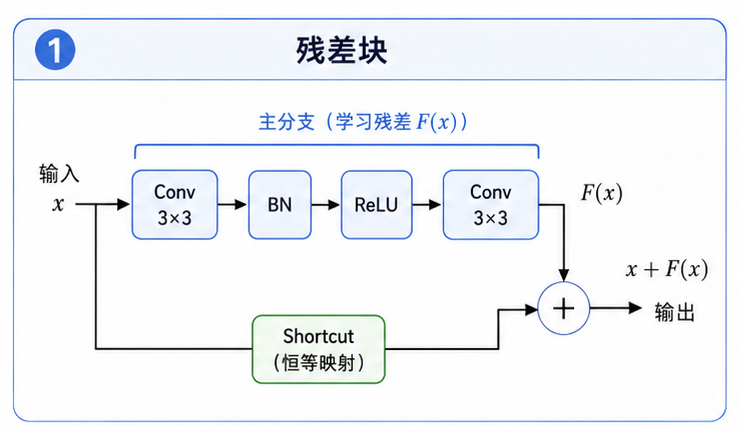
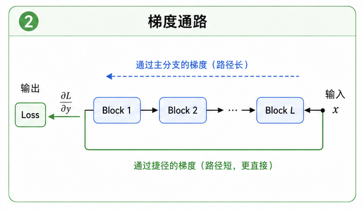

# task_13: 残差块

现在我们已经有了卷积、池化和 BatchNorm.

照理说, 多堆几层 CNN, 模型应该越来越强. 但真实情况没这么顺.

网络变深以后, 训练反而可能变差. 不是过拟合, 甚至连训练集都学不好. 这就很难受了: 模型明明更大, 表达能力更强, 但优化更难.

ResNet 的想法很直接:

如果几层网络暂时学不好新东西, 至少让它先别破坏输入.

于是有了 shortcut.



---

## 一. 残差块在算什么?

普通网络的一段可以写成:

$$y = F(x)$$

ResNet 让它变成:

$$y = F(x) + x$$

这里的 $F(x)$ 是卷积、BN、ReLU 组成的分支. $x$ 是直接绕过去的 shortcut.

最后再接一个 ReLU:

$$\mathrm{out} = \mathrm{ReLU}(F(x) + x)$$

这就是残差块最核心的结构.

直觉上, 模型不需要直接学出目标映射 $H(x)$, 而是学:

$$F(x) = H(x) - x$$

也就是残差.

如果这一块暂时没学到什么, 它可以让 $F(x)$ 接近 0, 输出就接近 $x$. 至少不会比原来差太多.

---

## 二. BasicBlock 的结构

ResNet 里最基础的块通常长这样:

```text
Conv3x3 -> BN -> ReLU -> Conv3x3 -> BN -> add shortcut -> ReLU
```

对应代码里的 `BasicBlock`.

第一层卷积负责提取特征, 第二层卷积继续处理. shortcut 把输入直接加到第二个 BN 的输出上.

如果输入输出形状一样, shortcut 就是原样返回:

```text
shortcut = x
```

如果形状不一样, 比如通道数变了, 或者 stride=2 导致空间尺寸减半, 那就不能直接相加了.

这时需要 projection shortcut, 通常用 $1\times 1$ 卷积:

```text
shortcut = Conv1x1(x)
```

它的作用不是提复杂特征, 而是把形状对齐.

---

## 三. 为什么 shortcut 对反向传播有帮助?

假设:

$$y = F(x) + x$$

那么反向传播时:

$$\frac{\partial y}{\partial x} = \frac{\partial F(x)}{\partial x} + 1$$

注意这个 $+1$.

它意味着梯度不只要穿过卷积分支, 还可以沿着 shortcut 直接传回来.

深层网络里, 梯度一层层乘下去很容易变小. shortcut 给了梯度一条更短的路.



这就是 ResNet 能训练得更深的关键原因之一.

当然, 这不是说加了残差就万事大吉. 学习率、初始化、BatchNorm 模式、数据增强还是会影响训练. 但没有 shortcut, 深层 CNN 会难很多.

---

## 四. shape 必须对齐

残差块最常见的错误就是相加时 shape 不一致.

比如主分支输出:

```text
(N, 32, 16, 16)
```

shortcut 输出:

```text
(N, 16, 32, 32)
```

这当然不能加.

需要 projection 的情况通常有两种:

- `stride != 1`: 空间尺寸发生变化.
- `in_channels != out_channels`: 通道数发生变化.

代码里已经有这个判断:

```python
self.needs_projection = stride != 1 or in_channels != out_channels
```

如果 `needs_projection=True`, shortcut 分支就要用 $1\times 1$ 卷积和 BN 把形状改成和主分支一致.

---

## 五. forward 怎么写?

按 BasicBlock 的结构写:

```text
main:
  conv1 -> bn1 -> relu -> conv2 -> bn2

shortcut:
  identity 或 projection

out:
  relu(main + shortcut)
```

forward 时要缓存必要的中间结果, 因为 backward 会用到.

特别是最后的相加:

```text
z = main + shortcut
out = relu(z)
```

ReLU backward 需要知道 `z > 0` 的位置.

---

## 六. backward 怎么写?

反向传播从最后的 ReLU 开始.

假设上游梯度是 `dout`, 先过最后的 ReLU:

```text
dz = dout * (z > 0)
```

因为:

```text
z = main + shortcut
```

所以梯度会分成两路:

```text
dmain = dz
dshortcut = dz
```

主分支按反方向走:

```text
bn2 -> conv2 -> relu -> bn1 -> conv1
```

shortcut 分支如果是 identity, 那它对输入的梯度就是 `dshortcut`.

如果是 projection, 就要反向经过 projection conv 和 projection BN.

最后把两路对输入的梯度加起来:

```text
dx = dx_main + dx_shortcut
```

这个地方很容易漏. 一旦漏掉 shortcut 的梯度, 残差块就只剩半条路了.

---

## 七. 你要完成什么?

请完成 `residual_block.py` 里的 `BasicBlock`.

当前文件只留下了骨架:

```python
Conv3x3 -> BN -> ReLU -> Conv3x3 -> BN -> shortcut add -> ReLU
```

你需要在完成 task_11 和 task_12 后, 把那些层接进来.

建议先做两种测试:

1. 输入输出通道相同, stride=1. 这时 shortcut 应该是 identity.
2. 输入输出通道不同或 stride=2. 这时必须走 projection.

每种都检查:

- forward 输出 shape 是否正确.
- backward 输出 `dx` shape 是否和输入一致.
- 参数梯度 shape 是否正确.

再做一个小实验: 把主分支的卷积权重临时设得很小, 看输出是否接近输入经过最后 ReLU 后的结果.

下一关我们开始把这些块组装成一个轻量 ResNet.
