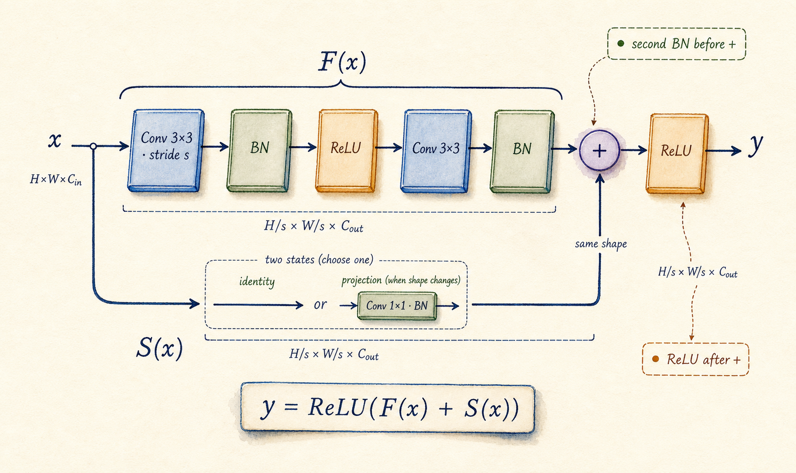
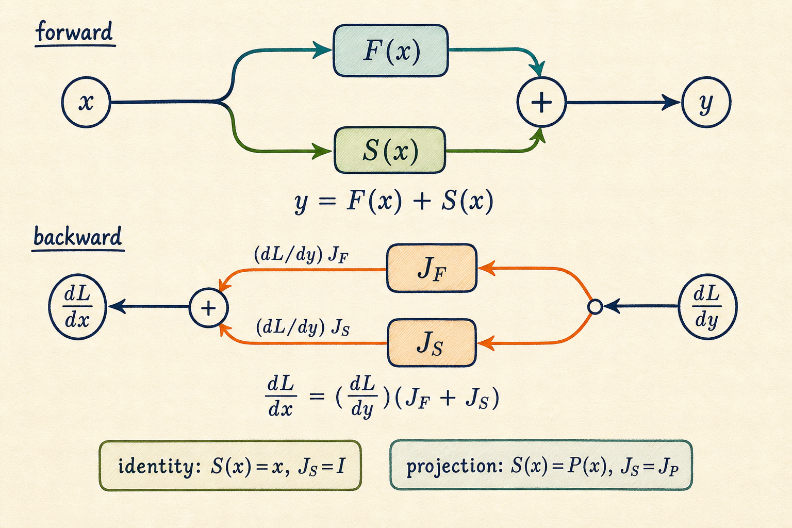

# task_13：残差块

[ResNet 原论文](https://arxiv.org/abs/1512.03385)观察到一个优化问题：把普通网络堆得更深，训练误差可能反而升高。这种 degradation 不能用过拟合解释，因为更深模型连训练集都没有拟合得更好。

残差块给变换分支加上一条 shortcut。代码入口是 [`residual_block.py`](./residual_block.py)，实现 post-activation `BasicBlock`。



---

## 残差块的公式

把主分支记为 $F(x)$，shortcut 记为 $S(x)$：

$$
z=F(x)+S(x),
\qquad
y=\operatorname{ReLU}(z).
$$

如果输入、输出 shape 相同，$S(x)=x$。这时若目标映射为 $H(x)$，主分支拟合的是：

$$
F(x)=H(x)-x.
$$

“残差”指的就是相对 shortcut 输入还需补上的变化。它不是预测误差，也不是 loss。

当空间尺寸或通道数改变时，$x$ 不能直接和主分支相加，$S$ 改用可学习的 projection。

---

## 本仓库的 BasicBlock

主分支：

```text
Conv3x3(stride=s)
-> BatchNorm
-> ReLU
-> Conv3x3(stride=1)
-> BatchNorm
```

shortcut：

```text
identity                           shape 不变
Conv1x1(stride=s) -> BatchNorm     shape 改变
```

合并：

```text
main + shortcut -> ReLU
```

第二个卷积后有 BatchNorm，但在加法前没有 ReLU；加法之后还有一个 ReLU。少掉第二个 BN 或末尾 ReLU，都会使图、正文和代码表示成不同结构。

本实现的 projection 使用 `Conv1x1 + BN`。这是清晰易验算的教学选择；原论文讨论过不止一种 CIFAR shortcut 方案，因此这个块名并不表示它是某个官方模型的逐层复刻。

---

## 两种 shortcut shape

### identity shortcut

```python
block = BasicBlock(in_channels=16, out_channels=16, stride=1)
x.shape       == (N, 16, 32, 32)
block.forward(x).shape == (N, 16, 32, 32)
```

主分支的两个 `3×3` 卷积都使用 `padding=1`，空间尺寸不变；shortcut 原样传递输入。

### projection shortcut

```python
block = BasicBlock(in_channels=16, out_channels=32, stride=2)
x.shape        == (N, 16, 32, 32)
block.forward(x).shape == (N, 32, 16, 16)
```

主分支的第一个 `3×3` 卷积和 shortcut 的 `1×1` 卷积都使用 stride 2，两路输出均为 `(N,32,16,16)`。

构造函数的判断是：

```python
self.needs_projection = self.stride != 1 or self.in_channels != self.out_channels
```

forward 在相加前再次比较 `main.shape` 与 `shortcut.shape`，不一致时立即报错。

---

## forward 的缓存顺序

对应代码：

```text
main = conv1(x)
main = bn1(main)
main = relu1(main)
main = conv2(main)
main = bn2(main)

shortcut = x
# 或 shortcut = proj_bn(proj_conv(x))

y = relu2(main + shortcut)
```

每个子层保存自己的 backward 缓存。块本身记录是否已经执行过 forward；没有缓存就调用 backward 会抛出 `RuntimeError`。

以下片段展示两种路径的 shape：

```python
import numpy as np
from exercises.block_02_resnet.task_13_residual_block.residual_block import BasicBlock

rng = np.random.default_rng(0)

identity = BasicBlock(4, 4, stride=1)
x1 = rng.normal(size=(2, 4, 8, 8))
y1 = identity.forward(x1)
dx1 = identity.backward(np.ones_like(y1))
print(x1.shape, y1.shape, dx1.shape)

projection = BasicBlock(4, 8, stride=2)
x2 = rng.normal(size=(2, 4, 8, 8))
y2 = projection.forward(x2)
dx2 = projection.backward(np.ones_like(y2))
print(x2.shape, y2.shape, dx2.shape)
```

预期：

```text
(2, 4, 8, 8) (2, 4, 8, 8) (2, 4, 8, 8)
(2, 4, 8, 8) (2, 8, 4, 4) (2, 4, 8, 8)
```

---

## backward 在加法处分成两路

先反传末尾 ReLU：

```text
dadded = relu2.backward(dout)
```

因为 `z = main + shortcut`，两条分支都收到 `dadded`。

主分支按相反顺序：

```text
bn2 -> conv2 -> relu1 -> bn1 -> conv1
```

shortcut 分支：

```text
identity:    dshortcut = dadded
projection:  proj_bn -> proj_conv
```

最后：

```text
dx = dmain + dshortcut
```



若暂时忽略末尾 ReLU并令 $z=F(x)+S(x)$，则：

$$
\frac{\partial L}{\partial x}
=\frac{\partial L}{\partial z}
\left(J_F(x)+J_S(x)\right).
$$

identity shortcut 的 $J_S=I$；projection shortcut 的 $J_S$ 是 `Conv1x1 + BN` 的 Jacobian。shortcut 增加了传播路径，但 ReLU、分支参数和上游梯度仍会影响最终梯度，不能据此声称梯度恒定或永不消失。

---

## 参数、buffer 与模式递归

`parameters()` 返回主分支的 Conv/BN 参数；存在 projection 时，再加入 `proj_conv/proj_bn` 参数。

命名示例：

```text
block.conv1.W
block.bn1.gamma
block.conv2.W
block.bn2.gamma
block.proj_conv.W
block.proj_bn.gamma
```

`named_buffers()` 收集每个 BatchNorm 的：

```text
running_mean
running_var
```

`train()` 和 `eval()` 会递归调用所有子层。模式切换不只修改 `block.training`，也会传递给 BatchNorm 子层。

---

## 运行与核对

```bash
python exercises/block_02_resnet/task_13_residual_block/residual_block.py
python -m unittest discover -s tests -p 'test_block2.py' -v
```

第一条命令成功时不打印内容。测试正常结束时显示 `OK`。

测试覆盖以下性质：

- identity 模式保持 `(N,C,H,W)`；
- projection 模式同时改变通道与空间大小；
- 两种模式的 `dx.shape` 都等于输入 shape；
- 参数名称不重复，包含 `bn2`；
- projection 的 BatchNorm buffer 出现在 `named_buffers()`；
- `train()/eval()` 能递归切换所有 BN；
- backward 同时累加主分支和 shortcut 的输入梯度。

[task_14](../task_14_numpy_resnet_train/README.md) 将多个 BasicBlock 接成 SmallResNet，并加入训练与评估循环。

## 参考资料

- [Deep Residual Learning for Image Recognition](https://arxiv.org/abs/1512.03385)
- [Dive into Deep Learning: Residual Networks](https://d2l.ai/chapter_convolutional-modern/resnet.html)
