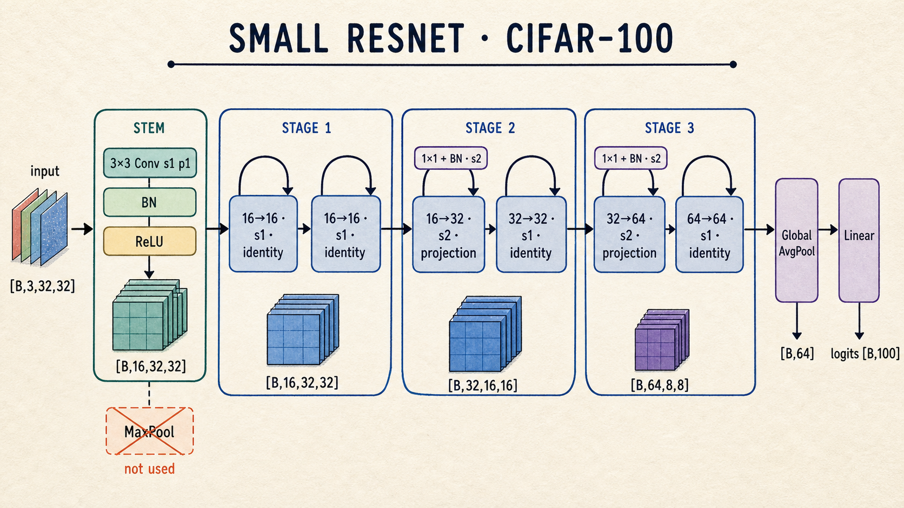

# task_14：训练一个 NumPy SmallResNet

前几节的算子在这里组成训练程序。代码入口 [`train_resnet.py`](./train_resnet.py) 包含模型、训练/评估循环、合成数据 smoke test 和 CIFAR-100 小样本路径。

这份程序用于连通完整实现，不用于复现论文准确率。纯 NumPy 的 `im2col` 会占用较多内存，完整 CIFAR-100 训练也远慢于 PyTorch；小模型运行更适合观察 shape、梯度和状态是否连通。



---

## 模型结构

`SmallResNet` 接收：

```python
SmallResNet(
    num_classes=100,
    channels=(16, 32, 64),
    blocks_per_stage=(2, 2, 2),
)
```

类默认配置的 shape 为：

| 位置 | 运算 | 输出 shape |
| --- | --- | --- |
| input | — | `(N,3,32,32)` |
| stem | `Conv3x3 -> BN -> ReLU` | `(N,16,32,32)` |
| stage 1 | 2 个 BasicBlock | `(N,16,32,32)` |
| stage 2 | 首块 stride 2 | `(N,32,16,16)` |
| stage 3 | 首块 stride 2 | `(N,64,8,8)` |
| pool | GlobalAvgPool | `(N,64)` |
| fc | Linear | `(N,100)` |

图中画的是这组类默认配置。命令行工具为缩短运行时间，默认改用：

```text
channels=(8,16,32)
blocks=(1,1,1)
train/val/test limit=500/500/500
```

网络不含 MaxPool。stage 2 和 stage 3 的首个 BasicBlock 同时在主分支和 projection shortcut 中使用 stride 2。

### 与论文模型的边界

这份 `SmallResNet` 沿用残差块思想，但不是 ImageNet ResNet-18，也不是原论文的 CIFAR ResNet-20：block 数量可配置，projection 统一采用 `Conv1x1 + BN`，卷积还保留 bias。实验记录中标明 `SmallResNet` 和具体配置，可以避免与标准 ResNet 配置混淆。

---

## 模型接口

```text
forward(x)             -> logits
backward(dlogits)      -> dx
parameters()           -> (value, gradient) 列表
named_parameters()     -> 稳定名称、值、梯度
named_buffers()        -> BatchNorm running statistics
state_dict()           -> 参数和 buffer 的副本
load_state_dict(...)   -> 原位恢复状态
train() / eval()       -> 递归切换子层模式
```

`load_state_dict()` 不替换参数数组，而是写入 `destination[...]`。这样在加载前已经创建的 optimizer 仍持有有效引用。

严格加载会检查：

- 缺失键；
- 多余键；
- 每个数组的 shape。

---

## 训练循环

一轮训练的顺序是：

```text
model.train()
shuffle minibatches
可选 crop + flip
forward
CrossEntropyLoss.forward
dlogits = loss_fn.backward()
model.backward(dlogits)
optimizer.step()
```

代码使用 `one_hot()` 将整数标签转换成 `(N,num_classes)` target，以匹配公共 `CrossEntropyLoss` 接口。优化器默认为 Momentum：

```python
Momentum(model.parameters(), lr=args.lr, beta=0.9)
```

当前层实现会在每次 backward 原位覆盖梯度，因此训练循环不需要额外调用 `zero_grad()`。

### epoch loss 的权重

`CrossEntropyLoss` 返回 batch 均值。若最后一个 batch 较短，不能直接平均所有 batch loss。代码按样本数累计：

$$
L_{epoch}
=\frac{\sum_b |B_b|L_b}{\sum_b |B_b|}.
$$

训练和验证都采用这一写法。对应测试专门构造了一个高损失的末尾短 batch，防止回归为“batch 均值的均值”。

---

## 评估循环与 BatchNorm

`evaluate()` 首先调用 `model.eval()`：

- BatchNorm 使用 `running_mean/running_var`；
- running buffers 保持不变；
- batch 不打乱；
- 不做随机裁剪或翻转。

下一轮 `train_epoch()` 会重新调用 `model.train()`，因此训练和评估循环会分别设置对应模式。

验证集用于选配置，官方 test 用于最后一次报告。task 10 的加载器已经将 validation 从官方 train 中独立划出。

---

## 无下载 smoke test

```bash
python exercises/block_02_resnet/task_14_numpy_resnet_train/train_resnet.py \
  --synthetic --epochs 1 --channels 2 4 8 --blocks 1 1 1
```

合成数据用不同通道和位置的条纹编码类别，共分为 train/validation/test。它检查训练程序能否运行，不代表 CIFAR-100 难度。

预期输出格式：

```text
epoch=1 train_loss=... train_acc=... val_loss=... val_acc=...
test_loss=... test_acc=...
```

这个 smoke test 关心字段是否齐全、数值是否有限。一次 epoch 的准确率可能随 NumPy 版本和浮点运算略有变化，因此没有固定阈值。

---

## CIFAR-100 小样本

第一次运行会通过 `torchvision` 下载数据到仓库根目录的 `data/`：

```bash
python exercises/block_02_resnet/task_14_numpy_resnet_train/train_resnet.py \
  --epochs 1 \
  --train-limit 500 --val-limit 200 --test-limit 200 \
  --channels 8 16 32 --blocks 1 1 1
```

默认开启 padding crop 和水平翻转。关闭增强的小样本运行如下：

```bash
python exercises/block_02_resnet/task_14_numpy_resnet_train/train_resnet.py \
  --epochs 5 --train-limit 100 --val-limit 100 --test-limit 100 \
  --channels 4 8 16 --blocks 1 1 1 --no-augment
```

这条命令仍按多个 minibatch 训练，不等同于自动测试中的“固定四张图片重复 60 步”。loss 不降时，相关的排查点有：

1. `test_block2.py` 中的有限差分是否通过；
2. 卷积参数在 `optimizer.step()` 后是否改变；
3. 图片和标签是否同步打乱；
4. 学习率是否导致 `NaN/Inf`；
5. BN 是否在训练时处于 train 模式。

扩大数据量或增加 epoch 不会修正前四类实现问题。

---

## checkpoint 与恢复训练

`train_resnet.py` 聚焦模型和循环，不写文件。完整保存/恢复位于：

```text
solutions/block_02_resnet/train_cifar100_solution.py
```

小样本示例：

```bash
python solutions/block_02_resnet/train_cifar100_solution.py \
  --subset-size 200 --epochs 5 --batch-size 20 \
  --channels 8 16 32 --blocks 1 1 1 --lr 0.03 --no-augment
```

`--subset-size` 只是 `--train-limit` 的别名；关闭增强需要显式传入 `--no-augment`。checkpoint 默认写到：

```text
checkpoints/cifar100_numpy_resnet.npz
```

保存内容：

```text
model parameters
BatchNorm running_mean / running_var
optimizer class, hyperparameters, array state, step
epoch, config, history
model train/eval mode
checkpoint version
```

恢复示例：

```bash
python solutions/block_02_resnet/train_cifar100_solution.py \
  --resume --epochs 10
```

`--epochs 10` 表示训练到第 10 轮；若 checkpoint 在第 5 轮，程序继续第 6～10 轮。脚本会先读取 checkpoint config，恢复模型结构、optimizer、数据限制、batch size、seed 和增强开关，再构建数据与模型；`epochs` 仍由本次命令指定，`data_dir` 也可以随仓库位置改变。随后 strict loader 恢复数组状态，并拒绝缺失 BN buffer、shape 不同或 optimizer 类型不符的 checkpoint。

round-trip 测试会比较：

- 新模型的全部 BN buffers；
- optimizer 的 velocity 和超参数；
- 恢复后的 eval logits；
- 原模型和恢复模型各继续一步后的参数。

---

## 运行与核对

```bash
python -m unittest discover -s tests -p 'test_block2.py' -v
```

测试覆盖以下性质：

- `SmallResNet.forward()` 输出 `(N,num_classes)`；
- backward 能返回与输入同 shape 的梯度；
- 参数、buffer 名称稳定且无重复；
- 四张合成图片重复训练后，loss 降到初值的 25% 以下；
- epoch 指标按实际样本数加权；
- checkpoint 恢复后 logits 逐元素一致；
- 恢复后的下一次参数更新与原训练过程一致。

[task_15：实验记录](../task_15_experiment_notes/README.md) 提供了一份保留命令、seed、配置和结果的参考格式。

## 参考资料

- [Deep Residual Learning for Image Recognition](https://arxiv.org/abs/1512.03385)
- [Stanford CS231n: Neural Networks Part 3 — Learning and Evaluation](https://cs231n.github.io/neural-networks-3/)
