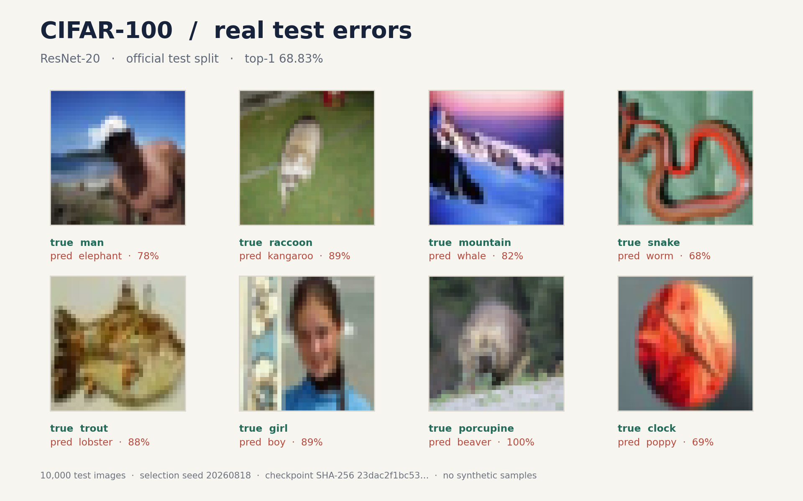

# task_15：实验记录与结果分析

这一节不增加网络层，而是说明如何保留可复跑的实验上下文。仓库中的 [`NOTES.md`](./NOTES.md) 是一份参考格式。

运行命令、数据划分、seed、模型配置和训练/验证指标，构成了一次实验的基本上下文。比起“效果不错”或“loss 不降”，这些信息更能支持复现和排查。

---

## 从一个具体问题开始

一次实验通常围绕一个小问题展开，例如：

- 关闭随机增强后，100 张训练图片能否被拟合？
- learning rate 从 `0.01` 改为 `0.03`，前五轮 loss 怎样变化？
- 同一配置从 checkpoint 恢复后，下一轮结果是否连续？

只改变一个相关变量时，结果更容易解释。如果模型宽度、学习率、batch size、optimizer 和增强同时变化，即使验证准确率提高，也很难分辨主要因素。

记录的开头可以用四个简短字段概括：

```text
问题：
基线：
本次只改：
其余保持：
```

---

## 命令与配置

下面是一条无需下载数据的示例命令：

```bash
python exercises/block_02_resnet/task_14_numpy_resnet_train/train_resnet.py \
  --synthetic --epochs 2 --channels 2 4 8 --blocks 1 1 1 --seed 0
```

输出格式为两轮训练/验证指标和一行测试指标：

```text
epoch=1 train_loss=... train_acc=... val_loss=... val_acc=...
epoch=2 train_loss=... train_acc=... val_loss=... val_acc=...
test_loss=... test_acc=...
```

完整命令和输出比单独的最终准确率保留了更多上下文。CIFAR-100 运行还涉及：

```text
train_limit / val_limit / test_limit
val_size
是否增强
channels / blocks
batch_size / optimizer / lr
seed
```

task 14 的日志不记录 wall-clock time。总耗时和硬件信息可用于比较不同运行的成本。

---

## 用小样本拟合检查实现

在少量固定样本上反复训练，目的是确认模型有能力降低训练 loss。它不是泛化实验。

下面是一个关闭增强的小样本配置：

```bash
python exercises/block_02_resnet/task_14_numpy_resnet_train/train_resnet.py \
  --epochs 5 --train-limit 100 --val-limit 100 --test-limit 100 \
  --channels 4 8 16 --blocks 1 1 1 --no-augment --seed 0
```

每轮 `train_loss/train_acc` 可以显示拟合趋势。训练指标没有改善时，常见的检查点包括：

1. Block 2 自动测试是否全部通过；
2. 数据与标签是否对齐；
3. 参数在 `optimizer.step()` 后是否改变；
4. 是否出现 `NaN/Inf`；
5. BN 是否处于 train 模式。

小样本 train acc 较高也不能说明验证集表现好。它只排除了部分训练链路错误。

---

## 区分观察与解释

将记录拆成“观察”和“解释”两列，可以把日志事实与当前假设分开：

| 观察到的结果 | 暂时解释 |
| --- | --- |
| 第 3 轮开始 val loss 上升 | 可能过拟合，也可能是验证集太小 |
| loss 第 1 个 batch 变成 NaN | 可能学习率过大，可对照梯度和输入 |
| 关闭增强后 train acc 上升 | 拟合难度降低；这项观察本身不反映泛化 |

左列对应日志或图片中可直接核对的事实；右列可以保留不确定性，并指向后续可区分这些解释的对照。单次波动本身不足以支持因果结论。

---

## 查看真实误分类



这张图来自一份公开 CIFAR-100 ResNet-20 checkpoint 对官方 10,000 张 test 图片的完整推理，图上报告 top-1 `68.83%`。它用于示范错误分析，**不是** task 14 的 NumPy `SmallResNet` 结果。

可复现脚本是 [`scripts/render_cifar100_errors.py`](../../../scripts/render_cifar100_errors.py)。脚本会：

- 严格加载完整权重和 BatchNorm 状态；
- 校验参考 checkpoint 的 SHA-256；
- 在官方 test split 上运行推理；
- 按固定 seed 选择八个错误；
- 把测试索引、true/pred 标签和 checkpoint 摘要写入 PNG metadata。

图中实际出现的错误包括：

| true | pred | 可观察的线索 |
| --- | --- | --- |
| `snake` | `worm` | 两类外形细长，低分辨率下局部轮廓接近 |
| `girl` | `boy` | 画面主体和类别定义可能含有歧义 |
| `mountain` | `whale` | 背景和整体色块可能压过对象形状 |
| `clock` | `poppy` | 单张图难以支持原因判断，仍需更多同类混淆样本 |

右列只是检查方向，不是由一张图片证明的原因。一种常见的分析路径是：

1. 汇总 confusion matrix；
2. 找重复出现的 true/pred 对；
3. 查看这些样本的置信度和原图；
4. 再决定检查标签、裁剪、类别相似性或模型容量。

误分类证据来自真实推理结果；第三方模型的图片则与来源、checkpoint 和指标一起标注。这两点使实验证据与教学示意图保持明确边界。

---

## train、validation、test 的用途

```text
train       参数更新；判断是否能拟合
validation  选择学习率、增强、结构和停止轮次
test        配置确定后做最终评估
```

反复根据 test accuracy 调参，会把测试集变成事实上的验证集。为指标标明所属 split，可以保留这一评估语境。对于 100～500 张的小验证子集，类别样本很少，单次准确率波动也会较大，小数点后的细微差别通常没有稳定含义。

---

## 记录模板

`NOTES.md` 预留了以下信息位置：

- 一个明确问题；
- 一条完整可运行命令；
- seed、split 大小、模型和优化器配置；
- 每轮 train/val 指标；
- 一条可核对的观察；
- 一条标明不确定性的解释；
- 下一次只改变的一个变量。

代码回归检查仍使用 Block 2 的自动测试：

```bash
python -m unittest discover -s tests -p 'test_block2.py' -v
```

测试正常结束时显示 `OK`。它检查的是实现性质，而实验笔记对应具体运行的配置与结果。

## 参考资料

- [Stanford CS231n: Neural Networks Part 3 — Babysitting the Learning Process](https://cs231n.github.io/neural-networks-3/)
- [CIFAR-100 官方类别与数据规模](https://www.cs.toronto.edu/~kriz/cifar.html)
