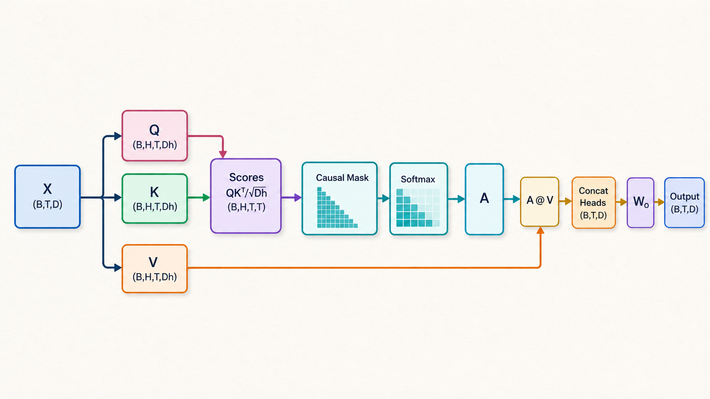
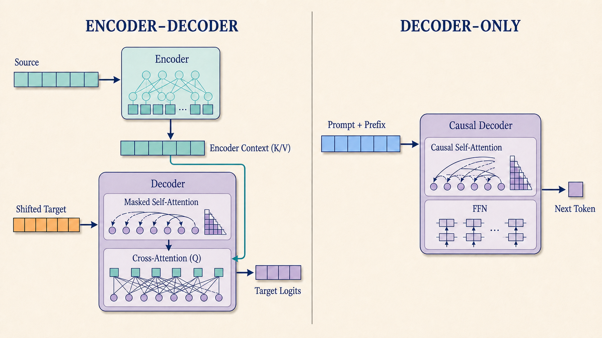

# task_20：从 Attention 到 Decoder-only

卷积用固定窗口读取局部区域，RNN 按顺序把状态传下去。文本中的依赖却可能隔得很远：读到句尾的“它”时，模型也许要回到十几个 token 以前寻找所指对象。

Self-attention 把这件事写成矩阵运算。先把整段序列放进同一个张量，再让每个位置计算自己该从哪些位置取信息。



---


<div class="widget-mount" data-widget="qkv-flow" data-title="Q/K/V 到输出，分步走"></div>

## Q、K、V

输入 hidden states 记为：

```text
X: (B,T,D)
```

同一个 `X` 经过三组不同参数：

```text
Q = X @ Wq    # 当前位置要匹配什么
K = X @ Wk    # 每个位置可以怎样被匹配
V = X @ Wv    # 匹配以后取回的内容
```

一个 attention head 计算：

$$
\operatorname{Attention}(Q,K,V)
=\operatorname{softmax}\left(\frac{QK^\top}{\sqrt{d_{head}}}+M\right)V.
$$

其中 $M$ 是与 score 同 shape 的加法掩码：可见位置取 $0$，禁止位置取 $-\infty$（实现里用有限的最小值代替，见 task 23）。`QKᵀ` 得到位置两两之间的 score；softmax 沿 key 方向把 score 变成权重；最后用权重加权 `V`。所以可以简单记成：Q/K 决定“看哪里”，V 决定“拿回来什么”。

缩放项来自 score 的量级。若 Q、K 各维近似独立且方差相近，点积的方差会随 $d_{head}$ 增长；除以 $\sqrt{d_{head}}$ 后，softmax 不容易因为维度变大而过早饱和。

## 从一个 head 到多个 head

以 `D=32, H=4` 为例，`head_dim=8`：

```text
Q: (B,T,32) -> (B,4,T,8)
K: (B,T,32) -> (B,4,T,8)
V: (B,T,32) -> (B,4,T,8)

scores:       (B,4,T,T)
head outputs: (B,4,T,8)
concat:       (B,T,32)
```

四个 head 使用不同投影参数，给模型留下多组匹配空间。它们学到什么由数据决定，并没有预先分配好的“语法”“指代”等固定角色。

## 为什么语言模型要遮住未来

训练 next-token 模型时，整段序列会并行计算。位置 2 的输入旁边虽然已经放着位置 3、4，但它不能借此读取目标答案。`T=4` 时，可见关系是：

```text
q0 -> k0
q1 -> k0 k1
q2 -> k0 k1 k2
q3 -> k0 k1 k2 k3
```

这就是下三角 causal mask，也就是代入公式里 $M$ 的方式：下三角（含对角线）取 $0$，上三角取 $-\infty$，禁止位置便在 softmax 前从 score 中排除。它带来一个可直接观察的性质：固定前缀、任意改动未来 token，前缀位置的输出保持不变。

## 原论文和本章模型并不相同

《Attention Is All You Need》用于机器翻译，结构是 encoder-decoder：

```text
source -> Encoder ------------------+
                                      -> Decoder -> target logits
shifted target -> masked self-attn --+   (含 cross-attention)
```

本章走 decoder-only 路线：

```text
已有 token -> causal self-attention -> next-token logits
```



Decoder-only 没有 encoder，也没有 cross-attention；Q/K/V 全部来自当前 token 序列。图中左侧 decoder 的 cross-attention 读取 encoder context，右侧 causal decoder 则只读取自己的前缀。

## 后续内容

```text
task 21  原始正弦位置编码
task 22  RoPE
task 23  causal attention + GQA
task 24  SwiGLU
task 25  embedding + LM head + weight tying
task 26  Pre-RMSNorm decoder block
task 27  组装微型 Transformer
task 28  文本训练、验证与 checkpoint
task 29  自回归采样
task 30  KV Cache
```

本节没有 Python 文件，主要建立后续代码里的几个对应关系：`QKᵀ` 与 `V` 分别决定取信息的位置和内容；$\sqrt{d_{head}}$ 缩放控制 score 量级；causal mask 防止未来标签泄漏；cross-attention 的 K/V 来自 encoder context，self-attention 的 Q/K/V 则来自同一序列。拆分 head 后，Q/K/V、score 和输出的 shape 会在 task 23 直接出现。

参考：[Attention Is All You Need](https://arxiv.org/abs/1706.03762)、[PyTorch SDPA API](https://docs.pytorch.org/docs/stable/generated/torch.nn.functional.scaled_dot_product_attention.html)。
