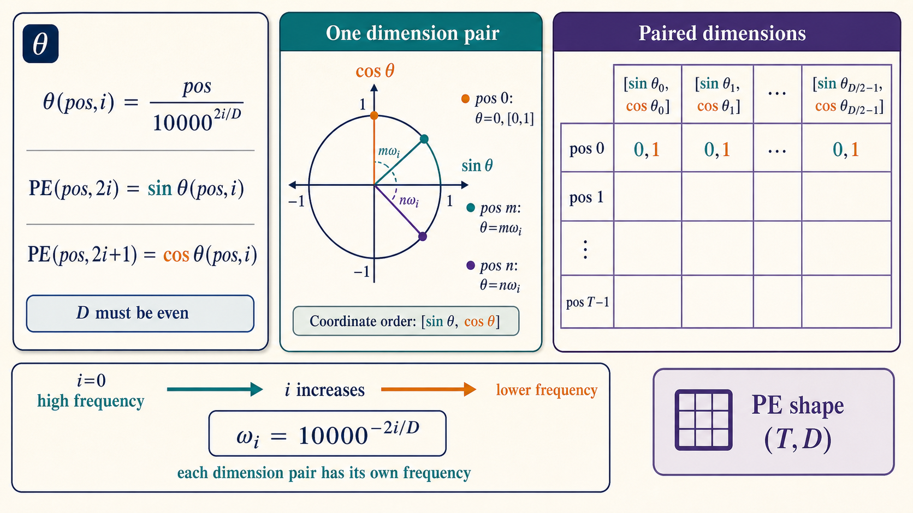
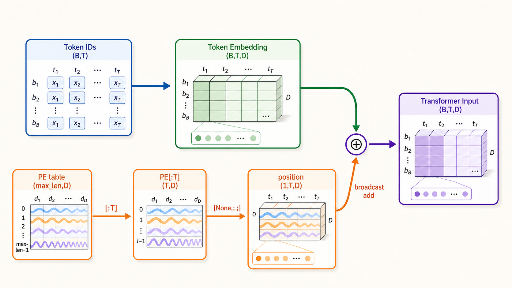

# task_21：正弦位置编码

Self-attention 只比较向量内容，不会凭空知道 token 的先后顺序。“小猫追小狗”和“小狗追小猫”包含同一组 token，顺序却改变了句意。

原始 Transformer 为每个整数位置准备一个固定向量，再把它加到 token embedding 上。这张位置表不参与训练，所有数值都由 sin/cos 公式给出。



---


<div class="widget-mount" data-widget="pos-encoding" data-title="正弦编码：频率有多快"></div>

## 公式怎样落到数组中

对位置 `pos` 和维度对 `i`：

$$
PE(pos,2i)=\sin\left(pos/10000^{2i/D}\right),
$$

$$
PE(pos,2i+1)=\cos\left(pos/10000^{2i/D}\right).
$$

- `pos` 是 token 在序列中的整数位置；
- `D` 是 embedding 维度；
- 相邻的偶数、奇数维使用同一个频率，分别放 sin 和 cos；
- `i` 不同，频率也不同。

代码把分母写成等价的指数形式：

```python
div_term = exp(arange(0, D, 2) * (-log(10000) / D))
angles = position * div_term
```

图中低编号维度变化快，高编号维度在同一段位置范围内变化慢。只画一条波形无法表示这种多频率结构。

## 两个方便的手算点

`pos=0` 时，所有角度都是 0：

```text
PE[0] = [0,1,0,1,0,1,...]
```

这能很快查出 sin/cos 列是否放反，或 position 是否误从 1 开始。

对同一维度对，还可以利用：

$$
\sin(a+b)=\sin a\cos b+\cos a\sin b,
$$

$$
\cos(a+b)=\cos a\cos b-\sin a\sin b.
$$

也就是说，位置 `pos+k` 的这一对数值可以由位置 `pos` 的数值做一次与 `k` 有关的线性变换得到。这是原论文选择 sin/cos 的一个重要动机。

## 怎样加到 embedding

函数返回整张表：

```text
sinusoidal_position_encoding(max_len, D): (max_len,D)
```

当前 batch 的 embedding 是 `(B,T,D)`，取前 `T` 行并增加 batch 轴：

```python
x = token_embedding + position_table[:T][None, :, :]
# (B,T,D)       + (1,T,D) -> (B,T,D)
```



位置表在 batch 维广播，同一位置对所有样本使用相同编码。

## 偶数维接口

实现分别写入 `0::2` 和 `1::2`，每个 sin 列都有一个相邻 cos 列。若 `D` 为奇数，最后一维无法组成完整配对。当前函数因此采用以下入参范围：

```text
max_len > 0
D > 0
D % 2 == 0
```

这是当前实现的接口约束，并不意味着所有位置编码都采用偶数维。

## 运行与核对

在仓库根目录运行：

```bash
python exercises/block_03_transformer/task_21_sinusoidal_position/position.py
```

输出包含：

```text
shape: (4, 8)
position 0: [0.0, 1.0, 0.0, 1.0, 0.0, 1.0, 0.0, 1.0]
```

位置编码的边界也收录在 Block 3 测试中：

```bash
python -m unittest discover -s tests -p 'test_block3.py' -v
```

运行结果和测试中可以核对这些性质：返回值为 `(max_len,D)`，第 0 行与手算结果一致，不同维度对使用不同频率，指定 `device` 后可直接与 embedding 相加，奇数 `D` 会触发 `ValueError`。

下一节保留多频率 sin/cos，但不再把位置表加到 embedding，而是用它旋转 attention 的 Q/K。

参考：[Attention Is All You Need，第 3.5 节](https://arxiv.org/abs/1706.03762)。
