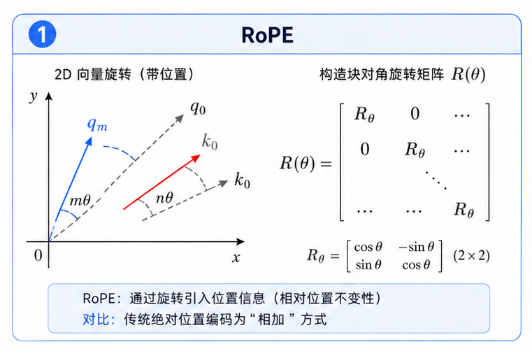

# task_22: RoPE 位置编码

Attention 本身不知道顺序.

如果不给位置信息, 它只知道一堆 token 互相能看, 但不知道谁在前谁在后.

上一关的 sinusoidal position encoding 是把位置向量直接加到 embedding 上.

MiniMind/LLaMA 风格模型通常不用这种加法, 而是用 RoPE.

RoPE 的做法是: 让 Q 和 K 按位置旋转.



## 一. 为什么作用在 Q/K?

Attention score 来自:

$$
QK^\top
$$

如果位置影响 Q 和 K, 那位置就会影响 attention score.

这样模型在算“这个 token 应该看谁”时, 就能感知相对位置.

V 不参与打分, 所以 RoPE 通常不作用在 V 上.

## 二. 你要写什么?

当前文件是 `rope.py`.

你需要理解三个函数:

```text
build_rope_cache
rotate_half
apply_rope
```

`build_rope_cache` 生成 cos/sin 表.

`rotate_half` 把成对维度旋转.

`apply_rope` 把旋转应用到 attention 的 Q/K 上.

## 三. 检查什么?

先检查 shape:

```text
input : (batch, heads, seq_len, head_dim)
output: (batch, heads, seq_len, head_dim)
```

RoPE 不应该改变 shape.

再检查 `head_dim` 必须是偶数. 因为它按两两一组做旋转.

下一关把 RoPE 接到 causal attention 里.
