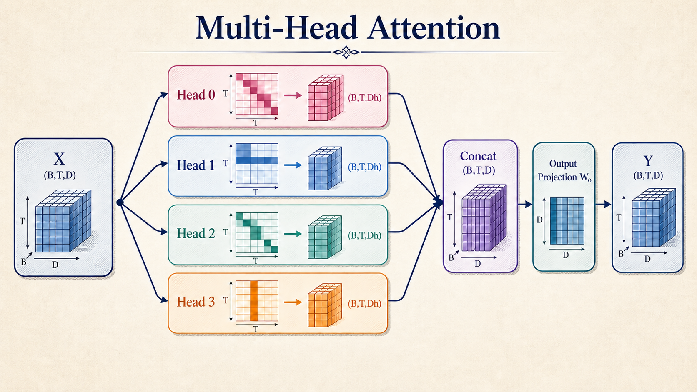

# task_23：Causal Attention 与 GQA

正弦位置编码和 RoPE 解决了位置的表示方式。这一节再把 Q/K/V 投影、RoPE、mask 和多头输出接成一层可运行的 causal self-attention。

Decoder-only 模型的 Q/K/V 都来自同一段 hidden states，但可见范围不同：位置 `t` 只能读取 `0..t`。若 batch 为了对齐长度加入 PAD，padding mask 会把这些填充位置排除在有效上下文之外。


---

## 从 Q/K/V 到输出

单个 head 在位置 $t$、$j$ 间的 score 是：

$$
s_{tj}=\frac{q_tk_j^\top}{\sqrt{d_{head}}}.
$$

先把禁止位置从 score 中排除，再沿 key 轴做 softmax：

$$
a_{tj}=\operatorname{softmax}_j(s_{tj}+M_{tj}),\qquad
o_t=\sum_j a_{tj}v_j.
$$

Mask 不能等到输出之后才乘。若被禁止的 score 参加了 softmax，它仍会分走一部分概率，留下来的权重也会随之改变。

`MultiHeadSelfAttention.forward` 接收 `x: (B,T,D)`。以 `D=32, Hq=4, Hkv=2` 为例：

```text
head_dim = 32 / 4 = 8

Q: (B,T,32) -> (B,4,T,8)
K: (B,T,16) -> (B,2,T,8)
V: (B,T,16) -> (B,2,T,8)
```

Q/K 先应用 RoPE。K/V 再沿 head 轴复用给 4 个 query heads：

```text
scores:  (B,4,T,T)
weights: (B,4,T,T)
heads:   (B,4,T,8)
concat:  (B,T,32)
output:  (B,T,32)
```



输出回到 `(B,T,D)` 后，可以直接和 block 输入做残差相加。

## GQA 共享的是 K/V，不是 query 输出

标准 MHA 为每个 query head 各准备一组 K/V。GQA 保留 query heads 的数量，只减少 K/V heads。

```text
n_heads = 4
n_kv_heads = 2
kv_repeats = 2

Q0,Q1 -> KV0
Q2,Q3 -> KV1
```


图中每个 Q head 只配一组 K/V，最终仍有 `O0..O3` 四个输出。`_repeat_kv` 只做 `expand/reshape`，不会创建新的参数；原始 K/V 投影和后续 KV Cache 都只保存 2 个 heads。

构造函数因此检查三项整除关系：

```text
D % n_heads == 0
n_heads % n_kv_heads == 0
head_dim % 2 == 0       # RoPE 成对旋转
```

非法配置会在建层时直接报错，错误位置比 `view` 或矩阵乘法中的 shape 异常更明确。

## 两张 mask，各管一件事

Causal mask 的 shape 可以广播为 `(1,1,T,T)`，负责时间方向。`attention_mask: (B,T)` 则随样本变化，当前约定是 `True` 表示该 key 可见：

```text
(B,T) -> (B,1,1,T)
```

两者取交集后才是最终允许矩阵。

这里的 padding mask 只屏蔽 **key**。它不删除 PAD query 行，输出仍是 `(B,T,D)`；到语言模型中，PAD query 对应的 target 还会从 loss 中排除。

若一个样本没有任何可见 key，所有 score 都会被填成有限 dtype 的最小值。softmax 后代码再次乘 allowed mask，把该行权重归零，避免 NaN。这个处理是本教学实现的显式约定。

## Causal 性质的数值核对

固定前缀，任意替换未来：

```python
x2 = x.clone()
x2[:, 4:] = torch.randn_like(x2[:, 4:])

y1 = attention(x)
y2 = attention(x2)
```

`y1[:, :4]` 与 `y2[:, :4]` 在浮点容差内一致。反向对照中，改动前文通常会改变后面位置。如果末位 logits 始终不随前文变化，实际运行的可能仍是逐 token MLP。

## 运行与核对

`mha.py` 末尾包含一个 smoke test：

```bash
python exercises/block_03_transformer/task_23_causal_attention/mha.py
```

预期输出：

```text
output: (2, 6, 32)
Q heads / KV heads: 4 / 2
```

同一组性质也收录在 Block 3 测试中：

```bash
python -m unittest discover -s tests -p 'test_block3.py' -v
```

测试覆盖输入输出 shape、`n_kv_heads` 对 K/V 投影数量的实际影响、未来 token 对过去位置的隔离、padding mask 的有限输出，以及非法 head 配置和 mask shape 的报错边界。

`mha.py` 用基础张量操作展开计算，shape 变化因此比较直观。生产代码通常会使用 PyTorch 的 fused SDPA；换用其他实现时，mask 的布尔语义和 GQA 的 shape 约束仍然不变。

参考：[GQA 论文](https://arxiv.org/abs/2305.13245)、[PyTorch `scaled_dot_product_attention`](https://docs.pytorch.org/docs/stable/generated/torch.nn.functional.scaled_dot_product_attention.html)。
