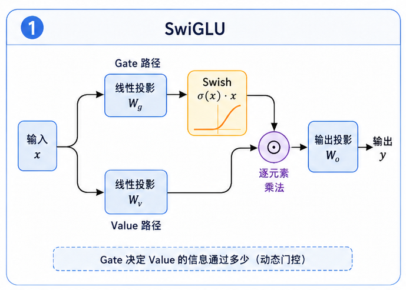

# task_24: SwiGLU 前馈网络

Attention 负责让 token 之间交换信息.

但交换完以后, 每个位置还需要自己做一层非线性变换.

这就是 FFN.



MiniMind/LLaMA 风格模型里常见的是 SwiGLU, 而不是最普通的 GELU FFN.

## 一. 普通 FFN

普通 FFN 大概是:

```text
Linear(dim -> hidden)
GELU
Linear(hidden -> dim)
```

输入输出 shape 一样:

```text
(batch, seq_len, dim)
```

中间 hidden_dim 通常比 dim 大很多.

## 二. SwiGLU

SwiGLU 会多一条门控分支:

$$
\mathrm{SwiGLU}(x) = W_3(\mathrm{SiLU}(W_1x) \odot W_2x)
$$

可以理解为:

- 一路生成内容.
- 一路生成门.
- 两路相乘, 再投回 dim.

这比普通 FFN 多一点计算, 但在现代语言模型里很常见.

## 三. 你要写什么?

当前文件是 `ffn.py`.

保留普通 `FeedForward` 作为对比, 主线重点看 `SwiGLU`.

检查输入输出 shape:

```text
input : (batch, seq_len, dim)
output: (batch, seq_len, dim)
```

下一关把 token embedding 和 LM head 接进来.
