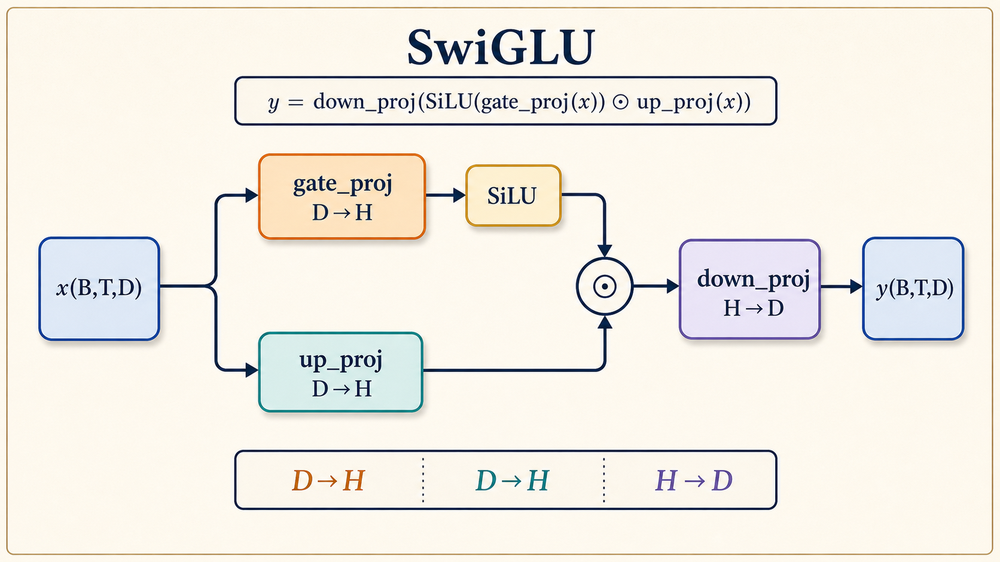

# task_24：SwiGLU 前馈网络

Attention 负责 token 之间的信息交换，FFN 则在每个 token 内部变换特征。它对所有位置复用同一组参数，但不会沿序列轴把不同 token 混在一起。

普通两层 FFN 可以写成：

$$
\operatorname{FFN}(x)=W_2\,\phi(W_1x+b_1)+b_2.
$$

Shape 先扩张，再压回模型维度：

```text
(B,T,D) -> (B,T,H) -> (B,T,D)
```

`H` 通常大于 `D`。最后回到 `D`，结果便能与 decoder block 的输入相加。

---

## SwiGLU 多了一条并行分支

本章使用的形式是：

$$
g=W_{gate}x,\qquad u=W_{up}x,
$$

$$
\operatorname{SwiGLU}(x)
=W_{down}\left(\operatorname{SiLU}(g)\odot u\right).
$$



三次投影的 shape：

```text
gate: D -> H
up:   D -> H
down: H -> D
```

Gate 分支先经过：

$$
\operatorname{SiLU}(x)=x\sigma(x),
$$

再与 up 分支逐元素相乘。这里的 `*` 不是矩阵乘法；两个分支都是 `(B,T,H)`，乘完仍是 `(B,T,H)`。

这也说明为什么下面的结构不等价：

```text
Linear -> SiLU -> Linear
```

它只有一次上投影，没有独立的 up 分支，是普通两层 FFN，不是 SwiGLU。

## `ffn.py` 中的两个版本

文件保留两个实现：

```text
FeedForward  Linear -> GELU -> Linear
SwiGLU      w3(SiLU(w1(x)) * w2(x))
```

其中 `SwiGLU` 的对应关系是：

1. `w1`、`w2` 是两个不同的 `nn.Linear`；
2. 两者都把 `D` 投影到 `H`；
3. 只有 `w1` 分支经过 SiLU；
4. `w3` 把乘积投影回 `D`；
5. batch 和 sequence 维始终保留。

这个独立示例使用 `nn.Linear` 的默认 bias。Task 27 中的模型主干把三次投影都设为 `bias=False`；这不改变 SwiGLU 的分支结构。

## FFN 不会破坏 causal 性质

可把计算理解为：

```text
x[:,0,:] -> 同一个 ffn -> out[:,0,:]
x[:,1,:] -> 同一个 ffn -> out[:,1,:]
...
```

FFN 不沿 `T` 维求和，所以不会让早期位置读到未来。序列方向的信息边界仍由 attention 的 causal mask 决定。

## 运行与核对

```bash
python exercises/block_03_transformer/task_24_swiglu_ffn/ffn.py
```

输出形如：

```text
SwiGLU output: (2, 6, 32)
```

SwiGLU 的结构性质也收录在 Block 3 测试中：

```bash
python -m unittest discover -s tests -p 'test_block3.py' -v
```

输出与测试中可以看到：输入输出均为 `(B,T,D)`，两次上投影使用不同 Parameter，逐元素乘法前 shape 一致，前向结果有限且可正常反向传播。

参考：[GLU Variants Improve Transformer](https://arxiv.org/abs/2002.05202)。
