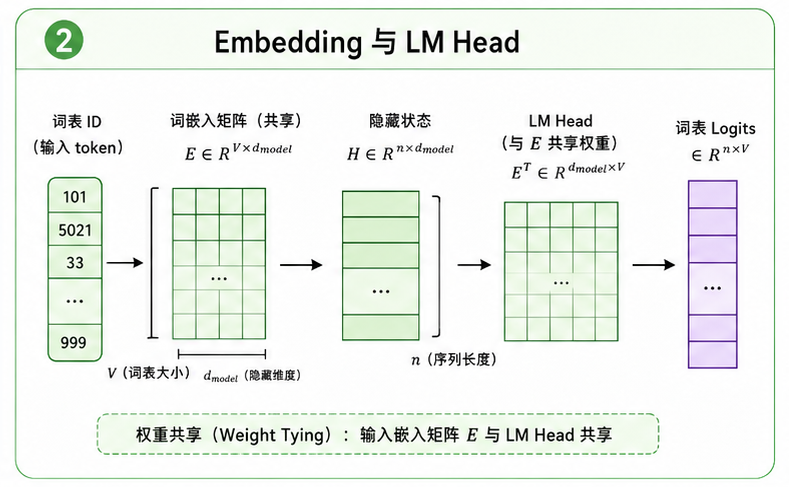

# task_25: Embedding 与 LM Head

模型不能直接处理文字.

它处理的是 token id.



比如:

```text
"apple is red" -> [12, 45, 88]
```

但 token id 只是编号, 不能直接拿去做 attention. 所以第一步是 embedding.

## 一. Token Embedding

Embedding 本质上是一张表:

```text
vocab_size x dim
```

输入 token id 后, 查表得到向量:

```text
input_ids.shape = (batch, seq_len)
x.shape         = (batch, seq_len, dim)
```

后面的 Transformer block 都处理这个 `x`.

## 二. LM Head

模型最后要预测下一个 token.

所以 hidden state 要重新映射回词表大小:

```text
logits.shape = (batch, seq_len, vocab_size)
```

这个线性层叫 LM head.

## 三. Weight Tying

很多语言模型会让 token embedding 和 LM head 共用同一份权重.

也就是:

```python
lm_head.weight = token_embedding.weight
```

这叫 weight tying.

直觉上, 输入 token 的表示空间和输出 token 的分类空间可以共用一部分结构. 它还能减少参数量.

## 四. Next-token Loss

训练时输入和标签错开一位:

```text
input : [t0, t1, t2]
label : [t1, t2, t3]
```

然后对每个位置的 logits 算 CrossEntropy.

当前 `language_model.py` 是一个很小的版本, 用来先跑通 embedding、position embedding、lm_head 和 loss.

后面的 MiniMind Core 会把 position embedding 换成 RoPE, 并堆叠 decoder blocks.
