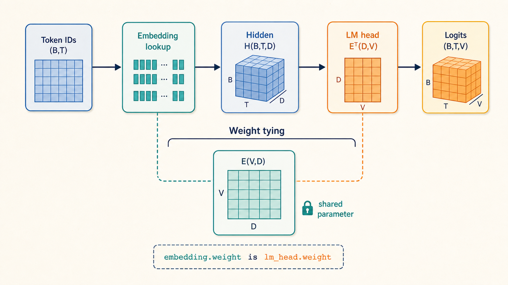

# task_25：Embedding、LM Head 与 Weight Tying

Tokenizer 把字符或子词变成整数 id；embedding 把 id 查成向量；模型处理完这些向量后，LM head 再把每个位置投影回词表。

设词表大小为 `V`，hidden dimension 为 `D`：

```text
token_embedding.weight: (V,D)
input_ids:              (B,T)
hidden:                 (B,T,D)
lm_head.weight:         (V,D)
logits:                 (B,T,V)
```

`logits[b,t,v]` 是样本 `b` 在位置 `t` 预测词表项 `v` 的未归一化分数。训练时 `cross_entropy` 内部计算 softmax；生成时才由采样函数处理最后一个位置的 logits。



---


<div class="widget-mount" data-widget="token-embed-3d" data-title="token 向量的三维投影"></div>

## 一张矩阵，两种用法

Embedding 表 $E\in\mathbb{R}^{V\times D}$ 按 token id 查行。LM head 则使用同一张表的转置，把 hidden vector 投到 `V` 个词表分数：

$$
H:(B,T,D),\qquad HE^\top:(B,T,V).
$$

PyTorch 的 `nn.Linear(D,V)` 把 weight 存成 `(V,D)`，所以可以直接让两个模块引用同一个 Parameter：

```python
self.lm_head.weight = self.token_embedding.weight
```

如果改为数值复制：

```python
self.lm_head.weight.data.copy_(self.token_embedding.weight.data)
```

得到的只是初始数值相同的两份参数。真正的共享关系可以用对象身份确认：

```python
model.lm_head.weight is model.token_embedding.weight
```

来自输入 embedding 路径和输出分类路径的梯度会累积到同一个张量，optimizer 也只维护这一份 Parameter。

## `TinyLanguageModel` 的作用范围

`language_model.py` 这一小模型没有 attention。为了让不同位置不至于完全相同，它额外加入可学习的位置表：

```text
token embedding + learned position embedding
```

它适合检查 embedding、LM head、weight tying 和 loss mask，却不能读取其他 token 的内容，不能当作语言模型主干来评价上下文能力。

Task 27 的 `MiniMindCore` 不使用这张 learned position table；完整模型在每层 attention 内用 RoPE 处理 Q/K。两套位置方案分别属于两个示例，没有同时叠加。

## Next-token 标签由 Dataset 错开

`forward` 不自动移动 labels，它接收的是已经错开一位的序列：

```text
tokens: [BOS, t0, t1, t2, EOS]
input:  [BOS, t0, t1, t2]
label:  [t0,  t1, t2, EOS]
```

若直接传 `labels=input_ids`，监督目标会变成复制当前位置。Task 28 的 `NextTokenDataset` 会统一完成错位，因此训练循环不需要再 shift 一次。

## PAD 在 loss 中怎样消失

`TinyLanguageModel.forward` 会把以下 target 改成 `-100`：

- label 等于 `pad_token_id`；
- 当前 query 的 `attention_mask` 为 `False`。

PyTorch cross-entropy 忽略 `-100`。若整个 batch 都没有有效 target，代码返回 `logits.sum() * 0.0`：数值为 0，同时仍与计算图相连。

这里的 `attention_mask` 只用于筛 loss，因为这个局部模型没有 attention。完整模型还会把它传给 attention，用来屏蔽 PAD key。二者作用不同。

## 运行与核对

```bash
python exercises/block_03_transformer/task_25_embedding_lm_head/language_model.py
```

输出形如：

```text
logits: (1, 4, 40)
weights shared: True
```

Embedding、weight tying 和 loss mask 也收录在 Block 3 测试中：

```bash
python -m unittest discover -s tests -p 'test_block3.py' -v
```

运行结果与测试覆盖以下性质：logits 为 `(B,T,V)`，共享关系用 `is` 观察为真，输入超过 `max_seq_len` 时会报错，PAD target 不参与 loss，全 PAD 时返回有限的 0 loss。

参考：[Using the Output Embedding to Improve Language Models](https://arxiv.org/abs/1608.05859)。
