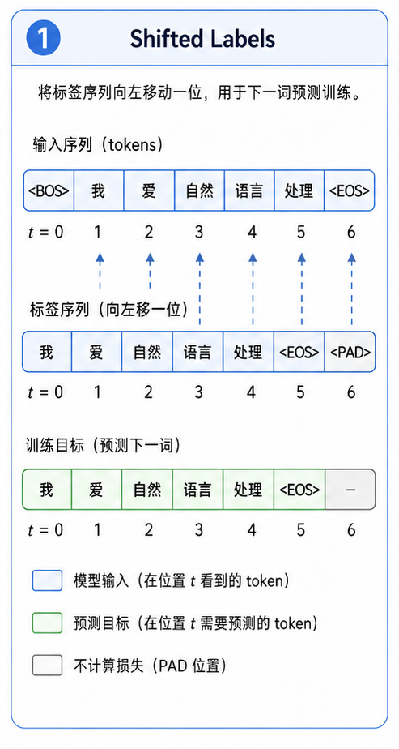

# task_28: Next-token 训练

模型结构搭好以后, 先别急着找大语料.

先用随机 token 或很小的文本跑通训练闭环.



```text
input_ids -> model -> logits/loss -> backward -> optimizer.step
```

## 一. 训练 batch

当前 `train.py` 用的是随机 token:

```python
x = torch.randint(0, vocab_size, (batch_size, seq_len))
return x[:, :-1], x[:, 1:]
```

这不是真正语料, 但能检查代码是否能跑.

先让 forward/backward/update 通了, 再接真实文本.

## 二. loss 为什么看起来不漂亮?

随机 token 没有规律.

所以 loss 不一定会像小数据过拟合那样一路下降.

这一步主要看:

- 会不会报 shape 错.
- loss 是否是有限数, 不是 NaN.
- 参数能不能反向传播.
- 显存/内存是否正常.

## 三. 怎么接真实语料?

把随机 token 换成真实文本时, 流程会变成:

```text
读取文本
tokenize
切成固定长度 block
next-token labels
保存 checkpoint
定期 generate
```

如果再往聊天助手方向走, 会接触 SFT. 那已经不是“学会续写文本”这一件事了, 而是让模型学习如何按指令回答.
