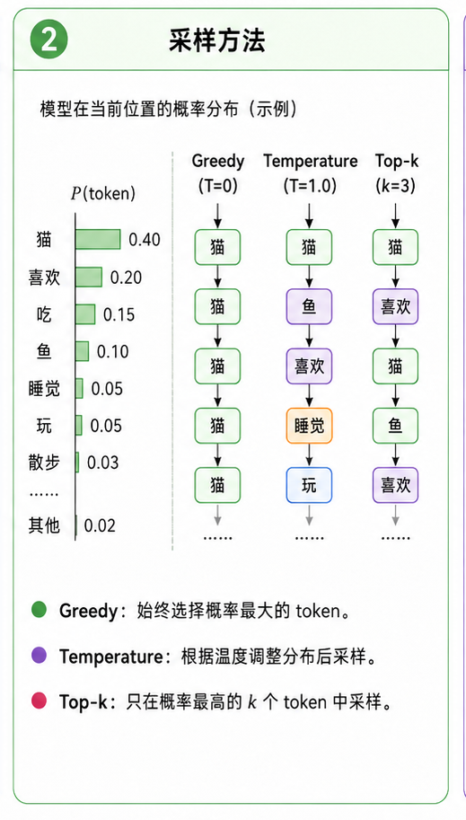

# task_29: Generate 与采样

模型训练完以后, 你总要让它真的吐几个 token 出来.

这一步叫 generate.

它看起来很简单: 输入一段 prompt, 模型预测下一个 token, 把这个 token 接到后面, 再预测下一个.

```text
prompt -> next token -> append -> next token -> append -> ...
```

但这里马上会遇到一个问题: 模型输出的是整个词表上的 logits, 你到底选哪个 token?



## 一. 最朴素的做法: greedy

每一步都选概率最大的 token.

```text
next_id = argmax(logits)
```

这很稳定, 也很无聊. 模型容易一直走最安全的路, 生成结果可能重复.

## 二. temperature

temperature 控制分布有多“尖”.

$$
p = \mathrm{softmax}(logits / T)
$$

$T$ 小, 分布更尖, 模型更保守.

$T$ 大, 分布更平, 模型更随机.

一般先试 `0.7` 或 `1.0`.

## 三. top-k

top-k 的意思是: 只从概率最高的 k 个 token 里采样.

比如 `top_k=50`, 那就先把其他 token 的概率砍掉, 再从剩下 50 个里抽.

这能避免模型突然抽到特别离谱的低概率 token.

## 四. 你要写什么?

给 MiniMind Core 加一个生成函数:

```text
generate(input_ids, max_new_tokens, temperature, top_k)
```

检查三件事:

- 输出长度是否正确.
- 每次只把最后一个 token 的 logits 用来采样.
- 超过 `max_seq_len` 时, 只保留最后一段上下文.

下一关是 KV Cache. 那是 generate 变快的关键.
