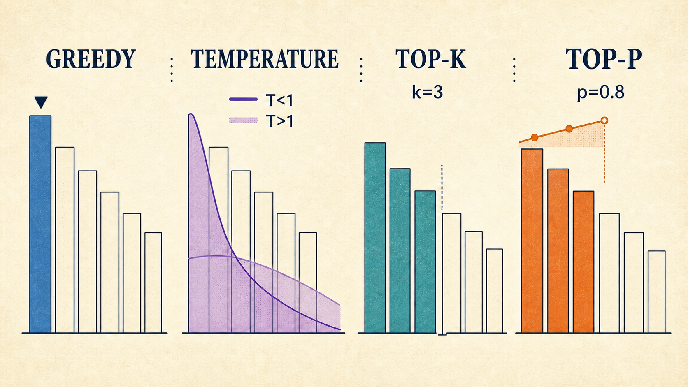

# task_29：自回归生成与采样

训练时，一次 forward 会返回所有位置的 logits。生成时未来 token 还不存在，只能把刚生成的 id 接回序列，再算下一步：

```text
当前上下文 -> 最后一位 logits -> 选 token -> 追加 -> 下一轮
```

这里先从未缓存版本开始。它会重复计算上下文，但逻辑直白，也为 Task 30 的 KV Cache 提供数值对照。



---


<div class="widget-mount" data-widget="sampling" data-title="温度、top-k、top-p 实时对比"></div>

## 为什么取 `logits[:, -1]`

```text
input_ids: (B,T)
logits:    (B,T,V)
```

第 `t` 行 logits 预测该位置之后的 token。当前上下文停在 `T-1`，所以下一个 token 来自：

```python
next_logits = logits[:, -1]   # (B,V)
```

`sample_next_token` 为每个 batch 行返回一个 id，shape 为 `(B,1)`，再把它拼回 `input_ids`。误取 `logits[:,0]` 会让每一步都根据序列开头生成。

## 四种选择规则

### Greedy

当 `temperature=0` 时直接取：

```python
next_id = logits.argmax(dim=-1, keepdim=True)
```

这一分支不再应用 top-k/top-p。Greedy 不一定给出最自然的文本，但结果确定，适合核对最后位置、EOS 和 cached/uncached 等价性。

### Temperature

当 $\tau>0$，设 $z$ 为最后一位的 logits 向量（`(B,V)` 中的一行，shape 为 `(V,)`）：

$$
p=\operatorname{softmax}(z/\tau),\qquad
p_i=\frac{\exp(z_i/\tau)}{\sum_{j}\exp(z_j/\tau)}.
$$

- `0 < τ < 1`：分布更尖，更偏向高 logit；
- `τ > 1`：分布更平，低 logit 更容易被采到；
- `τ < 0`：没有定义，代码抛出 `ValueError`。

Temperature 只改变同一组 logits 的随机性，不能补回模型没有学到的知识。

### Top-k

实现先找到第 `k` 大 logit 的阈值，把更低的候选设为 `-inf`，再 softmax：

```text
top_k=None  不过滤
top_k<=0    报错
top_k>V     截到 V
```

严格来说，若阈值处出现相同 logit，当前“按阈值”实现会保留所有并列项，因此候选数可能略多于 `k`。最高 logit 唯一时，`top_k=1` 与 greedy 相同。

### Top-p / nucleus

Top-p 先按概率降序排列，再保留累计概率达到 $p_{\text{top}}$ 所需的最小前缀。假设：

```text
probabilities = [0.60, 0.25, 0.10, 0.05]
top_p = 0.70
```

第一个候选只累计到 0.60，所以还要保留第二个，采样集合为前两项。实现先标出累计概率超过阈值的位置，再把删除 mask 右移一格，保证跨过 $p_{\text{top}}$ 的那个 token 留下。

```text
top_p=None 或 1  不过滤
0 < top_p < 1     nucleus 过滤
top_p<=0 或 >1    报错
```

同时设置 top-k/top-p 时，代码先做 top-k，再在剩余候选中做 top-p。

## 随机性、EOS 与 batch

CLI 创建显式 generator：

```python
generator = torch.Generator(device=device).manual_seed(seed)
```

在设备、软件环境、模型、prompt 和采样参数都相同时，同一初始 seed 会得到相同序列。显式 generator 也使这一性质不受全局随机状态干扰。

`max_new_tokens` 是生成上限。某个 batch 行先生成 EOS 后，后续轮次会一直追加 EOS；其他行仍继续。所有行都结束时，循环提前退出。若始终没有 EOS：

```text
output_length = prompt_length + max_new_tokens
```

Tokenizer 解码时会隐藏 BOS/EOS/PAD，因此检查长度要看 token ids，不能只数字符串。

## 变长 prompt 与上下文窗口

生成统一读取每行最后位置，因此变长 batch 接受左 padding：

```text
[PAD, PAD, BOS, t0, t1]  # 支持
[BOS, t0, t1, PAD, PAD]  # 拒绝
```

接口约定 `attention_mask` 与 ids 同 shape，最后一列全为有效 token。没有显式 mask 时，代码依据 `pad_token_id` 创建。

当结果超过 `max_seq_len`，下一次 forward 只读取最近窗口：

```python
context = result[:, -model.config.max_seq_len:]
```

完整 `result` 仍保留所有生成 id，但被滑出窗口的旧 token 不再影响预测。这是一种明确的截断策略，不是无限上下文。

## 运行与核对

Checkpoint 可由 Task 28 的训练脚本产生：

```bash
python exercises/block_03_transformer/task_28_next_token_training/train.py \
  --steps 80 --checkpoint /tmp/minimind_demo.pt
```

对应的采样命令是：

```bash
python exercises/block_03_transformer/task_29_generate_sampling/generate.py \
  --checkpoint /tmp/minimind_demo.pt --prompt "清晨，" \
  --max-new-tokens 20 --temperature 0.8 \
  --top-k 20 --top-p 0.9 --seed 0
```

第一行形如：

```text
checkpoint_step=80
```

随后打印 prompt 与生成文本。默认语料和训练步数很小，文本流畅度不用来判断采样逻辑是否正确。

采样边界也收录在 Block 3 测试中：

```bash
python -m unittest discover -s tests -p 'test_block3.py' -v
```

测试覆盖 greedy/argmax 一致性、无并列时的 top-1、nucleus 候选范围、非法参数、固定 generator 的可复现性、EOS 与输出长度、右 padding 报错，以及窗口滚动时 ids 与 mask 的同步截取。

参考：[The Curious Case of Neural Text Degeneration（nucleus sampling）](https://arxiv.org/abs/1904.09751)。
