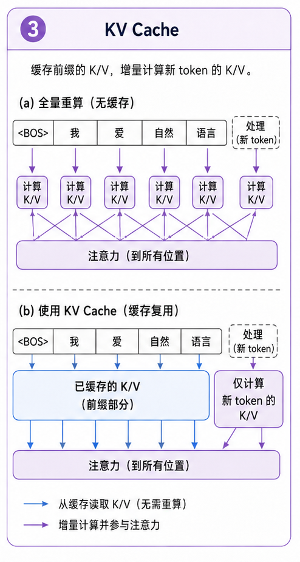

# task_30: KV Cache

Generate 最浪费的地方在哪里?

每生成一个新 token, 你都把整段上下文重新算一遍.

假设 prompt 已经有 100 个 token, 你生成第 101 个 token 时算了一遍 100 个 token 的 attention. 生成第 102 个 token 时, 前 100 个 token 的 K/V 其实没变, 但你又算了一遍.

这很浪费.

KV Cache 就是把历史 token 的 key 和 value 存下来.



## 一. 为什么只缓存 K/V?

Self-attention 里:

```text
Q = current token wants to ask
K = history tokens can be matched
V = history tokens provide information
```

生成时, 新 token 的 Q 每一步都不一样, 必须重新算.

但历史 token 的 K/V 不变. 所以可以缓存.

## 二. cache 长什么样?

通常每层都要存一份:

```text
k_cache[layer].shape = (batch, n_kv_heads, past_len, head_dim)
v_cache[layer].shape = (batch, n_kv_heads, past_len, head_dim)
```

每来一个新 token, 就把新的 K/V append 到 cache 后面.

然后 attention 只用当前 token 的 Q 去看历史所有 K/V.

## 三. 实现时要小心什么?

- cache 是按层存的, 不是全模型共用一份.
- GQA 下 `n_heads` 和 `n_kv_heads` 不一样.
- RoPE 的 position 不能每次从 0 开始, 要接着 past length 算.
- 如果上下文超过 `max_seq_len`, 要处理裁剪或滑动窗口.

到这里, Block 3 的主线就完整了: 训练一个 MiniMind 风格的小模型, 再让它能比较正常地生成.
